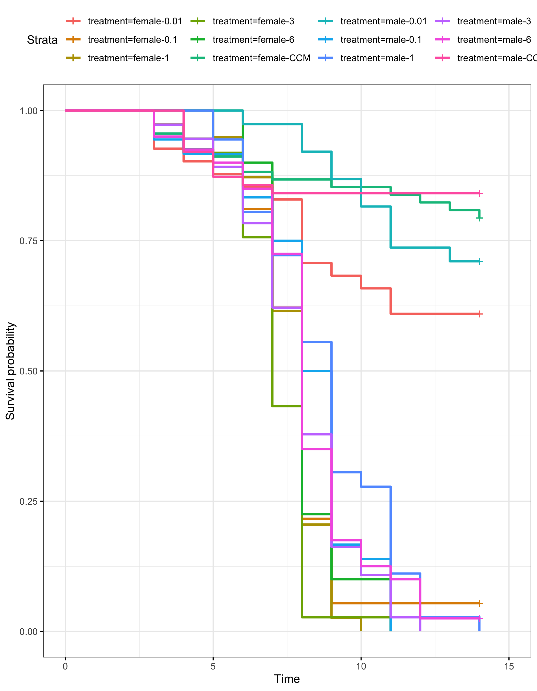
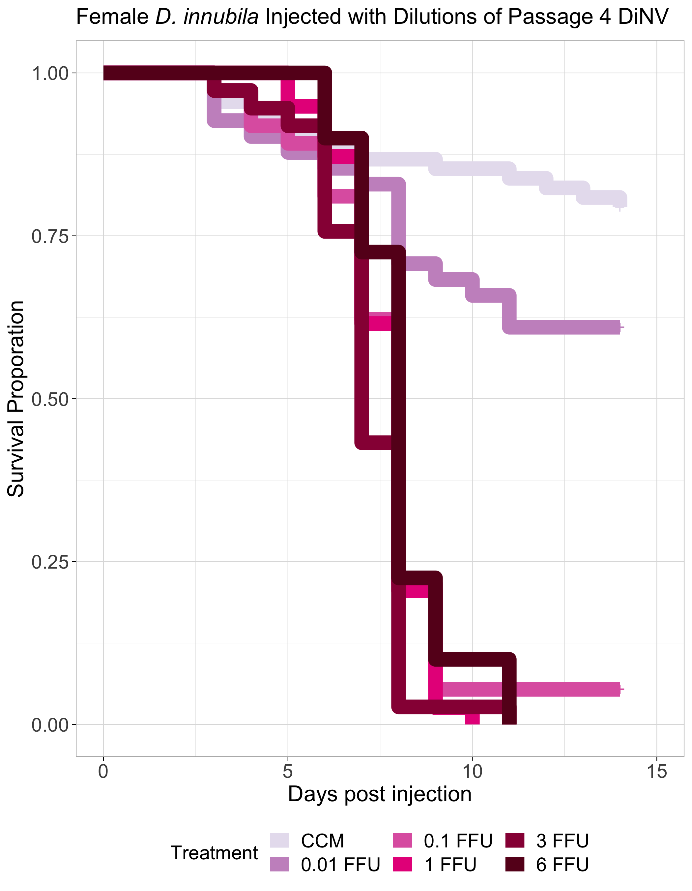
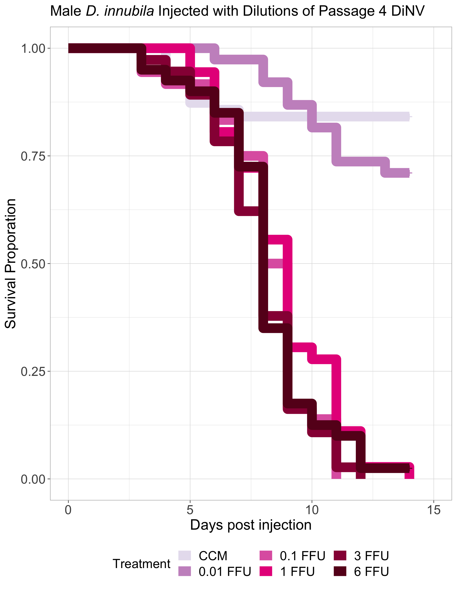
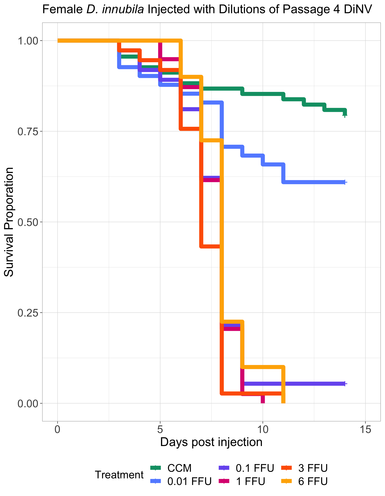
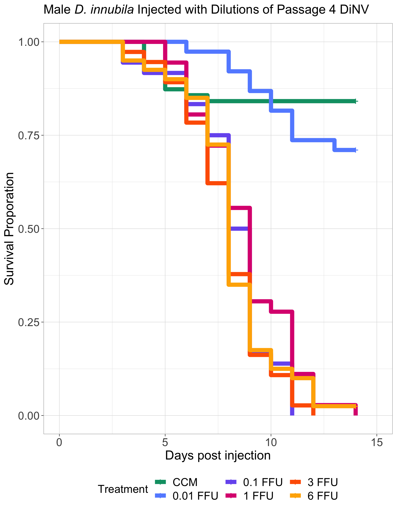

# p4-Dilutions-4-rep-combo

Load in packages needed for the analysis

``` r
library("survival")
library("survminer")
```

    Loading required package: ggplot2

    Loading required package: ggpubr


    Attaching package: 'survminer'

    The following object is masked from 'package:survival':

        myeloma

``` r
library(dplyr)
```


    Attaching package: 'dplyr'

    The following objects are masked from 'package:stats':

        filter, lag

    The following objects are masked from 'package:base':

        intersect, setdiff, setequal, union

``` r
library(tidyr)
library(stringr)
library(AICcmodavg)
```

### Loop to convert the example data.frame ‘df’ into properly formatted data.frame ‘results’

``` r
#write a function to transform a data.frame that has the column format 'vial | treatment | D0 | D1 | D2...', with one row for each vial
#into a long version in tidy format that can be input to make a survivorship curve
convert_df<-function(df){
  #open empty data.frame to store results
  results<-data.frame(vial=character(),treatment=character(),dead=numeric(),status=numeric())
  #This loop will index out each row (one row per vial) one at a time, transform it into long format (one row per fly), and add the information to the empty data.frame called results
  for(i in 1:nrow(df)){
  #isolate the row (vial) you want to work on
  temp<-df[i,]
    #iteratively isolate each day for this vial (day 0 must be column 3, day 1 column 4, etc.). Loop stops the column before the last day
    for(j in 3:(ncol(temp)-1)){
      #assign the number of flies that died in the vial on that day (starting with day 1) to the variable 'z'
      z<-temp[1,j]-temp[1,j+1]
        #if >0 flies died add this information to the results dataframe
        if(z>0){
          #iterate over 1 through total number of dead flies
          for(k in 1:z){
            #add a new row to the 'results' data.frame for the given dead fly, specifying vial #, treatment, day died, and
            #record the current vial #
            vial<-temp[,1]
            #record the genotype of the current vial
            treatment<-temp[,2]
            #record the death date of the flies that died on this day (assumes that your input DF starts with day 0 in column 3)
            dd<-j-2
            #append this information into a new row in the 'results' data.frame, and add a '1' in the 4th column to indicate mortality
            results[nrow(results)+1,]<- c(vial,treatment,dd,1)
          } #close for loop
        } #close if loop
    } #close for loop
  
  #now assign the number of flies remaining in the vial on the last day (value in the last column of the row) to the variable 'z'
  z<-temp[1,j+1]
    #if there are any flies alive in the vial on the last day
    if(z>0){
      #iterate over 1:(number of flies alive on the last day)
      for(l in 1:z){
        #record the current vial #
        vial<-temp[,1]
        #record the genotype of the current vial
        treatment<-temp[,2]
        #record the last day we recorded this fly alive (assumes that your input DF starts with day 0 in column 3)
        dd<-j-2
        #append this information into a new row in the 'results' data.frame, and add a '0' in the 4th column to indicate that the fly made it to the end of the experiment
        results[nrow(results)+1,]<- c(vial,treatment,dd,0)
      } #close for loop
    } #close if loop
  } #close original for loop
results$dead<-as.numeric(results$dead)  #reiterate that this column must be class numeric
results$status<-as.numeric(results$status)  #reiterate that this column must be class numeric
results$vial <- as.factor(results$vial) # make sure vial is considered a factor
# gives you only the results dataframe as output from function 
return(results) 
} #close function
```

Read in raw data

**Note that for these datasets, the adjusted N number is the number of
flies alive on day 2 because there seemed to be more early death in
these experiments than usual**

``` r
#read the file from csv
df<-read.csv("/Users/maggieschedl/Desktop/Github/Unckless_Lab_Resources/Infection_survival_analyses/20240209-dilution-rep-4/dilution-infection-combo-sheet.csv")

# Remove the rows of the undiluted samples because I did not do those for the other replicates
df <- df[c(1:12, 15:56),]
# separate out columns needed
df <- df[,c(1,3,15:29)]
```

Convert dataframe

``` r
df.convert<-convert_df(df)
```

Plot survivial curve with every line separate, yes this is a mess

``` r
# change to not have confidence intervals in this one so you can see them 
df_fit<- survfit(Surv(dead, status) ~ treatment, data=df.convert)
ggsurvplot(df_fit,
          pval = FALSE, conf.int = FALSE,
          #risk.table = TRUE, # Add risk table
          #risk.table.col = "strata", # Change risk table color by groups
          #linetype = "strata", # Change line type by groups
          #surv.median.line = "hv", # Specify median survival
          ggtheme = theme_bw()) # Change ggplot2 theme
```



``` r
          # palette = c("orchid", "aquamarine", "blueviolet", "darkslategray3")) + ylab("Survival Proporation") + xlab("Days post injection")
```

Add in columns for sex and dilution separately

``` r
# add in sex information and DiNV information as separate columns by splitting the treatment column 
# split the columns 
df.convert_S <- str_split_fixed(df.convert$treatment, "-", 2)

# change column names
colnames(df.convert_S) <- c("sex", "dilution")

# add columns to df 
df.convert_full <- cbind(df.convert,df.convert_S)

# add in block information 
# this was not reproducable to count but I don't know how else to do it
# first 118 rows are block A, second 127 rows are block B, the third 138 rows are block C, and the last 133 rows are block D
df.convert_full$Block <- rep(c("A","B", "C", "D"), c(118, 127, 138, 129))
```

Plot survival curve with only females

``` r
df.convert_fem <- df.convert_full[which(df.convert_full$sex != "male"),]

# order treatments 
df.convert_fem <- df.convert_fem %>% 
  mutate(dilution = factor(dilution, levels = c("CCM", "0.01", "0.1", "1", "3", "6")))

# change to not have confidence intervals in this one so you can see them 
df_fit_fem<- survfit(Surv(dead, status) ~ dilution, data=df.convert_fem)
ggsurvplot(df_fit_fem, size = 5,
          pval = FALSE, conf.int = FALSE,
          legend = "bottom",
          font.tickslab = c(14),
          font.x = c(16),
          font.y = c(16),
          font.t = c(16),
          ggtheme = theme_light(),
          title = expression(paste("Female",italic(" D. innubila "), "Injected with Dilutions of Passage 4 DiNV")),
          legend.title="Treatment",
          legend.labs=c("CCM", "0.01 FFU", "0.1 FFU", "1 FFU", "3 FFU", "6 FFU"),
          font.legend = c(14),
          palette = c("#E7E1EF", "#C994C7","#DF65B0","#E7298A" ,"#980043", "#67001F")) + ylab("Survival Proporation") + xlab("Days post injection")
```



Plot survival curve with only males

``` r
df.convert_m <- df.convert_full[which(df.convert_full$sex != "female"),]

# order treatments 
df.convert_m <- df.convert_m %>% 
  mutate(dilution = factor(dilution, levels = c("CCM", "0.01", "0.1", "1", "3", "6")))

# change to not have confidence intervals in this one so you can see them 
df_fit_m<- survfit(Surv(dead, status) ~ dilution, data=df.convert_m)
ggsurvplot(df_fit_m, size = 5,
          pval = FALSE, conf.int = FALSE,
          legend = "bottom",
          font.tickslab = c(14),
          font.x = c(16),
          font.y = c(16),
          font.t = c(16),
          ggtheme = theme_light(),
          title = expression(paste("Male",italic(" D. innubila "), "Injected with Dilutions of Passage 4 DiNV")),
          legend.title="Treatment",
          legend.labs=c("CCM", "0.01 FFU", "0.1 FFU", "1 FFU", "3 FFU", "6 FFU"),
          font.legend = c(14),
          palette = c("#E7E1EF", "#C994C7","#DF65B0","#E7298A" ,"#980043", "#67001F")) + ylab("Survival Proporation") + xlab("Days post injection")
```



Look at median survival time

``` r
# females 
surv_median(df_fit_fem, combine = FALSE)
```

    Warning: `select_()` was deprecated in dplyr 0.7.0.
    ℹ Please use `select()` instead.
    ℹ The deprecated feature was likely used in the survminer package.
      Please report the issue at <https://github.com/kassambara/survminer/issues>.

             strata median lower upper
    1  dilution=CCM     NA    NA    NA
    2 dilution=0.01     NA    11    NA
    3  dilution=0.1      8     7     8
    4    dilution=1      8     7     8
    5    dilution=3      7     7     8
    6    dilution=6      8     8     8

``` r
# males 
surv_median(df_fit_m, combine = FALSE)
```

             strata median lower upper
    1  dilution=CCM     NA    NA    NA
    2 dilution=0.01     NA    NA    NA
    3  dilution=0.1    8.5     8     9
    4    dilution=1    9.0     8     9
    5    dilution=3    8.0     7     9
    6    dilution=6    8.0     8     9

Look at model for males comparing dilutions

``` r
male_1 <- coxph(Surv(dead, status) ~ dilution + Block, data=df.convert_m)
summary(male_1)
```

    Call:
    coxph(formula = Surv(dead, status) ~ dilution + Block, data = df.convert_m)

      n= 250, number of events= 169 

                     coef exp(coef) se(coef)      z Pr(>|z|)    
    dilution0.01  0.64137   1.89909  0.43786  1.465    0.143    
    dilution0.1   3.07911  21.73895  0.38150  8.071 6.97e-16 ***
    dilution1     2.82666  16.88900  0.37428  7.552 4.27e-14 ***
    dilution3     3.16419  23.66966  0.37827  8.365  < 2e-16 ***
    dilution6     3.02622  20.61908  0.36992  8.181 2.82e-16 ***
    BlockB        0.26764   1.30688  0.22586  1.185    0.236    
    BlockC       -0.03467   0.96592  0.21220 -0.163    0.870    
    BlockD        0.11904   1.12641  0.22580  0.527    0.598    
    ---
    Signif. codes:  0 '***' 0.001 '**' 0.01 '*' 0.05 '.' 0.1 ' ' 1

                 exp(coef) exp(-coef) lower .95 upper .95
    dilution0.01    1.8991    0.52657    0.8051     4.480
    dilution0.1    21.7389    0.04600   10.2922    45.917
    dilution1      16.8890    0.05921    8.1100    35.171
    dilution3      23.6697    0.04225   11.2774    49.679
    dilution6      20.6191    0.04850    9.9861    42.574
    BlockB          1.3069    0.76518    0.8394     2.035
    BlockC          0.9659    1.03528    0.6373     1.464
    BlockD          1.1264    0.88778    0.7236     1.753

    Concordance= 0.748  (se = 0.025 )
    Likelihood ratio test= 184.4  on 8 df,   p=<2e-16
    Wald test            = 113.7  on 8 df,   p=<2e-16
    Score (logrank) test = 168.1  on 8 df,   p=<2e-16

Look at model for females comparing dilutions

``` r
female_1 <- coxph(Surv(dead, status) ~ dilution + Block, data=df.convert_fem)
summary(female_1)
```

    Call:
    coxph(formula = Surv(dead, status) ~ dilution + Block, data = df.convert_fem)

      n= 262, number of events= 181 

                     coef exp(coef) se(coef)      z Pr(>|z|)    
    dilution0.01  0.79530   2.21511  0.36634  2.171   0.0299 *  
    dilution0.1   2.66335  14.34427  0.33233  8.014 1.11e-15 ***
    dilution1     2.75607  15.73781  0.33261  8.286  < 2e-16 ***
    dilution3     3.18544  24.17803  0.33988  9.372  < 2e-16 ***
    dilution6     2.63422  13.93248  0.32875  8.013 1.12e-15 ***
    BlockB        0.04832   1.04950  0.20808  0.232   0.8164    
    BlockC       -0.09536   0.90904  0.20733 -0.460   0.6456    
    BlockD       -0.38127   0.68299  0.22644 -1.684   0.0922 .  
    ---
    Signif. codes:  0 '***' 0.001 '**' 0.01 '*' 0.05 '.' 0.1 ' ' 1

                 exp(coef) exp(-coef) lower .95 upper .95
    dilution0.01     2.215    0.45144    1.0804     4.542
    dilution0.1     14.344    0.06971    7.4782    27.515
    dilution1       15.738    0.06354    8.2002    30.204
    dilution3       24.178    0.04136   12.4198    47.068
    dilution6       13.932    0.07177    7.3147    26.537
    BlockB           1.050    0.95283    0.6980     1.578
    BlockC           0.909    1.10006    0.6055     1.365
    BlockD           0.683    1.46414    0.4382     1.065

    Concordance= 0.749  (se = 0.025 )
    Likelihood ratio test= 177.1  on 8 df,   p=<2e-16
    Wald test            = 119.9  on 8 df,   p=<2e-16
    Score (logrank) test = 164.6  on 8 df,   p=<2e-16

Compare all dilutions with sex as an interaction term Using continuous
variables

``` r
# make dilution as a numeric/continuous variable
# make a duplicate column 
df.convert_full$numeric.dilution <- df.convert_full$dilution
# set CCM to a dose of 0
df.convert_full$numeric.dilution[which(df.convert_full$numeric.dilution == "CCM")] = 0
# make all values numeric 
df.convert_full$numeric.dilution <- as.numeric(df.convert_full$numeric.dilution)

df_all_fit<- coxph(Surv(dead, status) ~ sex*numeric.dilution + Block, data=df.convert_full)
summary(df_all_fit)
```

    Call:
    coxph(formula = Surv(dead, status) ~ sex * numeric.dilution + 
        Block, data = df.convert_full)

      n= 512, number of events= 350 

                                  coef exp(coef)  se(coef)      z Pr(>|z|)    
    sexmale                  -0.207558  0.812566  0.140707 -1.475   0.1402    
    numeric.dilution          0.233196  1.262629  0.028954  8.054 8.01e-16 ***
    BlockB                   -0.112934  0.893210  0.150880 -0.749   0.4542    
    BlockC                   -0.166504  0.846620  0.147131 -1.132   0.2578    
    BlockD                   -0.352383  0.703011  0.156659 -2.249   0.0245 *  
    sexmale:numeric.dilution -0.005473  0.994542  0.040956 -0.134   0.8937    
    ---
    Signif. codes:  0 '***' 0.001 '**' 0.01 '*' 0.05 '.' 0.1 ' ' 1

                             exp(coef) exp(-coef) lower .95 upper .95
    sexmale                     0.8126      1.231    0.6167    1.0706
    numeric.dilution            1.2626      0.792    1.1930    1.3364
    BlockB                      0.8932      1.120    0.6645    1.2006
    BlockC                      0.8466      1.181    0.6345    1.1296
    BlockD                      0.7030      1.422    0.5171    0.9557
    sexmale:numeric.dilution    0.9945      1.005    0.9178    1.0777

    Concordance= 0.676  (se = 0.016 )
    Likelihood ratio test= 108.8  on 6 df,   p=<2e-16
    Wald test            = 121.9  on 6 df,   p=<2e-16
    Score (logrank) test = 135.4  on 6 df,   p=<2e-16

Compare above model with no sex

``` r
df_all_nosex_fit<- coxph(Surv(dead, status) ~ numeric.dilution + Block, data=df.convert_full)
summary(df_all_nosex_fit)
```

    Call:
    coxph(formula = Surv(dead, status) ~ numeric.dilution + Block, 
        data = df.convert_full)

      n= 512, number of events= 350 

                        coef exp(coef) se(coef)      z Pr(>|z|)    
    numeric.dilution  0.2286    1.2569   0.0214 10.685   <2e-16 ***
    BlockB           -0.1056    0.8998   0.1508 -0.701   0.4836    
    BlockC           -0.1659    0.8471   0.1471 -1.128   0.2594    
    BlockD           -0.3359    0.7147   0.1563 -2.149   0.0317 *  
    ---
    Signif. codes:  0 '***' 0.001 '**' 0.01 '*' 0.05 '.' 0.1 ' ' 1

                     exp(coef) exp(-coef) lower .95 upper .95
    numeric.dilution    1.2569     0.7956    1.2053    1.3107
    BlockB              0.8997     1.1114    0.6695    1.2092
    BlockC              0.8471     1.1805    0.6349    1.1302
    BlockD              0.7147     1.3992    0.5261    0.9709

    Concordance= 0.676  (se = 0.017 )
    Likelihood ratio test= 104.6  on 4 df,   p=<2e-16
    Wald test            = 117.7  on 4 df,   p=<2e-16
    Score (logrank) test = 129.8  on 4 df,   p=<2e-16

Model with numeric dilution, block, and sex with no interaction

``` r
df_all_noint_fit<- coxph(Surv(dead, status) ~ numeric.dilution + Block + sex, data=df.convert_full)
summary(df_all_noint_fit)
```

    Call:
    coxph(formula = Surv(dead, status) ~ numeric.dilution + Block + 
        sex, data = df.convert_full)

      n= 512, number of events= 350 

                         coef exp(coef) se(coef)      z Pr(>|z|)    
    numeric.dilution  0.23058   1.25934  0.02141 10.770   <2e-16 ***
    BlockB           -0.11333   0.89286  0.15085 -0.751   0.4525    
    BlockC           -0.16683   0.84634  0.14711 -1.134   0.2568    
    BlockD           -0.35168   0.70351  0.15657 -2.246   0.0247 *  
    sexmale          -0.21968   0.80278  0.10762 -2.041   0.0412 *  
    ---
    Signif. codes:  0 '***' 0.001 '**' 0.01 '*' 0.05 '.' 0.1 ' ' 1

                     exp(coef) exp(-coef) lower .95 upper .95
    numeric.dilution    1.2593     0.7941    1.2076    1.3133
    BlockB              0.8929     1.1200    0.6643    1.2000
    BlockC              0.8463     1.1816    0.6343    1.1292
    BlockD              0.7035     1.4214    0.5176    0.9562
    sexmale             0.8028     1.2457    0.6501    0.9913

    Concordance= 0.676  (se = 0.016 )
    Likelihood ratio test= 108.8  on 5 df,   p=<2e-16
    Wald test            = 121.7  on 5 df,   p=<2e-16
    Score (logrank) test = 134  on 5 df,   p=<2e-16

Compare all three models together

``` r
models <- list(df_all_fit, df_all_nosex_fit, df_all_noint_fit)

model.names <- c( 'model with sex and dilution interaction', 'model without sex as a variable', 'model with sex but no interaction')

aictab(cand.set = models, modnames = model.names)
```


    Model selection based on AICc:

                                            K    AICc Delta_AICc AICcWt Cum.Wt
    model with sex but no interaction       5 3942.16       0.00   0.59   0.59
    model with sex and dilution interaction 6 3944.19       2.03   0.21   0.80
    model without sex as a variable         4 3944.29       2.13   0.20   1.00
                                                  LL
    model with sex but no interaction       -1966.02
    model with sex and dilution interaction -1966.01
    model without sex as a variable         -1968.10

``` r
# best model is df_all_noint_fit but not by much 
summary(df_all_noint_fit)
```

    Call:
    coxph(formula = Surv(dead, status) ~ numeric.dilution + Block + 
        sex, data = df.convert_full)

      n= 512, number of events= 350 

                         coef exp(coef) se(coef)      z Pr(>|z|)    
    numeric.dilution  0.23058   1.25934  0.02141 10.770   <2e-16 ***
    BlockB           -0.11333   0.89286  0.15085 -0.751   0.4525    
    BlockC           -0.16683   0.84634  0.14711 -1.134   0.2568    
    BlockD           -0.35168   0.70351  0.15657 -2.246   0.0247 *  
    sexmale          -0.21968   0.80278  0.10762 -2.041   0.0412 *  
    ---
    Signif. codes:  0 '***' 0.001 '**' 0.01 '*' 0.05 '.' 0.1 ' ' 1

                     exp(coef) exp(-coef) lower .95 upper .95
    numeric.dilution    1.2593     0.7941    1.2076    1.3133
    BlockB              0.8929     1.1200    0.6643    1.2000
    BlockC              0.8463     1.1816    0.6343    1.1292
    BlockD              0.7035     1.4214    0.5176    0.9562
    sexmale             0.8028     1.2457    0.6501    0.9913

    Concordance= 0.676  (se = 0.016 )
    Likelihood ratio test= 108.8  on 5 df,   p=<2e-16
    Wald test            = 121.7  on 5 df,   p=<2e-16
    Score (logrank) test = 134  on 5 df,   p=<2e-16

Compare 0.1 FFU, 1 FFU, 3 FFU, and 6 FFU together

``` r
# remove CCM or 0 dose treatment 
df_highdils <- df.convert_full[which(df.convert_full$numeric.dilution != 0),]
# remove 0.01 FFU dose treatment 
df_highdils <- df_highdils[which(df_highdils$numeric.dilution != 0.01),]

# dilution and sex interaction
df_highdils_fit <- coxph(Surv(dead, status) ~ numeric.dilution*sex + Block, data=df_highdils)
summary(df_highdils_fit)
```

    Call:
    coxph(formula = Surv(dead, status) ~ numeric.dilution * sex + 
        Block, data = df_highdils)

      n= 302, number of events= 299 

                                  coef exp(coef)  se(coef)      z Pr(>|z|)   
    numeric.dilution         -0.003255  0.996750  0.033535 -0.097  0.92267   
    sexmale                  -0.567023  0.567212  0.177636 -3.192  0.00141 **
    BlockB                    0.163581  1.177720  0.164958  0.992  0.32137   
    BlockC                   -0.239321  0.787162  0.162469 -1.473  0.14075   
    BlockD                   -0.173238  0.840938  0.168902 -1.026  0.30505   
    numeric.dilution:sexmale  0.022955  1.023221  0.049498  0.464  0.64282   
    ---
    Signif. codes:  0 '***' 0.001 '**' 0.01 '*' 0.05 '.' 0.1 ' ' 1

                             exp(coef) exp(-coef) lower .95 upper .95
    numeric.dilution            0.9968     1.0033    0.9333    1.0645
    sexmale                     0.5672     1.7630    0.4004    0.8034
    BlockB                      1.1777     0.8491    0.8524    1.6273
    BlockC                      0.7872     1.2704    0.5725    1.0823
    BlockD                      0.8409     1.1891    0.6039    1.1709
    numeric.dilution:sexmale    1.0232     0.9773    0.9286    1.1275

    Concordance= 0.588  (se = 0.023 )
    Likelihood ratio test= 24.18  on 6 df,   p=5e-04
    Wald test            = 24.15  on 6 df,   p=5e-04
    Score (logrank) test = 24.56  on 6 df,   p=4e-04

``` r
# dilution and sex no interaction 
df_highdils_fitni <- coxph(Surv(dead, status) ~ numeric.dilution + sex + Block, data=df_highdils)
summary(df_highdils_fitni)
```

    Call:
    coxph(formula = Surv(dead, status) ~ numeric.dilution + sex + 
        Block, data = df_highdils)

      n= 302, number of events= 299 

                          coef exp(coef)  se(coef)      z Pr(>|z|)    
    numeric.dilution  0.007233  1.007259  0.024629  0.294    0.769    
    sexmale          -0.506775  0.602435  0.121004 -4.188 2.81e-05 ***
    BlockB            0.170302  1.185663  0.164372  1.036    0.300    
    BlockC           -0.235239  0.790382  0.162216 -1.450    0.147    
    BlockD           -0.171040  0.842788  0.168768 -1.013    0.311    
    ---
    Signif. codes:  0 '***' 0.001 '**' 0.01 '*' 0.05 '.' 0.1 ' ' 1

                     exp(coef) exp(-coef) lower .95 upper .95
    numeric.dilution    1.0073     0.9928    0.9598    1.0571
    sexmale             0.6024     1.6599    0.4752    0.7637
    BlockB              1.1857     0.8434    0.8591    1.6363
    BlockC              0.7904     1.2652    0.5751    1.0862
    BlockD              0.8428     1.1865    0.6054    1.1732

    Concordance= 0.588  (se = 0.023 )
    Likelihood ratio test= 23.96  on 5 df,   p=2e-04
    Wald test            = 24.01  on 5 df,   p=2e-04
    Score (logrank) test = 24.4  on 5 df,   p=2e-04

``` r
# dilution no sex
df_highdils_fitns <- coxph(Surv(dead, status) ~ numeric.dilution + Block, data=df_highdils)
summary(df_highdils_fitns)
```

    Call:
    coxph(formula = Surv(dead, status) ~ numeric.dilution + Block, 
        data = df_highdils)

      n= 302, number of events= 299 

                          coef exp(coef)  se(coef)      z Pr(>|z|)
    numeric.dilution  0.007719  1.007749  0.024811  0.311    0.756
    BlockB            0.216176  1.241320  0.164366  1.315    0.188
    BlockC           -0.201952  0.817134  0.161909 -1.247    0.212
    BlockD           -0.067704  0.934537  0.165983 -0.408    0.683

                     exp(coef) exp(-coef) lower .95 upper .95
    numeric.dilution    1.0077     0.9923    0.9599     1.058
    BlockB              1.2413     0.8056    0.8994     1.713
    BlockC              0.8171     1.2238    0.5949     1.122
    BlockD              0.9345     1.0700    0.6750     1.294

    Concordance= 0.531  (se = 0.022 )
    Likelihood ratio test= 6.47  on 4 df,   p=0.2
    Wald test            = 6.58  on 4 df,   p=0.2
    Score (logrank) test = 6.64  on 4 df,   p=0.2

``` r
models2 <- list(df_highdils_fit, df_highdils_fitni, df_highdils_fitns )

model.names2 <- c( 'dilution and sex interaction', 'dilution and sex no interaction', 'just dilution')

aictab(cand.set = models2, modnames = model.names2)
```


    Model selection based on AICc:

                                    K    AICc Delta_AICc AICcWt Cum.Wt       LL
    dilution and sex no interaction 5 2835.30       0.00   0.72   0.72 -1412.55
    dilution and sex interaction    6 2837.17       1.87   0.28   1.00 -1412.44
    just dilution                   4 2850.73      15.43   0.00   1.00 -1421.30

``` r
# best model is df_highdils_fitni no interaction 
summary(df_highdils_fitni)
```

    Call:
    coxph(formula = Surv(dead, status) ~ numeric.dilution + sex + 
        Block, data = df_highdils)

      n= 302, number of events= 299 

                          coef exp(coef)  se(coef)      z Pr(>|z|)    
    numeric.dilution  0.007233  1.007259  0.024629  0.294    0.769    
    sexmale          -0.506775  0.602435  0.121004 -4.188 2.81e-05 ***
    BlockB            0.170302  1.185663  0.164372  1.036    0.300    
    BlockC           -0.235239  0.790382  0.162216 -1.450    0.147    
    BlockD           -0.171040  0.842788  0.168768 -1.013    0.311    
    ---
    Signif. codes:  0 '***' 0.001 '**' 0.01 '*' 0.05 '.' 0.1 ' ' 1

                     exp(coef) exp(-coef) lower .95 upper .95
    numeric.dilution    1.0073     0.9928    0.9598    1.0571
    sexmale             0.6024     1.6599    0.4752    0.7637
    BlockB              1.1857     0.8434    0.8591    1.6363
    BlockC              0.7904     1.2652    0.5751    1.0862
    BlockD              0.8428     1.1865    0.6054    1.1732

    Concordance= 0.588  (se = 0.023 )
    Likelihood ratio test= 23.96  on 5 df,   p=2e-04
    Wald test            = 24.01  on 5 df,   p=2e-04
    Score (logrank) test = 24.4  on 5 df,   p=2e-04

Compare 0.01 FFU and CCM together

``` r
# remove 1, 3, 6, 0.1 dose treatment 
df_lowdils <- df.convert_full[which(df.convert_full$numeric.dilution != 0.1),]
# remove 0.01 FFU dose treatment 
df_lowdils <- df_lowdils[which(df_lowdils$numeric.dilution != 1),]
df_lowdils <- df_lowdils[which(df_lowdils$numeric.dilution != 3),]
df_lowdils <- df_lowdils[which(df_lowdils$numeric.dilution != 6),]

# dilution and sex interaction 
df_lowdils_fit<- coxph(Surv(dead, status) ~ numeric.dilution*sex + Block, data=df_lowdils)
summary(df_lowdils_fit)
```

    Call:
    coxph(formula = Surv(dead, status) ~ numeric.dilution * sex + 
        Block, data = df_lowdils)

      n= 210, number of events= 51 

                                   coef  exp(coef)   se(coef)      z Pr(>|z|)  
    numeric.dilution          7.415e+01  1.588e+32  3.672e+01  2.019   0.0435 *
    sexmale                  -2.674e-01  7.654e-01  4.143e-01 -0.645   0.5187  
    BlockB                    2.975e-01  1.347e+00  4.244e-01  0.701   0.4833  
    BlockC                    5.381e-01  1.713e+00  4.035e-01  1.334   0.1823  
    BlockD                   -5.762e-01  5.620e-01  5.064e-01 -1.138   0.2552  
    numeric.dilution:sexmale -1.574e+01  1.457e-07  5.708e+01 -0.276   0.7827  
    ---
    Signif. codes:  0 '***' 0.001 '**' 0.01 '*' 0.05 '.' 0.1 ' ' 1

                             exp(coef) exp(-coef) lower .95 upper .95
    numeric.dilution         1.588e+32  6.297e-33 8.735e+00 2.887e+63
    sexmale                  7.654e-01  1.307e+00 3.398e-01 1.724e+00
    BlockB                   1.347e+00  7.427e-01 5.861e-01 3.093e+00
    BlockC                   1.713e+00  5.839e-01 7.767e-01 3.777e+00
    BlockD                   5.620e-01  1.779e+00 2.083e-01 1.516e+00
    numeric.dilution:sexmale 1.457e-07  6.864e+06 3.757e-56 5.648e+41

    Concordance= 0.653  (se = 0.037 )
    Likelihood ratio test= 15.18  on 6 df,   p=0.02
    Wald test            = 14.29  on 6 df,   p=0.03
    Score (logrank) test = 15.28  on 6 df,   p=0.02

``` r
# dilution and sex no interaction 
df_lowdils_fitni <- coxph(Surv(dead, status) ~ numeric.dilution + sex + Block, data=df_lowdils)
summary(df_lowdils_fitni)
```

    Call:
    coxph(formula = Surv(dead, status) ~ numeric.dilution + sex + 
        Block, data = df_lowdils)

      n= 210, number of events= 51 

                           coef  exp(coef)   se(coef)      z Pr(>|z|)  
    numeric.dilution  6.770e+01  2.521e+29  2.828e+01  2.394   0.0167 *
    sexmale          -3.509e-01  7.040e-01  2.848e-01 -1.232   0.2179  
    BlockB            3.029e-01  1.354e+00  4.239e-01  0.715   0.4749  
    BlockC            5.401e-01  1.716e+00  4.034e-01  1.339   0.1806  
    BlockD           -5.752e-01  5.626e-01  5.063e-01 -1.136   0.2560  
    ---
    Signif. codes:  0 '***' 0.001 '**' 0.01 '*' 0.05 '.' 0.1 ' ' 1

                     exp(coef) exp(-coef) lower .95 upper .95
    numeric.dilution 2.521e+29  3.966e-30 2.127e+05 2.989e+53
    sexmale          7.040e-01  1.420e+00 4.029e-01 1.230e+00
    BlockB           1.354e+00  7.387e-01 5.898e-01 3.107e+00
    BlockC           1.716e+00  5.827e-01 7.784e-01 3.784e+00
    BlockD           5.626e-01  1.777e+00 2.085e-01 1.518e+00

    Concordance= 0.65  (se = 0.037 )
    Likelihood ratio test= 15.1  on 5 df,   p=0.01
    Wald test            = 14  on 5 df,   p=0.02
    Score (logrank) test = 14.77  on 5 df,   p=0.01

``` r
# dilution no sex
df_lowdils_fitns <- coxph(Surv(dead, status) ~ numeric.dilution + Block, data=df_lowdils)
summary(df_lowdils_fitns)
```

    Call:
    coxph(formula = Surv(dead, status) ~ numeric.dilution + Block, 
        data = df_lowdils)

      n= 210, number of events= 51 

                           coef  exp(coef)   se(coef)      z Pr(>|z|)  
    numeric.dilution  6.663e+01  8.622e+28  2.829e+01  2.355   0.0185 *
    BlockB            3.049e-01  1.356e+00  4.243e-01  0.719   0.4724  
    BlockC            5.312e-01  1.701e+00  4.034e-01  1.317   0.1880  
    BlockD           -5.854e-01  5.569e-01  5.063e-01 -1.156   0.2476  
    ---
    Signif. codes:  0 '***' 0.001 '**' 0.01 '*' 0.05 '.' 0.1 ' ' 1

                     exp(coef) exp(-coef) lower .95 upper .95
    numeric.dilution 8.622e+28  1.160e-29 7.160e+04 1.038e+53
    BlockB           1.356e+00  7.372e-01 5.905e-01 3.116e+00
    BlockC           1.701e+00  5.879e-01 7.714e-01 3.751e+00
    BlockD           5.569e-01  1.796e+00 2.064e-01 1.502e+00

    Concordance= 0.641  (se = 0.036 )
    Likelihood ratio test= 13.56  on 4 df,   p=0.009
    Wald test            = 12.43  on 4 df,   p=0.01
    Score (logrank) test = 13.17  on 4 df,   p=0.01

``` r
models3 <- list(df_lowdils_fit, df_lowdils_fitni, df_lowdils_fitns )

model.names3 <- c( 'dilution and sex interaction', 'dilution and sex no interaction', 'just dilution')

aictab(cand.set = models3, modnames = model.names3)
```


    Model selection based on AICc:

                                    K   AICc Delta_AICc AICcWt Cum.Wt      LL
    just dilution                   4 526.79       0.00   0.49   0.49 -259.30
    dilution and sex no interaction 5 527.34       0.56   0.37   0.87 -258.53
    dilution and sex interaction    6 529.39       2.60   0.13   1.00 -258.49

``` r
# best model does not have sex df_lowdils_fitns
summary(df_lowdils_fitns)
```

    Call:
    coxph(formula = Surv(dead, status) ~ numeric.dilution + Block, 
        data = df_lowdils)

      n= 210, number of events= 51 

                           coef  exp(coef)   se(coef)      z Pr(>|z|)  
    numeric.dilution  6.663e+01  8.622e+28  2.829e+01  2.355   0.0185 *
    BlockB            3.049e-01  1.356e+00  4.243e-01  0.719   0.4724  
    BlockC            5.312e-01  1.701e+00  4.034e-01  1.317   0.1880  
    BlockD           -5.854e-01  5.569e-01  5.063e-01 -1.156   0.2476  
    ---
    Signif. codes:  0 '***' 0.001 '**' 0.01 '*' 0.05 '.' 0.1 ' ' 1

                     exp(coef) exp(-coef) lower .95 upper .95
    numeric.dilution 8.622e+28  1.160e-29 7.160e+04 1.038e+53
    BlockB           1.356e+00  7.372e-01 5.905e-01 3.116e+00
    BlockC           1.701e+00  5.879e-01 7.714e-01 3.751e+00
    BlockD           5.569e-01  1.796e+00 2.064e-01 1.502e+00

    Concordance= 0.641  (se = 0.036 )
    Likelihood ratio test= 13.56  on 4 df,   p=0.009
    Wald test            = 12.43  on 4 df,   p=0.01
    Score (logrank) test = 13.17  on 4 df,   p=0.01

Changing color pallet and lines for paper

Female

``` r
df_fit_fem<- survfit(Surv(dead, status) ~ dilution, data=df.convert_fem)
ggsurvplot(df_fit_fem, size = 2.5,
          pval = FALSE, conf.int = FALSE,
          legend = "bottom",
          font.tickslab = c(14),
          font.x = c(16),
          font.y = c(16),
          font.t = c(16),
          ggtheme = theme_light(),
          title = expression(paste("Female",italic(" D. innubila "), "Injected with Dilutions of Passage 4 DiNV")),
          legend.title="Treatment",
          legend.labs=c("CCM", "0.01 FFU", "0.1 FFU", "1 FFU", "3 FFU", "6 FFU"),
          font.legend = c(14),
          palette = c("#009E73", "#648FFF","#785EF0","#DC267F" ,"#FE6100", "#FFB000")) + ylab("Survival Proporation") + xlab("Days post injection")
```



Male

``` r
df_fit_m<- survfit(Surv(dead, status) ~ dilution, data=df.convert_m)
ggsurvplot(df_fit_m, size = 2.5,
          pval = FALSE, conf.int = FALSE,
          legend = "bottom",
          font.tickslab = c(14),
          font.x = c(16),
          font.y = c(16),
          font.t = c(16),
          ggtheme = theme_light(),
          title = expression(paste("Male",italic(" D. innubila "), "Injected with Dilutions of Passage 4 DiNV")),
          legend.title="Treatment",
          legend.labs=c("CCM", "0.01 FFU", "0.1 FFU", "1 FFU", "3 FFU", "6 FFU"),
          font.legend = c(14),
          palette = c("#009E73", "#648FFF","#785EF0","#DC267F" ,"#FE6100", "#FFB000")) + ylab("Survival Proporation") + xlab("Days post injection")
```


