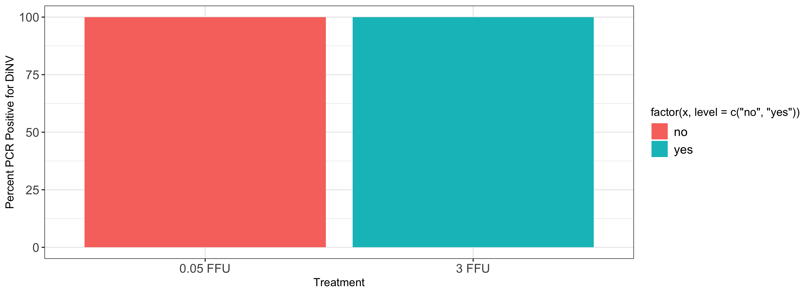
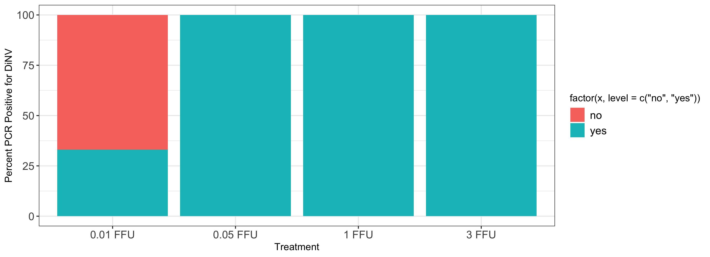
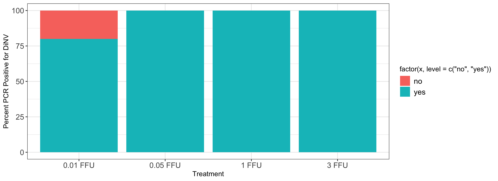
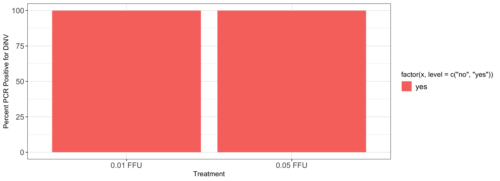
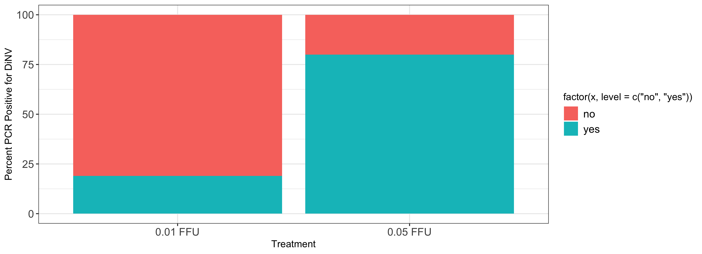
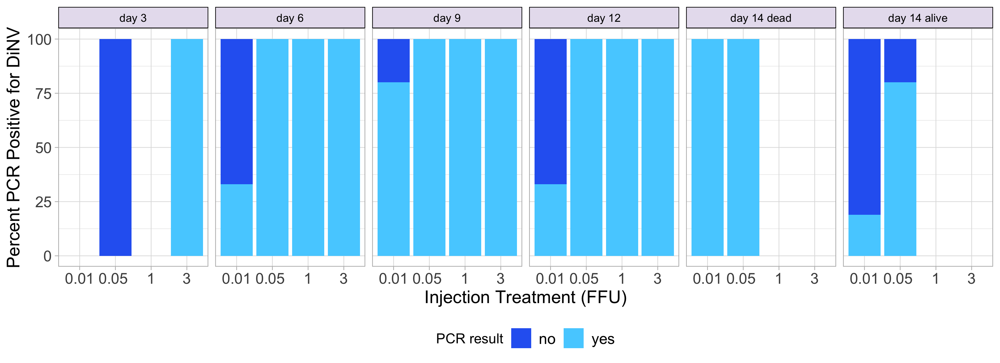

# 20240305-middle-band-PCR-analysis

Load packages needed

``` r
library(ggplot2)
library(tidyr)
library(dplyr)
```


    Attaching package: 'dplyr'

    The following objects are masked from 'package:stats':

        filter, lag

    The following objects are masked from 'package:base':

        intersect, setdiff, setequal, union

``` r
library(plyr)
```

    ------------------------------------------------------------------------------

    You have loaded plyr after dplyr - this is likely to cause problems.
    If you need functions from both plyr and dplyr, please load plyr first, then dplyr:
    library(plyr); library(dplyr)

    ------------------------------------------------------------------------------


    Attaching package: 'plyr'

    The following objects are masked from 'package:dplyr':

        arrange, count, desc, failwith, id, mutate, rename, summarise,
        summarize

Load in dataset

Note, any sample that was negative for both CO1 and TPI was removed from
the data

``` r
PCR_results <- read.csv("/Users/maggieschedl/Desktop/Github/Unckless_Lab_Resources/PCR_analysis/20240305-middle-band-PCR/20240305-middle-band-PCR.csv")

# remove extra columns
PCR_results <- PCR_results[,c(1:7)]
```

Get percentages for each dilution by day

Start with day 3

``` r
# subset dataframe to just the day 3
PCR_results_day3 <- subset(PCR_results, day == "day3")

# subset out different FFUs
# only 3 or 0.05 FFU here 
PCR_results_day3_005 <- subset(PCR_results_day3, treatment == "0.05 FFU")

# how many yes or no PCR results are there for the p47 PCR for the day3 flies  0.05 
# make this into a table 
p47_results_day3_005<- count(PCR_results_day3_005$p47)

# add a column to that table that is the count (column name is freq) divided by the number of rows to get a proportion

p47_results_day3_005$Result_prop <- p47_results_day3_005$freq / nrow(PCR_results_day3_005)

# add a column to that table with the percentage (proportion *100)
p47_results_day3_005$Result_percent <- p47_results_day3_005$Result_prop * 100

# add a column that says treatment
p47_results_day3_005$Treatment <- "0.05 FFU"

#########
# repeat for 3 day 3 
PCR_results_day3_3 <- subset(PCR_results_day3, treatment == "3 FFU")

# how many yes or no PCR PCR results are there for the p47 PCR for the day3 flies 3 
# make this into a table 
p47_results_day3_3<- count(PCR_results_day3_3$p47)

# add a column to that table that is the count (column name is freq) divided by the number of rows to get a proportion

p47_results_day3_3$Result_prop <- p47_results_day3_3$freq / nrow(PCR_results_day3_3)

# add a column to that table with the percentage (proportion *100)
p47_results_day3_3$Result_percent <- p47_results_day3_3$Result_prop * 100

# add a column that says treatment
p47_results_day3_3$Treatment <- "3 FFU"

# combine dfs
percent_table_day3 <- rbind(p47_results_day3_005, p47_results_day3_3)

# create a new column in the df that is a round of the percent column
percent_table_day3$Round_percent <- round(percent_table_day3$Result_percent)


ggplot(percent_table_day3, aes(x =factor(Treatment, level=c("0.05 FFU", "3 FFU")), y = Round_percent,fill =factor(x, level=c('no', 'yes')))) +
    geom_bar(stat = "identity")  + theme_bw() + xlab("Treatment") +
    theme(legend.text=element_text(size=12), axis.text=element_text(size=12)) +
    ylab("Percent PCR Positive for DiNV") 
```



Day 6

``` r
# subset dataframe to just the day 6
PCR_results_day6 <- subset(PCR_results, day == "day6")

# subset out different FFUs
# All treatments here

# start with 0.05 FFU 
PCR_results_day6_005 <- subset(PCR_results_day6, treatment == "0.05 FFU")

# how many yes or no PCR results are there for the p47 PCR for the day6 flies  0.05 
# make this into a table 
p47_results_day6_005<- count(PCR_results_day6_005$p47)

# add a column to that table that is the count (column name is freq) divided by the number of rows to get a proportion

p47_results_day6_005$Result_prop <- p47_results_day6_005$freq / nrow(PCR_results_day6_005)

# add a column to that table with the percentage (proportion *100)
p47_results_day6_005$Result_percent <- p47_results_day6_005$Result_prop * 100

# add a column that says treatment
p47_results_day6_005$Treatment <- "0.05 FFU"

####
# repeat for 0.01 FFU

PCR_results_day6_001 <- subset(PCR_results_day6, treatment == "0.01 FFU")

# how many yes or no PCR results are there for the p47 PCR for the day6 flies  0.01 
# make this into a table 
p47_results_day6_001<- count(PCR_results_day6_001$p47)

# add a column to that table that is the count (column name is freq) divided by the number of rows to get a proportion

p47_results_day6_001$Result_prop <- p47_results_day6_001$freq / nrow(PCR_results_day6_001)

# add a column to that table with the percentage (proportion *100)
p47_results_day6_001$Result_percent <- p47_results_day6_001$Result_prop * 100

# add a column that says treatment
p47_results_day6_001$Treatment <- "0.01 FFU"

#####
# repeat for 1 FFU

PCR_results_day6_1 <- subset(PCR_results_day6, treatment == "1 FFU")

# how many yes or no PCR PCR results are there for the p47 PCR for the day6 flies 1 
# make this into a table 
p47_results_day6_1<- count(PCR_results_day6_1$p47)

# add a column to that table that is the count (column name is freq) divided by the number of rows to get a proportion

p47_results_day6_1$Result_prop <- p47_results_day6_1$freq / nrow(PCR_results_day6_1)

# add a column to that table with the percentage (proportion *100)
p47_results_day6_1$Result_percent <- p47_results_day6_1$Result_prop * 100

# add a column that says treatment
p47_results_day6_1$Treatment <- "1 FFU"


#########
# repeat for 3  
PCR_results_day6_3 <- subset(PCR_results_day6, treatment == "3 FFU")

# how many yes or no PCR PCR results are there for the p47 PCR for the day6 flies 3 
# make this into a table 
p47_results_day6_3<- count(PCR_results_day6_3$p47)

# add a column to that table that is the count (column name is freq) divided by the number of rows to get a proportion

p47_results_day6_3$Result_prop <- p47_results_day6_3$freq / nrow(PCR_results_day6_3)

# add a column to that table with the percentage (proportion *100)
p47_results_day6_3$Result_percent <- p47_results_day6_3$Result_prop * 100

# add a column that says treatment
p47_results_day6_3$Treatment <- "3 FFU"

#########
# combine dfs
percent_table_day6 <- rbind(p47_results_day6_001, p47_results_day6_005, p47_results_day6_1, p47_results_day6_3)

# create a new column in the df that is a round of the percent column
percent_table_day6$Round_percent <- round(percent_table_day6$Result_percent)


ggplot(percent_table_day6, aes(x =factor(Treatment, level=c("0.01 FFU","0.05 FFU", "1 FFU", "3 FFU")), y = Round_percent,fill =factor(x, level=c('no', 'yes')))) +
    geom_bar(stat = "identity")  + theme_bw() + xlab("Treatment") +
    theme(legend.text=element_text(size=12), axis.text=element_text(size=12)) +
    ylab("Percent PCR Positive for DiNV") 
```



Day 9

``` r
# subset dataframe to just the day 9
PCR_results_day9 <- subset(PCR_results, day == "day9")

# subset out different FFUs
# All treatments here

# start with 0.05 FFU 
PCR_results_day9_005 <- subset(PCR_results_day9, treatment == "0.05 FFU")

# how many yes or no PCR results are there for the p47 PCR for the day9 flies  0.05 
# make this into a table 
p47_results_day9_005<- count(PCR_results_day9_005$p47)

# add a column to that table that is the count (column name is freq) divided by the number of rows to get a proportion

p47_results_day9_005$Result_prop <- p47_results_day9_005$freq / nrow(PCR_results_day9_005)

# add a column to that table with the percentage (proportion *100)
p47_results_day9_005$Result_percent <- p47_results_day9_005$Result_prop * 100

# add a column that says treatment
p47_results_day9_005$Treatment <- "0.05 FFU"

####
# repeat for 0.01 FFU

PCR_results_day9_001 <- subset(PCR_results_day9, treatment == "0.01 FFU")

# how many yes or no PCR results are there for the p47 PCR for the day9 flies  0.01 
# make this into a table 
p47_results_day9_001<- count(PCR_results_day9_001$p47)

# add a column to that table that is the count (column name is freq) divided by the number of rows to get a proportion

p47_results_day9_001$Result_prop <- p47_results_day9_001$freq / nrow(PCR_results_day9_001)

# add a column to that table with the percentage (proportion *100)
p47_results_day9_001$Result_percent <- p47_results_day9_001$Result_prop * 100

# add a column that says treatment
p47_results_day9_001$Treatment <- "0.01 FFU"

#####
# repeat for 1 FFU

PCR_results_day9_1 <- subset(PCR_results_day9, treatment == "1 FFU")

# how many yes or no PCR PCR results are there for the p47 PCR for the day9 flies 1 
# make this into a table 
p47_results_day9_1<- count(PCR_results_day9_1$p47)

# add a column to that table that is the count (column name is freq) divided by the number of rows to get a proportion

p47_results_day9_1$Result_prop <- p47_results_day9_1$freq / nrow(PCR_results_day9_1)

# add a column to that table with the percentage (proportion *100)
p47_results_day9_1$Result_percent <- p47_results_day9_1$Result_prop * 100

# add a column that says treatment
p47_results_day9_1$Treatment <- "1 FFU"


#########
# repeat for 3  
PCR_results_day9_3 <- subset(PCR_results_day9, treatment == "3 FFU")

# how many yes or no PCR PCR results are there for the p47 PCR for the day6 flies 3 
# make this into a table 
p47_results_day9_3<- count(PCR_results_day9_3$p47)

# add a column to that table that is the count (column name is freq) divided by the number of rows to get a proportion

p47_results_day9_3$Result_prop <- p47_results_day9_3$freq / nrow(PCR_results_day9_3)

# add a column to that table with the percentage (proportion *100)
p47_results_day9_3$Result_percent <- p47_results_day9_3$Result_prop * 100

# add a column that says treatment
p47_results_day9_3$Treatment <- "3 FFU"

#########
# combine dfs
percent_table_day9 <- rbind(p47_results_day9_001, p47_results_day9_005, p47_results_day9_1, p47_results_day9_3)

# create a new column in the df that is a round of the percent column
percent_table_day9$Round_percent <- round(percent_table_day9$Result_percent)


ggplot(percent_table_day9, aes(x =factor(Treatment, level=c("0.01 FFU","0.05 FFU", "1 FFU", "3 FFU")), y = Round_percent,fill =factor(x, level=c('no', 'yes')))) +
    geom_bar(stat = "identity")  + theme_bw() + xlab("Treatment") +
    theme(legend.text=element_text(size=12), axis.text=element_text(size=12)) +
    ylab("Percent PCR Positive for DiNV") 
```



Day 12

``` r
# subset dataframe to just the day 12
PCR_results_day12 <- subset(PCR_results, day == "day12")

# subset out different FFUs
# All treatments here

# start with 0.05 FFU 
PCR_results_day12_005 <- subset(PCR_results_day12, treatment == "0.05 FFU")

# how many yes or no PCR results are there for the p47 PCR for the day12 flies  0.05 
# make this into a table 
p47_results_day12_005<- count(PCR_results_day12_005$p47)

# add a column to that table that is the count (column name is freq) divided by the number of rows to get a proportion

p47_results_day12_005$Result_prop <- p47_results_day12_005$freq / nrow(PCR_results_day12_005)

# add a column to that table with the percentage (proportion *100)
p47_results_day12_005$Result_percent <- p47_results_day12_005$Result_prop * 100

# add a column that says treatment
p47_results_day12_005$Treatment <- "0.05 FFU"

####
# repeat for 0.01 FFU

PCR_results_day12_001 <- subset(PCR_results_day6, treatment == "0.01 FFU")

# how many yes or no PCR results are there for the p47 PCR for the day6 flies  0.01 
# make this into a table 
p47_results_day12_001<- count(PCR_results_day12_001$p47)

# add a column to that table that is the count (column name is freq) divided by the number of rows to get a proportion

p47_results_day12_001$Result_prop <- p47_results_day12_001$freq / nrow(PCR_results_day12_001)

# add a column to that table with the percentage (proportion *100)
p47_results_day12_001$Result_percent <- p47_results_day12_001$Result_prop * 100

# add a column that says treatment
p47_results_day12_001$Treatment <- "0.01 FFU"

#####
# repeat for 1 FFU

PCR_results_day12_1 <- subset(PCR_results_day12, treatment == "1 FFU")

# how many yes or no PCR PCR results are there for the p47 PCR for the day12 flies 1 
# make this into a table 
p47_results_day12_1<- count(PCR_results_day12_1$p47)

# add a column to that table that is the count (column name is freq) divided by the number of rows to get a proportion

p47_results_day12_1$Result_prop <- p47_results_day12_1$freq / nrow(PCR_results_day12_1)

# add a column to that table with the percentage (proportion *100)
p47_results_day12_1$Result_percent <- p47_results_day12_1$Result_prop * 100

# add a column that says treatment
p47_results_day12_1$Treatment <- "1 FFU"


#########
# repeat for 3  
PCR_results_day12_3 <- subset(PCR_results_day12, treatment == "3 FFU")

# how many yes or no PCR PCR results are there for the p47 PCR for the day12 flies 3 
# make this into a table 
p47_results_day12_3<- count(PCR_results_day12_3$p47)

# add a column to that table that is the count (column name is freq) divided by the number of rows to get a proportion

p47_results_day12_3$Result_prop <- p47_results_day12_3$freq / nrow(PCR_results_day12_3)

# add a column to that table with the percentage (proportion *100)
p47_results_day12_3$Result_percent <- p47_results_day12_3$Result_prop * 100

# add a column that says treatment
p47_results_day12_3$Treatment <- "3 FFU"

#########
# combine dfs
percent_table_day12 <- rbind(p47_results_day12_001, p47_results_day12_005, p47_results_day12_1, p47_results_day12_3)

# create a new column in the df that is a round of the percent column
percent_table_day12$Round_percent <- round(percent_table_day12$Result_percent)


ggplot(percent_table_day12, aes(x =factor(Treatment, level=c("0.01 FFU","0.05 FFU", "1 FFU", "3 FFU")), y = Round_percent,fill =factor(x, level=c('no', 'yes')))) +
    geom_bar(stat = "identity")  + theme_bw() + xlab("Treatment") +
    theme(legend.text=element_text(size=12), axis.text=element_text(size=12)) +
    ylab("Percent PCR Positive for DiNV") 
```


Day 14 dead

``` r
# subset dataframe to just the day 14
PCR_results_day14 <- subset(PCR_results, day == "day14")

# separate out who was dead 
PCR_results_day14d <- subset(PCR_results_day14, dead == "yes")

# subset out different FFUs
# only 0.01 and 0.05

# start with 0.05 FFU 
PCR_results_day14d_005 <- subset(PCR_results_day14d, treatment == "0.05 FFU")

# how many yes or no PCR results are there for the p47 PCR for the day14d flies  0.05 
# make this into a table 
p47_results_day14d_005<- count(PCR_results_day14d_005$p47)

# add a column to that table that is the count (column name is freq) divided by the number of rows to get a proportion

p47_results_day14d_005$Result_prop <- p47_results_day14d_005$freq / nrow(PCR_results_day14d_005)

# add a column to that table with the percentage (proportion *100)
p47_results_day14d_005$Result_percent <- p47_results_day14d_005$Result_prop * 100

# add a column that says treatment
p47_results_day14d_005$Treatment <- "0.05 FFU"

####
# repeat for 0.01 FFU

PCR_results_day14d_001 <- subset(PCR_results_day14d, treatment == "0.01 FFU")

# how many yes or no PCR results are there for the p47 PCR for the day14d flies  0.01 
# make this into a table 
p47_results_day14d_001<- count(PCR_results_day14d_001$p47)

# add a column to that table that is the count (column name is freq) divided by the number of rows to get a proportion

p47_results_day14d_001$Result_prop <- p47_results_day14d_001$freq / nrow(PCR_results_day14d_001)

# add a column to that table with the percentage (proportion *100)
p47_results_day14d_001$Result_percent <- p47_results_day14d_001$Result_prop * 100

# add a column that says treatment
p47_results_day14d_001$Treatment <- "0.01 FFU"


#########
# combine dfs
percent_table_day14d <- rbind(p47_results_day14d_001, p47_results_day14d_005)

# create a new column in the df that is a round of the percent column
percent_table_day14d$Round_percent <- round(percent_table_day14d$Result_percent)


ggplot(percent_table_day14d, aes(x =factor(Treatment, level=c("0.01 FFU","0.05 FFU")), y = Round_percent,fill =factor(x, level=c('no', 'yes')))) +
    geom_bar(stat = "identity")  + theme_bw() + xlab("Treatment") +
    theme(legend.text=element_text(size=12), axis.text=element_text(size=12)) +
    ylab("Percent PCR Positive for DiNV") 
```



Day 14 alive

``` r
# separate out who was alive day 14 
PCR_results_day14a <- subset(PCR_results_day14, dead == "no")

# subset out different FFUs
# only 0.01 and 0.05

# start with 0.05 FFU 
PCR_results_day14a_005 <- subset(PCR_results_day14a, treatment == "0.05 FFU")

# how many yes or no PCR results are there for the p47 PCR for the day14a flies  0.05 
# make this into a table 
p47_results_day14a_005<- count(PCR_results_day14a_005$p47)

# add a column to that table that is the count (column name is freq) divided by the number of rows to get a proportion

p47_results_day14a_005$Result_prop <- p47_results_day14a_005$freq / nrow(PCR_results_day14a_005)

# add a column to that table with the percentage (proportion *100)
p47_results_day14a_005$Result_percent <- p47_results_day14a_005$Result_prop * 100

# add a column that says treatment
p47_results_day14a_005$Treatment <- "0.05 FFU"

####
# repeat for 0.01 FFU

PCR_results_day14a_001 <- subset(PCR_results_day14a, treatment == "0.01 FFU")

# how many yes or no PCR results are there for the p47 PCR for the day14d flies  0.01 
# make this into a table 
p47_results_day14a_001<- count(PCR_results_day14a_001$p47)

# add a column to that table that is the count (column name is freq) divided by the number of rows to get a proportion

p47_results_day14a_001$Result_prop <- p47_results_day14a_001$freq / nrow(PCR_results_day14a_001)

# add a column to that table with the percentage (proportion *100)
p47_results_day14a_001$Result_percent <- p47_results_day14a_001$Result_prop * 100

# add a column that says treatment
p47_results_day14a_001$Treatment <- "0.01 FFU"


#########
# combine dfs
percent_table_day14a <- rbind(p47_results_day14a_001, p47_results_day14a_005)

# create a new column in the df that is a round of the percent column
percent_table_day14a$Round_percent <- round(percent_table_day14a$Result_percent)


ggplot(percent_table_day14a, aes(x =factor(Treatment, level=c("0.01 FFU","0.05 FFU")), y = Round_percent,fill =factor(x, level=c('no', 'yes')))) +
    geom_bar(stat = "identity")  + theme_bw() + xlab("Treatment") +
    theme(legend.text=element_text(size=12), axis.text=element_text(size=12)) +
    ylab("Percent PCR Positive for DiNV") 
```



Combine each day into 1 dataset and plot

``` r
# first need to add the day to each of the datasets 

percent_table_day14d$day <- "day 14 dead"
percent_table_day14a$day <- "day 14 alive"
percent_table_day12$day <- "day 12"
percent_table_day9$day <- "day 9"
percent_table_day6$day <- "day 6"
percent_table_day3$day <- "day 3"

# combine tables 
percent_tables <- rbind(percent_table_day3, percent_table_day6, percent_table_day9, percent_table_day12, percent_table_day14a, percent_table_day14d)

# order the days 
percent_tables$day= factor(percent_tables$day, levels=c('day 3','day 6','day 9','day 12', "day 14 dead", "day 14 alive"))

# make a ledgend title
legend_title <- "PCR result"

ggplot(percent_tables, aes(x =factor(Treatment, level=c("0.01 FFU" ,"0.05 FFU", "1 FFU", "3 FFU")), y = Round_percent,fill =factor(x, level=c('no', 'yes')))) +
    geom_bar(stat = "identity")  + theme_light() + xlab("Injection Treatment (FFU)") +
    theme(legend.text=element_text(size=12), axis.text=element_text(size=12), legend.position = "bottom", axis.title=element_text(size=14), strip.background=element_rect(colour="black",fill="#E7E1EF"), strip.text = element_text(colour = 'black')) + 
    scale_fill_manual(values = c( "#2C67F2", "#55d0ff"), legend_title ) + 
    ylab("Percent PCR Positive for DiNV") + scale_x_discrete(labels=c("0.01 FFU" = "0.01", "0.05 FFU" = "0.05 ", "1 FFU" = "1", "3 FFU" = "3")) + facet_grid(~day)
```


