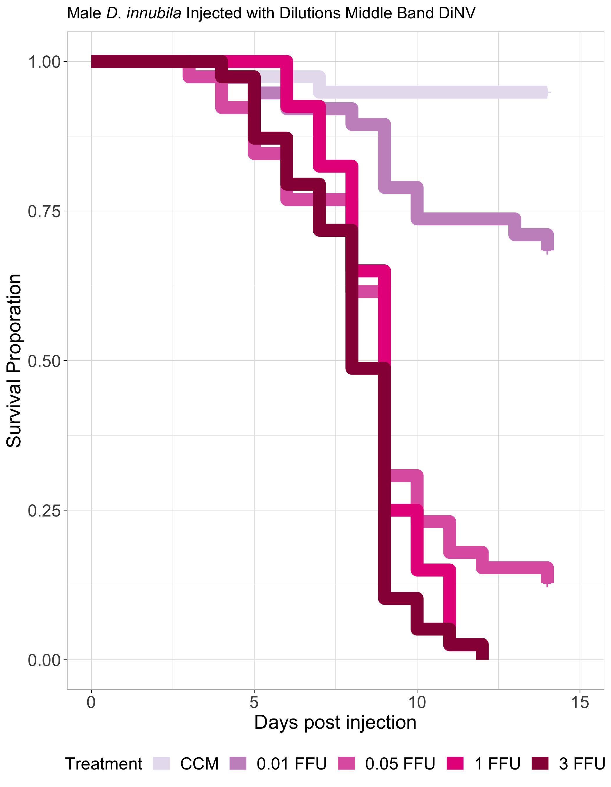
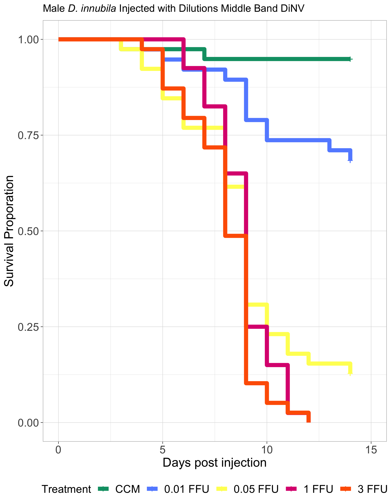

# 20230305-combo-middle-band-dilution-males

Load in packages needed for the analysis

``` r
library("survival")
library("survminer")
```

    Loading required package: ggplot2

    Loading required package: ggpubr


    Attaching package: 'survminer'

    The following object is masked from 'package:survival':

        myeloma

``` r
library(dplyr)
```


    Attaching package: 'dplyr'

    The following objects are masked from 'package:stats':

        filter, lag

    The following objects are masked from 'package:base':

        intersect, setdiff, setequal, union

``` r
library(tidyr)
library(stringr)
```

### Loop to convert the example data.frame ‘df’ into properly formatted data.frame ‘results’

``` r
#write a function to transform a data.frame that has the column format 'vial | treatment | D0 | D1 | D2...', with one row for each vial
#into a long version in tidy format that can be input to make a survivorship curve
convert_df<-function(df){
  #open empty data.frame to store results
  results<-data.frame(vial=character(),treatment=character(),dead=numeric(),status=numeric())
  #This loop will index out each row (one row per vial) one at a time, transform it into long format (one row per fly), and add the information to the empty data.frame called results
  for(i in 1:nrow(df)){
  #isolate the row (vial) you want to work on
  temp<-df[i,]
    #iteratively isolate each day for this vial (day 0 must be column 3, day 1 column 4, etc.). Loop stops the column before the last day
    for(j in 3:(ncol(temp)-1)){
      #assign the number of flies that died in the vial on that day (starting with day 1) to the variable 'z'
      z<-temp[1,j]-temp[1,j+1]
        #if >0 flies died add this information to the results dataframe
        if(z>0){
          #iterate over 1 through total number of dead flies
          for(k in 1:z){
            #add a new row to the 'results' data.frame for the given dead fly, specifying vial #, treatment, day died, and
            #record the current vial #
            vial<-temp[,1]
            #record the genotype of the current vial
            treatment<-temp[,2]
            #record the death date of the flies that died on this day (assumes that your input DF starts with day 0 in column 3)
            dd<-j-2
            #append this information into a new row in the 'results' data.frame, and add a '1' in the 4th column to indicate mortality
            results[nrow(results)+1,]<- c(vial,treatment,dd,1)
          } #close for loop
        } #close if loop
    } #close for loop
  
  #now assign the number of flies remaining in the vial on the last day (value in the last column of the row) to the variable 'z'
  z<-temp[1,j+1]
    #if there are any flies alive in the vial on the last day
    if(z>0){
      #iterate over 1:(number of flies alive on the last day)
      for(l in 1:z){
        #record the current vial #
        vial<-temp[,1]
        #record the genotype of the current vial
        treatment<-temp[,2]
        #record the last day we recorded this fly alive (assumes that your input DF starts with day 0 in column 3)
        dd<-j-2
        #append this information into a new row in the 'results' data.frame, and add a '0' in the 4th column to indicate that the fly made it to the end of the experiment
        results[nrow(results)+1,]<- c(vial,treatment,dd,0)
      } #close for loop
    } #close if loop
  } #close original for loop
results$dead<-as.numeric(results$dead)  #reiterate that this column must be class numeric
results$status<-as.numeric(results$status)  #reiterate that this column must be class numeric
results$vial <- as.factor(results$vial) # make sure vial is considered a factor
# gives you only the results dataframe as output from function 
return(results) 
} #close function
```

Read in raw data

**Note that for these datasets, the adjusted N number is the number of
flies alive on day 2 because there seemed to be more early death in
these experiments than usual**

``` r
#read the file from csv
df<-read.csv("/Users/maggieschedl/Desktop/Github/Unckless_Lab_Resources/Infection_survival_analyses/20240305-middle-band-dilution-male-combo/middle-band-dilution-male-combo.csv")

# separate out columns needed
df <- df[,c(1,9,15:29)]
```

Convert dataframe

``` r
df.convert<-convert_df(df)
```

Plot survivial curve with every line separate, yes this is a mess

``` r
# order treatments 
df.convert <- df.convert %>% 
  mutate(treatment = factor(treatment, levels = c("CCM", "0.01 FFU", "0.05 FFU", "1 FFU", "3 FFU")))

# change to not have confidence intervals in this one so you can see them 
df_fit<- survfit(Surv(dead, status) ~ treatment, data=df.convert)
ggsurvplot(df_fit, size = 5,
          pval = FALSE, conf.int = FALSE,
          legend = "bottom",
          font.tickslab = c(14),
          font.x = c(16),
          font.y = c(16),
          ggtheme = theme_light(),
          title = expression(paste("Male",italic(" D. innubila "), "Injected with Dilutions Middle Band DiNV")),
          legend.title="Treatment",
          legend.labs=c("CCM", "0.01 FFU", "0.05 FFU", "1 FFU", "3 FFU"),
          font.legend = c(14),
          palette = c("#E7E1EF", "#C994C7","#DF65B0","#E7298A","#980043")) + ylab("Survival Proporation") + xlab("Days post injection")
```



Median survival time

``` r
surv_median(df_fit, combine = FALSE)
```

    Warning: `select_()` was deprecated in dplyr 0.7.0.
    ℹ Please use `select()` instead.
    ℹ The deprecated feature was likely used in the survminer package.
      Please report the issue at <https://github.com/kassambara/survminer/issues>.

                  strata median lower upper
    1      treatment=CCM     NA    NA    NA
    2 treatment=0.01 FFU     NA    NA    NA
    3 treatment=0.05 FFU      9     8     9
    4    treatment=1 FFU      9     9     9
    5    treatment=3 FFU      8     8     9

Model looking at significance of block and treatment

``` r
# add in block 
df.convert$Block <- rep(c("A","B"), c(96, 99))
# model including block 
df2_fit<- coxph(Surv(dead, status) ~ treatment + Block, data=df.convert)
summary(df2_fit)
```

    Call:
    coxph(formula = Surv(dead, status) ~ treatment + Block, data = df.convert)

      n= 195, number of events= 127 

                         coef exp(coef) se(coef)      z Pr(>|z|)    
    treatment0.01 FFU  1.9866    7.2907   0.7639  2.601   0.0093 ** 
    treatment0.05 FFU  3.7495   42.4982   0.7309  5.130 2.90e-07 ***
    treatment1 FFU     4.0380   56.7106   0.7332  5.507 3.65e-08 ***
    treatment3 FFU     4.3818   79.9826   0.7355  5.957 2.56e-09 ***
    BlockB            -0.1075    0.8981   0.1779 -0.604   0.5458    
    ---
    Signif. codes:  0 '***' 0.001 '**' 0.01 '*' 0.05 '.' 0.1 ' ' 1

                      exp(coef) exp(-coef) lower .95 upper .95
    treatment0.01 FFU    7.2907    0.13716    1.6315    32.581
    treatment0.05 FFU   42.4982    0.02353   10.1438   178.049
    treatment1 FFU      56.7106    0.01763   13.4753   238.665
    treatment3 FFU      79.9826    0.01250   18.9192   338.134
    BlockB               0.8981    1.11344    0.6338     1.273

    Concordance= 0.772  (se = 0.025 )
    Likelihood ratio test= 149.3  on 5 df,   p=<2e-16
    Wald test            = 74.28  on 5 df,   p=1e-14
    Score (logrank) test = 132.4  on 5 df,   p=<2e-16

Look at model using dilution as a continuous variable

``` r
# make dilution as a numeric/continuous variable
# make a duplicate column 
df.convert$numeric.dilution <- df.convert$treatment
# set CCM to a dose of 0
df.convert$numeric.dilution <- str_replace_all(df.convert$numeric.dilution, 'CCM', '0')
# remove FFU and make numeric
df.convert$numeric.dilution <- as.numeric(gsub("FFU", "", df.convert$numeric.dilution))

# model including block 
df3_fit<- coxph(Surv(dead, status) ~ numeric.dilution + Block, data=df.convert)
summary(df3_fit)
```

    Call:
    coxph(formula = Surv(dead, status) ~ numeric.dilution + Block, 
        data = df.convert)

      n= 195, number of events= 127 

                         coef exp(coef) se(coef)      z Pr(>|z|)    
    numeric.dilution  0.57628   1.77941  0.07021  8.208 2.24e-16 ***
    BlockB           -0.16420   0.84858  0.17763 -0.924    0.355    
    ---
    Signif. codes:  0 '***' 0.001 '**' 0.01 '*' 0.05 '.' 0.1 ' ' 1

                     exp(coef) exp(-coef) lower .95 upper .95
    numeric.dilution    1.7794      0.562    1.5507     2.042
    BlockB              0.8486      1.178    0.5991     1.202

    Concordance= 0.738  (se = 0.025 )
    Likelihood ratio test= 59.79  on 2 df,   p=1e-13
    Wald test            = 67.89  on 2 df,   p=2e-15
    Score (logrank) test = 79.17  on 2 df,   p=<2e-16

Comparing specific dilutions with each other

Compare 1 and 3 FFU

``` r
df.convert_13 <- df.convert[which(df.convert$numeric.dilution != 0),]
df.convert_13 <- df.convert_13[which(df.convert_13$numeric.dilution != 0.01),]
df.convert_13 <- df.convert_13[which(df.convert_13$numeric.dilution != 0.05),]

df4_fit<- coxph(Surv(dead, status) ~ numeric.dilution + Block, data=df.convert_13)
summary(df4_fit)
```

    Call:
    coxph(formula = Surv(dead, status) ~ numeric.dilution + Block, 
        data = df.convert_13)

      n= 79, number of events= 79 

                        coef exp(coef) se(coef)      z Pr(>|z|)  
    numeric.dilution  0.1935    1.2135   0.1138  1.700   0.0891 .
    BlockB           -0.1070    0.8985   0.2256 -0.474   0.6353  
    ---
    Signif. codes:  0 '***' 0.001 '**' 0.01 '*' 0.05 '.' 0.1 ' ' 1

                     exp(coef) exp(-coef) lower .95 upper .95
    numeric.dilution    1.2135     0.8241    0.9709     1.517
    BlockB              0.8985     1.1129    0.5774     1.398

    Concordance= 0.595  (se = 0.046 )
    Likelihood ratio test= 3.01  on 2 df,   p=0.2
    Wald test            = 3.03  on 2 df,   p=0.2
    Score (logrank) test = 3.06  on 2 df,   p=0.2

Compare 1 and 0.05 FFU

``` r
df.convert_105 <- df.convert[which(df.convert$numeric.dilution != 0),]
df.convert_105 <- df.convert_105[which(df.convert_105$numeric.dilution != 3),]
df.convert_105 <- df.convert_105[which(df.convert_105$numeric.dilution != 0.01),]

df5_fit<- coxph(Surv(dead, status) ~ numeric.dilution + Block, data=df.convert_105)
summary(df5_fit)
```

    Call:
    coxph(formula = Surv(dead, status) ~ numeric.dilution + Block, 
        data = df.convert_105)

      n= 79, number of events= 74 

                       coef exp(coef) se(coef)     z Pr(>|z|)
    numeric.dilution 0.3162    1.3719   0.2529 1.250    0.211
    BlockB           0.0292    1.0296   0.2329 0.125    0.900

                     exp(coef) exp(-coef) lower .95 upper .95
    numeric.dilution     1.372     0.7289    0.8357     2.252
    BlockB               1.030     0.9712    0.6523     1.625

    Concordance= 0.506  (se = 0.044 )
    Likelihood ratio test= 1.6  on 2 df,   p=0.4
    Wald test            = 1.59  on 2 df,   p=0.5
    Score (logrank) test = 1.6  on 2 df,   p=0.4

Compare 0.01 and 0.05 FFU

``` r
df.convert_0105 <- df.convert[which(df.convert$numeric.dilution != 0),]
df.convert_0105 <- df.convert_0105[which(df.convert_0105$numeric.dilution != 3),]
df.convert_0105 <- df.convert_0105[which(df.convert_0105$numeric.dilution != 1),]

df6_fit<- coxph(Surv(dead, status) ~ numeric.dilution + Block, data=df.convert_0105)
summary(df6_fit)
```

    Call:
    coxph(formula = Surv(dead, status) ~ numeric.dilution + Block, 
        data = df.convert_0105)

      n= 77, number of events= 46 

                           coef  exp(coef)   se(coef)      z Pr(>|z|)    
    numeric.dilution  4.067e+01  4.586e+17  8.591e+00  4.733 2.21e-06 ***
    BlockB           -4.751e-02  9.536e-01  2.958e-01 -0.161    0.872    
    ---
    Signif. codes:  0 '***' 0.001 '**' 0.01 '*' 0.05 '.' 0.1 ' ' 1

                     exp(coef) exp(-coef) lower .95 upper .95
    numeric.dilution 4.586e+17  2.180e-18 2.231e+10 9.429e+24
    BlockB           9.536e-01  1.049e+00 5.341e-01 1.703e+00

    Concordance= 0.693  (se = 0.038 )
    Likelihood ratio test= 26.44  on 2 df,   p=2e-06
    Wald test            = 22.55  on 2 df,   p=1e-05
    Score (logrank) test = 27.21  on 2 df,   p=1e-06

Compare 0.01 and 0 FFU

``` r
df.convert_010 <- df.convert[which(df.convert$numeric.dilution != 0.05),]
df.convert_010 <- df.convert_010[which(df.convert_010$numeric.dilution != 3),]
df.convert_010 <- df.convert_010[which(df.convert_010$numeric.dilution != 1),]

df7_fit<- coxph(Surv(dead, status) ~ numeric.dilution + Block, data=df.convert_010)
summary(df7_fit)
```

    Call:
    coxph(formula = Surv(dead, status) ~ numeric.dilution + Block, 
        data = df.convert_010)

      n= 77, number of events= 14 

                           coef  exp(coef)   se(coef)      z Pr(>|z|)  
    numeric.dilution  1.917e+02  1.740e+83  7.643e+01  2.508   0.0121 *
    BlockB           -6.851e-01  5.041e-01  5.579e-01 -1.228   0.2195  
    ---
    Signif. codes:  0 '***' 0.001 '**' 0.01 '*' 0.05 '.' 0.1 ' ' 1

                     exp(coef) exp(-coef) lower .95  upper .95
    numeric.dilution 1.740e+83  5.748e-84 1.538e+18 1.967e+148
    BlockB           5.041e-01  1.984e+00 1.689e-01  1.504e+00

    Concordance= 0.738  (se = 0.055 )
    Likelihood ratio test= 10.88  on 2 df,   p=0.004
    Wald test            = 7.85  on 2 df,   p=0.02
    Score (logrank) test = 10.11  on 2 df,   p=0.006

Change color palette and lines for paper

``` r
df_fit<- survfit(Surv(dead, status) ~ treatment, data=df.convert)
ggsurvplot(df_fit, size = 2.5,
          pval = FALSE, conf.int = FALSE,
          legend = "bottom",
          font.tickslab = c(14),
          font.x = c(16),
          font.y = c(16),
          ggtheme = theme_light(),
          title = expression(paste("Male",italic(" D. innubila "), "Injected with Dilutions Middle Band DiNV")),
          legend.title="Treatment",
          legend.labs=c("CCM", "0.01 FFU", "0.05 FFU", "1 FFU", "3 FFU"),
          font.legend = c(14),
          palette = c("#009E73", "#648FFF","#FEFE62","#DC267F","#FE6100")) + ylab("Survival Proporation") + xlab("Days post injection")
```


