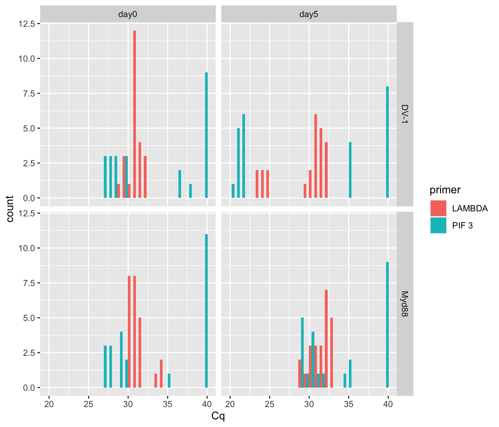
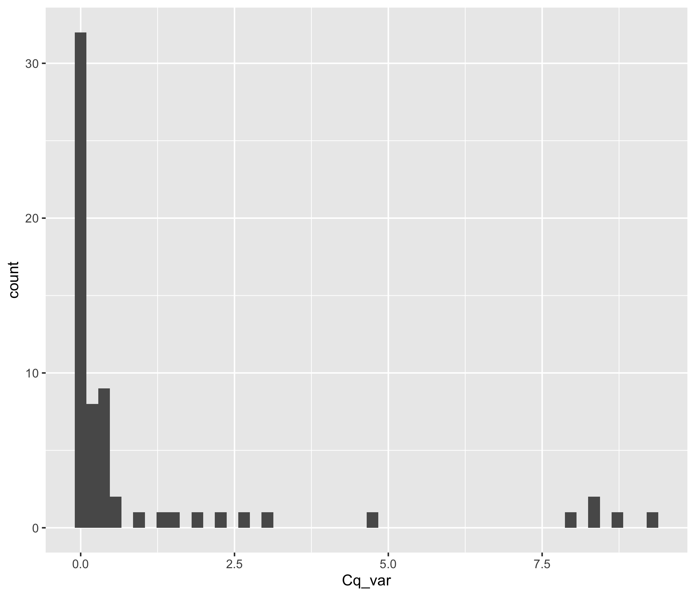
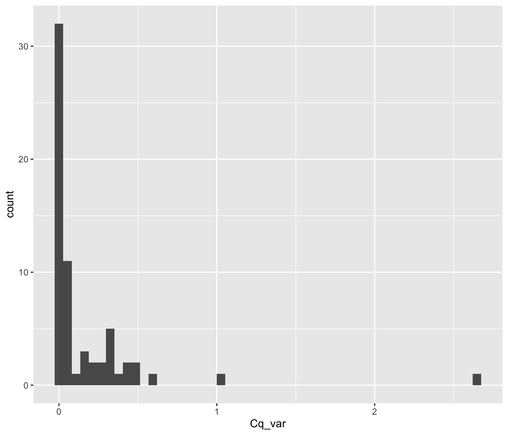
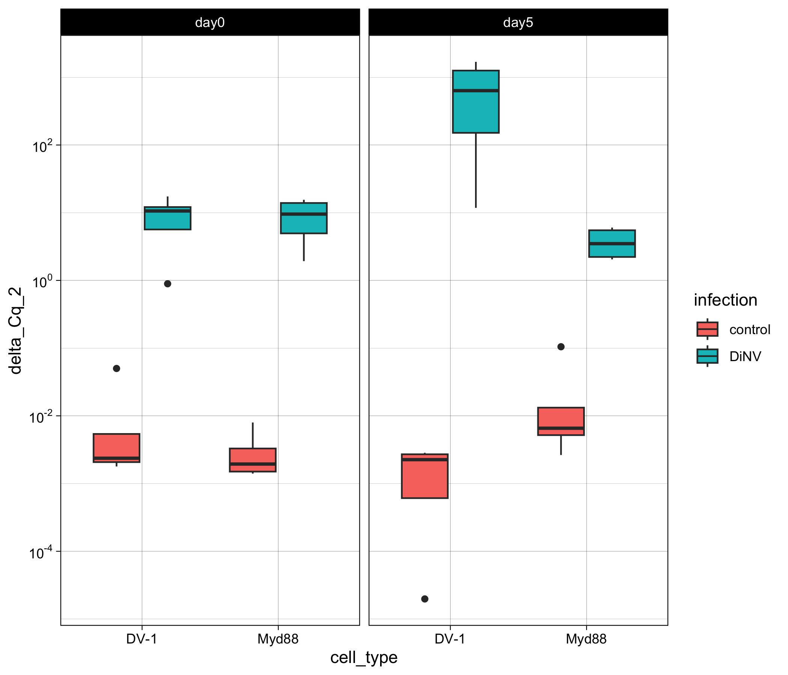
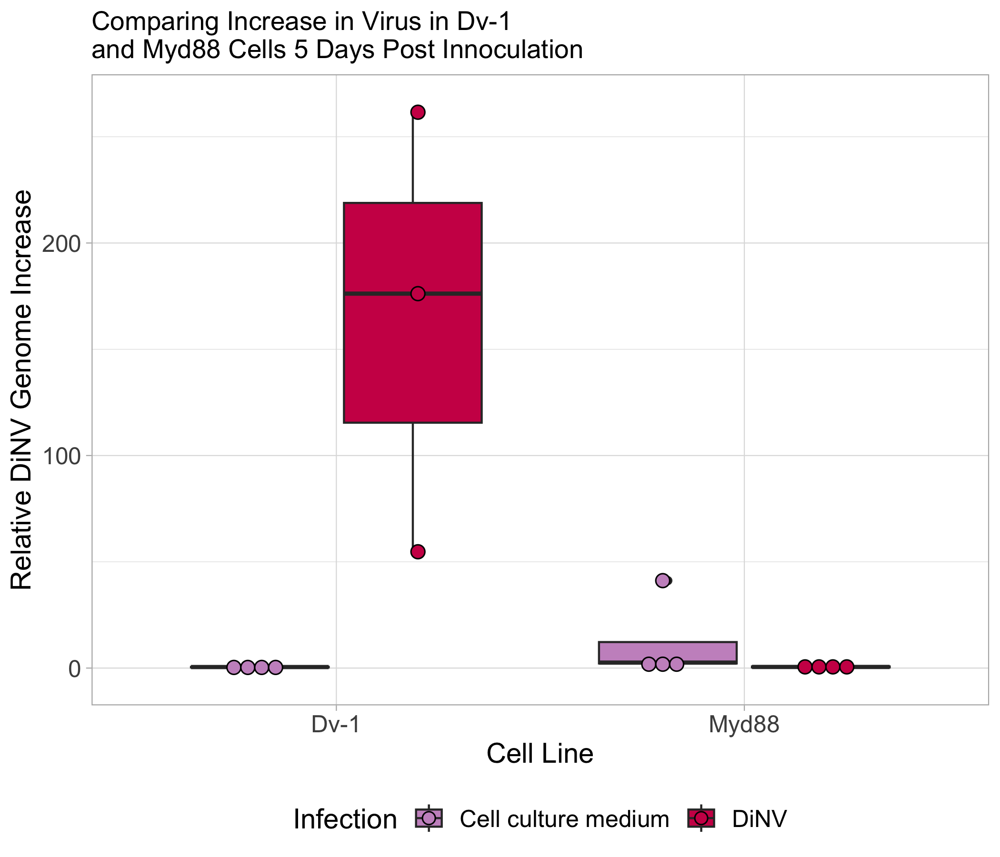
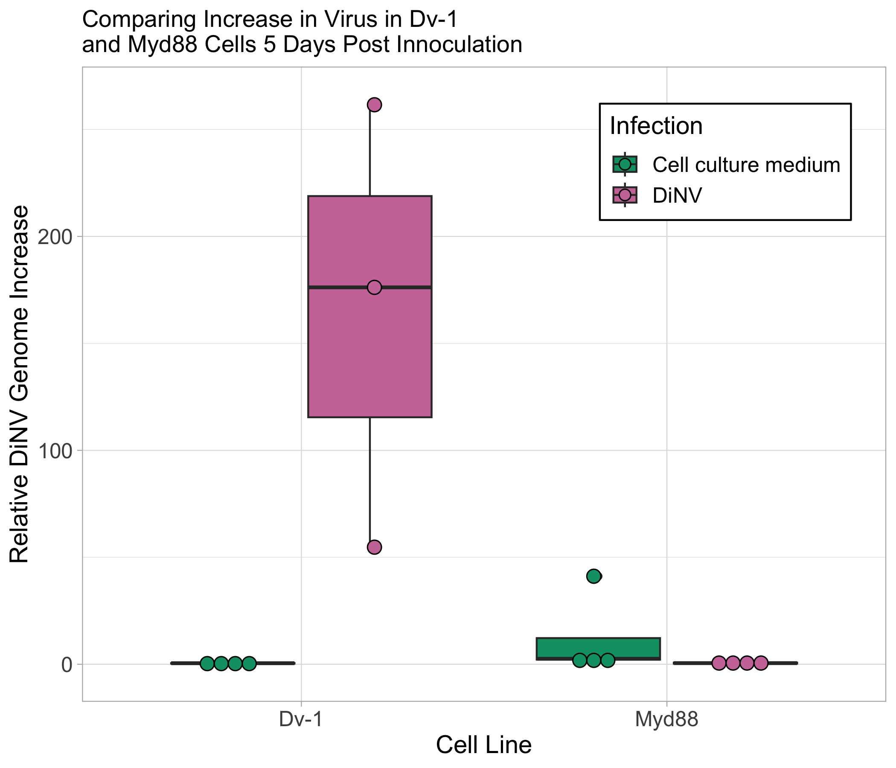

# 20240324-Dv1-Mdy88-qPCR

``` r
library(ggplot2)
library(dplyr)
```


    Attaching package: 'dplyr'

    The following objects are masked from 'package:stats':

        filter, lag

    The following objects are masked from 'package:base':

        intersect, setdiff, setequal, union

``` r
library(tidyr)
library(scales)
library(Rmisc)
```

    Loading required package: lattice

    Loading required package: plyr

    ------------------------------------------------------------------------------

    You have loaded plyr after dplyr - this is likely to cause problems.
    If you need functions from both plyr and dplyr, please load plyr first, then dplyr:
    library(plyr); library(dplyr)

    ------------------------------------------------------------------------------


    Attaching package: 'plyr'

    The following objects are masked from 'package:dplyr':

        arrange, count, desc, failwith, id, mutate, rename, summarise,
        summarize

``` r
library(rstatix)
```


    Attaching package: 'rstatix'

    The following objects are masked from 'package:plyr':

        desc, mutate

    The following object is masked from 'package:stats':

        filter

``` r
library(AICcmodavg)
```

Load in dataset

``` r
Cq_values <- read.csv("/Users/maggieschedl/Desktop/Github/Unckless_Lab_Resources/qPCR_analysis/20240324-Dv1-Myd88-qPCR/20240324-myd88-Dv1-qPCR.csv")
```

Look at raw Cq values

``` r
ggplot(Cq_values, aes(x= Cq, fill = primer)) + geom_histogram(position = "dodge") + facet_grid(~cell_type ~day) 
```

    `stat_bin()` using `bins = 30`. Pick better value with `binwidth`.



Calculate variance and mean of Cq value between the technical replicates

``` r
# use the variance function, and calculates the variance in Cq by the unique.name (each sample/primer has 3 Cq values to 
# calculate the variance by)
Cq_values$Cq_var <- ave(Cq_values$Cq, Cq_values$unique_name, FUN=var)

# use the mean function, and calculates the mean of Cq values by the unique.name (each sample/primer has 3 Cq values to 
# calculate the mean by)
Cq_values$Cq_mean <- ave(Cq_values$Cq, Cq_values$unique_name, FUN=mean)

# Keep all rows where the replicate is 1 (or you could do 2 or 3)
# make into new Df so we keep the original with all the Cq values
Cq_values_1rep <- Cq_values[which(Cq_values$replicate == "1"),]

# histogram of all variances
ggplot(Cq_values_1rep, aes(x=Cq_var)) + geom_histogram(bins = 50)
```



``` r
# I think some of these are really high because for the  cell control PIF3 some are 40 and some are 35, which will really mess this up 
# start trying to remove some of the problematic Cq values where 1 is different than the other two 
# first order df by the Cq variance 
ordered <- Cq_values[order(Cq_values$Cq_var, decreasing = TRUE),]
head(ordered)
```

       well sample replicate primer cell_type infection  day   unique_name    Cq
    25  C01      9         1  PIF 3      DV-1   control day5 Dv-pif-cc-5-1 40.00
    26  C02      9         2  PIF 3      DV-1   control day5 Dv-pif-cc-5-1 34.72
    27  C03      9         3  PIF 3      DV-1   control day5 Dv-pif-cc-5-1 40.00
    28  C04     10         1  PIF 3      DV-1   control day5 Dv-pif-cc-5-2 40.00
    29  C05     10         2  PIF 3      DV-1   control day5 Dv-pif-cc-5-2 40.00
    30  C06     10         3  PIF 3      DV-1   control day5 Dv-pif-cc-5-2 34.88
         Cq_var  Cq_mean
    25 9.292800 38.24000
    26 9.292800 38.24000
    27 9.292800 38.24000
    28 8.738133 38.29333
    29 8.738133 38.29333
    30 8.738133 38.29333

``` r
# change rownames
rownames(ordered) <- NULL
# what rows have a Cq value that is very different than the other 2 replicates 
# row 2, 6, 8, 10, 15, 17, 20, 25, 30, 31, 36
# try to remove those rows with negative indexing 
ordered_2 <- ordered[-c(2, 6, 8, 10, 15, 17, 20, 25, 30, 31, 36), ]
# I think this worked 
# now to re-do the variance and the means 
ordered_2$Cq_var <- ave(ordered_2$Cq, ordered_2$unique_name, FUN=var)
ordered_2$Cq_mean <- ave(ordered_2$Cq, ordered_2$unique_name, FUN=mean)
# this seems to have worked good 
# now I need to keep only 1 replicate row 
# remove "duplicated" rows based on the unique_name column: each technical replicate should have the same unique_name
Cq_values_var_1rep <- ordered_2[!duplicated(ordered_2$unique_name), ]
# re-look at histogram of variances
# there will probably be a few high ones because for some samples there was not an obvious 1 Cq value different than the others 
ggplot(Cq_values_var_1rep, aes(x=Cq_var)) + geom_histogram(bins = 50)
```



``` r
# at this point I am ok with that 1 high variance 


### old stuff not used 
# what if I looked at these without cell control pif3 
#rownames(Cq_values_1rep) <- NULL
#Cq_values_1rep_no_cc0 <- Cq_values_1rep[c(16:64),]

# histogram of variances now 
#ggplot(Cq_values_1rep_no_cc0, aes(x=Cq_var)) + geom_histogram(bins = 50)
```

Calculating Delta Cqs between Lambda and PIF3

``` r
# samples are not ordered properly
# they need to be ordered with the two primer samples next to each other for each sample 
# order them by the sample
Cq_values_var_1rep <- Cq_values_var_1rep[order(Cq_values_var_1rep$sample),]
Cq_values_var_1rep
```

        well sample replicate primer cell_type infection  day    unique_name    Cq
    115  A01      1         1 LAMBDA      DV-1   control day0  Dv-lam-cc-0-1 31.44
    169  A01      1         1  PIF 3      DV-1   control day0  Dv-pif-cc-0-1 40.00
    133  A04      2         1 LAMBDA      DV-1   control day0  Dv-lam-cc-0-2 31.00
    172  A04      2         1  PIF 3      DV-1   control day0  Dv-pif-cc-0-2 40.00
    34   A07      3         1  PIF 3      DV-1   control day0  Dv-pif-cc-0-3 40.00
    37   A07      3         1 LAMBDA      DV-1   control day0  Dv-lam-cc-0-3 31.29
    16   A10      4         1  PIF 3      DV-1   control day0  Dv-pif-cc-0-4 36.28
    70   A10      4         1 LAMBDA      DV-1   control day0  Dv-lam-cc-0-4 31.31
    103  B01      5         1 LAMBDA     Myd88   control day0 Myd-lam-cc-0-1 30.48
    175  B01      5         1  PIF 3     Myd88   control day0 Myd-pif-cc-0-1 40.00
    11   B05      6         2  PIF 3     Myd88   control day0 Myd-pif-cc-0-2 40.00
    91   B04      6         1 LAMBDA     Myd88   control day0 Myd-lam-cc-0-2 31.75
    97   B07      7         1 LAMBDA     Myd88   control day0 Myd-lam-cc-0-3 30.82
    178  B07      7         1  PIF 3     Myd88   control day0 Myd-pif-cc-0-3 40.00
    22   B10      8         1 LAMBDA     Myd88   control day0 Myd-lam-cc-0-4 33.73
    181  B10      8         1  PIF 3     Myd88   control day0 Myd-pif-cc-0-4 40.00
    1    C01      9         1  PIF 3      DV-1   control day5  Dv-pif-cc-5-1 40.00
    67   C01      9         1 LAMBDA      DV-1   control day5  Dv-lam-cc-5-1 23.74
    4    C04     10         1  PIF 3      DV-1   control day5  Dv-pif-cc-5-2 40.00
    46   C04     10         1 LAMBDA      DV-1   control day5  Dv-lam-cc-5-2 31.00
    7    C07     11         1  PIF 3      DV-1   control day5  Dv-pif-cc-5-3 40.00
    88   C07     11         1 LAMBDA      DV-1   control day5  Dv-lam-cc-5-3 31.11
    13   C10     12         1  PIF 3      DV-1   control day5  Dv-pif-cc-5-4 40.00
    55   C10     12         1 LAMBDA      DV-1   control day5  Dv-lam-cc-5-4 30.27
    28   D01     13         1 LAMBDA     Myd88   control day5 Myd-lam-cc-5-1 32.87
    184  D01     13         1  PIF 3     Myd88   control day5 Myd-pif-cc-5-1 40.00
    32   D05     14         2 LAMBDA     Myd88   control day5 Myd-lam-cc-5-2 31.56
    187  D04     14         1  PIF 3     Myd88   control day5 Myd-pif-cc-5-2 40.00
    49   D07     15         1  PIF 3     Myd88   control day5 Myd-pif-cc-5-3 34.04
    73   D07     15         1 LAMBDA     Myd88   control day5 Myd-lam-cc-5-3 31.48
    121  D10     16         1 LAMBDA     Myd88   control day5 Myd-lam-cc-5-4 32.61
    190  D10     16         1  PIF 3     Myd88   control day5 Myd-pif-cc-5-4 40.00
    40   E01     17         1 LAMBDA      DV-1      DiNV day0   Dv-lam-D-0-1 31.35
    127  E01     17         1  PIF 3      DV-1      DiNV day0   Dv-pif-D-0-1 28.07
    112  E04     18         1  PIF 3      DV-1      DiNV day0   Dv-pif-D-0-2 29.50
    124  E04     18         1 LAMBDA      DV-1      DiNV day0   Dv-lam-D-0-2 29.43
    82   E07     19         1 LAMBDA      DV-1      DiNV day0   Dv-lam-D-0-3 31.28
    166  E07     19         1  PIF 3      DV-1      DiNV day0   Dv-pif-D-0-3 26.81
    118  E10     20         1 LAMBDA      DV-1      DiNV day0   Dv-lam-D-0-4 31.26
    151  E10     20         1  PIF 3      DV-1      DiNV day0   Dv-pif-D-0-4 27.65
    61   F01     21         1 LAMBDA     Myd88      DiNV day0  Myd-lam-D-0-1 30.96
    148  F01     21         1  PIF 3     Myd88      DiNV day0  Myd-pif-D-0-1 26.83
    64   F04     22         1 LAMBDA     Myd88      DiNV day0  Myd-lam-D-0-2 31.81
    160  F04     22         1  PIF 3     Myd88      DiNV day0  Myd-pif-D-0-2 27.52
    26   F08     23         2 LAMBDA     Myd88      DiNV day0  Myd-lam-D-0-3 31.79
    100  F07     23         1  PIF 3     Myd88      DiNV day0  Myd-pif-D-0-3 28.70
    145  F10     24         1  PIF 3     Myd88      DiNV day0  Myd-pif-D-0-4 29.18
    163  F10     24         1 LAMBDA     Myd88      DiNV day0  Myd-lam-D-0-4 30.21
    79   G01     25         1 LAMBDA      DV-1      DiNV day5   Dv-lam-D-5-1 30.71
    154  G01     25         1  PIF 3      DV-1      DiNV day5   Dv-pif-D-5-1 21.11
    52   G04     26         1 LAMBDA      DV-1      DiNV day5   Dv-lam-D-5-2 30.30
    139  G04     26         1  PIF 3      DV-1      DiNV day5   Dv-pif-D-5-2 21.57
    130  G07     27         1 LAMBDA      DV-1      DiNV day5   Dv-lam-D-5-3 32.58
    136  G07     27         1  PIF 3      DV-1      DiNV day5   Dv-pif-D-5-3 21.55
    85   G10     28         1 LAMBDA      DV-1      DiNV day5   Dv-lam-D-5-4 24.30
    157  G10     28         1  PIF 3      DV-1      DiNV day5   Dv-pif-D-5-4 20.47
    58   H01     29         1 LAMBDA     Myd88      DiNV day5  Myd-lam-D-5-1 31.85
    142  H01     29         1  PIF 3     Myd88      DiNV day5  Myd-pif-D-5-1 29.33
    94   H04     30         1 LAMBDA     Myd88      DiNV day5  Myd-lam-D-5-2 32.60
    109  H04     30         1  PIF 3     Myd88      DiNV day5  Myd-pif-D-5-2 30.48
    19   H07     31         1 LAMBDA     Myd88      DiNV day5  Myd-lam-D-5-3 32.15
    43   H07     31         1  PIF 3     Myd88      DiNV day5  Myd-pif-D-5-3 31.63
    76   H10     32         1 LAMBDA     Myd88      DiNV day5  Myd-lam-D-5-4 30.28
    106  H10     32         1  PIF 3     Myd88      DiNV day5  Myd-pif-D-5-4 28.81
             Cq_var  Cq_mean
    115 0.043433333 31.39667
    169 0.000000000 40.00000
    133 0.020433333 31.15667
    172 0.000000000 40.00000
    34  0.000000000 40.00000
    37  1.004433333 30.87333
    16  0.001800000 36.25000
    70  0.298300000 31.93000
    103 0.062533333 30.65333
    175 0.000000000 40.00000
    11  0.000000000 40.00000
    91  0.138700000 31.33000
    97  0.073233333 30.52333
    178 0.000000000 40.00000
    22  2.647600000 33.03000
    181 0.000000000 40.00000
    1   0.000000000 40.00000
    67  0.300833333 24.37333
    4   0.000000000 40.00000
    46  0.463233333 31.44667
    7   0.000000000 40.00000
    88  0.140933333 31.54333
    13  0.000000000 40.00000
    55  0.364633333 30.96667
    28  0.036450000 32.73500
    184 0.000000000 40.00000
    32  0.031250000 31.43500
    187 0.000000000 40.00000
    49  0.455700000 34.80000
    73  0.284233333 31.54667
    121 0.027633333 32.76333
    190 0.000000000 40.00000
    40  0.611733333 31.56333
    127 0.022933333 28.17667
    112 0.049600000 29.54000
    124 0.024633333 29.37667
    82  0.205300000 30.97000
    166 0.002800000 26.85000
    118 0.041233333 31.16333
    151 0.006033333 27.73667
    61  0.323333333 30.79333
    148 0.008133333 26.83667
    64  0.303633333 31.33333
    160 0.003733333 27.58667
    26  0.006050000 31.73500
    100 0.068133333 28.97333
    145 0.012400000 29.30000
    163 0.003033333 30.24667
    79  0.207100000 31.21000
    154 0.005733333 21.05667
    52  0.414533333 30.14667
    139 0.013300000 21.68000
    130 0.022800000 32.42000
    136 0.016533333 21.69667
    85  0.174400000 24.10000
    157 0.004300000 20.54000
    58  0.332433333 31.61667
    142 0.012900000 29.20000
    94  0.110633333 32.85333
    109 0.053200000 30.26000
    19  0.000000000 32.15000
    43  0.477300000 30.96000
    76  0.270400000 30.00000
    106 0.056433333 28.96667

``` r
# this doesn't order them with a set pattern of which primer first.. 
# try ordering by primer first then by sample 
Cq_values_var_1rep <- Cq_values_var_1rep[order(Cq_values_var_1rep$primer),]
Cq_values_var_1rep
```

        well sample replicate primer cell_type infection  day    unique_name    Cq
    115  A01      1         1 LAMBDA      DV-1   control day0  Dv-lam-cc-0-1 31.44
    133  A04      2         1 LAMBDA      DV-1   control day0  Dv-lam-cc-0-2 31.00
    37   A07      3         1 LAMBDA      DV-1   control day0  Dv-lam-cc-0-3 31.29
    70   A10      4         1 LAMBDA      DV-1   control day0  Dv-lam-cc-0-4 31.31
    103  B01      5         1 LAMBDA     Myd88   control day0 Myd-lam-cc-0-1 30.48
    91   B04      6         1 LAMBDA     Myd88   control day0 Myd-lam-cc-0-2 31.75
    97   B07      7         1 LAMBDA     Myd88   control day0 Myd-lam-cc-0-3 30.82
    22   B10      8         1 LAMBDA     Myd88   control day0 Myd-lam-cc-0-4 33.73
    67   C01      9         1 LAMBDA      DV-1   control day5  Dv-lam-cc-5-1 23.74
    46   C04     10         1 LAMBDA      DV-1   control day5  Dv-lam-cc-5-2 31.00
    88   C07     11         1 LAMBDA      DV-1   control day5  Dv-lam-cc-5-3 31.11
    55   C10     12         1 LAMBDA      DV-1   control day5  Dv-lam-cc-5-4 30.27
    28   D01     13         1 LAMBDA     Myd88   control day5 Myd-lam-cc-5-1 32.87
    32   D05     14         2 LAMBDA     Myd88   control day5 Myd-lam-cc-5-2 31.56
    73   D07     15         1 LAMBDA     Myd88   control day5 Myd-lam-cc-5-3 31.48
    121  D10     16         1 LAMBDA     Myd88   control day5 Myd-lam-cc-5-4 32.61
    40   E01     17         1 LAMBDA      DV-1      DiNV day0   Dv-lam-D-0-1 31.35
    124  E04     18         1 LAMBDA      DV-1      DiNV day0   Dv-lam-D-0-2 29.43
    82   E07     19         1 LAMBDA      DV-1      DiNV day0   Dv-lam-D-0-3 31.28
    118  E10     20         1 LAMBDA      DV-1      DiNV day0   Dv-lam-D-0-4 31.26
    61   F01     21         1 LAMBDA     Myd88      DiNV day0  Myd-lam-D-0-1 30.96
    64   F04     22         1 LAMBDA     Myd88      DiNV day0  Myd-lam-D-0-2 31.81
    26   F08     23         2 LAMBDA     Myd88      DiNV day0  Myd-lam-D-0-3 31.79
    163  F10     24         1 LAMBDA     Myd88      DiNV day0  Myd-lam-D-0-4 30.21
    79   G01     25         1 LAMBDA      DV-1      DiNV day5   Dv-lam-D-5-1 30.71
    52   G04     26         1 LAMBDA      DV-1      DiNV day5   Dv-lam-D-5-2 30.30
    130  G07     27         1 LAMBDA      DV-1      DiNV day5   Dv-lam-D-5-3 32.58
    85   G10     28         1 LAMBDA      DV-1      DiNV day5   Dv-lam-D-5-4 24.30
    58   H01     29         1 LAMBDA     Myd88      DiNV day5  Myd-lam-D-5-1 31.85
    94   H04     30         1 LAMBDA     Myd88      DiNV day5  Myd-lam-D-5-2 32.60
    19   H07     31         1 LAMBDA     Myd88      DiNV day5  Myd-lam-D-5-3 32.15
    76   H10     32         1 LAMBDA     Myd88      DiNV day5  Myd-lam-D-5-4 30.28
    169  A01      1         1  PIF 3      DV-1   control day0  Dv-pif-cc-0-1 40.00
    172  A04      2         1  PIF 3      DV-1   control day0  Dv-pif-cc-0-2 40.00
    34   A07      3         1  PIF 3      DV-1   control day0  Dv-pif-cc-0-3 40.00
    16   A10      4         1  PIF 3      DV-1   control day0  Dv-pif-cc-0-4 36.28
    175  B01      5         1  PIF 3     Myd88   control day0 Myd-pif-cc-0-1 40.00
    11   B05      6         2  PIF 3     Myd88   control day0 Myd-pif-cc-0-2 40.00
    178  B07      7         1  PIF 3     Myd88   control day0 Myd-pif-cc-0-3 40.00
    181  B10      8         1  PIF 3     Myd88   control day0 Myd-pif-cc-0-4 40.00
    1    C01      9         1  PIF 3      DV-1   control day5  Dv-pif-cc-5-1 40.00
    4    C04     10         1  PIF 3      DV-1   control day5  Dv-pif-cc-5-2 40.00
    7    C07     11         1  PIF 3      DV-1   control day5  Dv-pif-cc-5-3 40.00
    13   C10     12         1  PIF 3      DV-1   control day5  Dv-pif-cc-5-4 40.00
    184  D01     13         1  PIF 3     Myd88   control day5 Myd-pif-cc-5-1 40.00
    187  D04     14         1  PIF 3     Myd88   control day5 Myd-pif-cc-5-2 40.00
    49   D07     15         1  PIF 3     Myd88   control day5 Myd-pif-cc-5-3 34.04
    190  D10     16         1  PIF 3     Myd88   control day5 Myd-pif-cc-5-4 40.00
    127  E01     17         1  PIF 3      DV-1      DiNV day0   Dv-pif-D-0-1 28.07
    112  E04     18         1  PIF 3      DV-1      DiNV day0   Dv-pif-D-0-2 29.50
    166  E07     19         1  PIF 3      DV-1      DiNV day0   Dv-pif-D-0-3 26.81
    151  E10     20         1  PIF 3      DV-1      DiNV day0   Dv-pif-D-0-4 27.65
    148  F01     21         1  PIF 3     Myd88      DiNV day0  Myd-pif-D-0-1 26.83
    160  F04     22         1  PIF 3     Myd88      DiNV day0  Myd-pif-D-0-2 27.52
    100  F07     23         1  PIF 3     Myd88      DiNV day0  Myd-pif-D-0-3 28.70
    145  F10     24         1  PIF 3     Myd88      DiNV day0  Myd-pif-D-0-4 29.18
    154  G01     25         1  PIF 3      DV-1      DiNV day5   Dv-pif-D-5-1 21.11
    139  G04     26         1  PIF 3      DV-1      DiNV day5   Dv-pif-D-5-2 21.57
    136  G07     27         1  PIF 3      DV-1      DiNV day5   Dv-pif-D-5-3 21.55
    157  G10     28         1  PIF 3      DV-1      DiNV day5   Dv-pif-D-5-4 20.47
    142  H01     29         1  PIF 3     Myd88      DiNV day5  Myd-pif-D-5-1 29.33
    109  H04     30         1  PIF 3     Myd88      DiNV day5  Myd-pif-D-5-2 30.48
    43   H07     31         1  PIF 3     Myd88      DiNV day5  Myd-pif-D-5-3 31.63
    106  H10     32         1  PIF 3     Myd88      DiNV day5  Myd-pif-D-5-4 28.81
             Cq_var  Cq_mean
    115 0.043433333 31.39667
    133 0.020433333 31.15667
    37  1.004433333 30.87333
    70  0.298300000 31.93000
    103 0.062533333 30.65333
    91  0.138700000 31.33000
    97  0.073233333 30.52333
    22  2.647600000 33.03000
    67  0.300833333 24.37333
    46  0.463233333 31.44667
    88  0.140933333 31.54333
    55  0.364633333 30.96667
    28  0.036450000 32.73500
    32  0.031250000 31.43500
    73  0.284233333 31.54667
    121 0.027633333 32.76333
    40  0.611733333 31.56333
    124 0.024633333 29.37667
    82  0.205300000 30.97000
    118 0.041233333 31.16333
    61  0.323333333 30.79333
    64  0.303633333 31.33333
    26  0.006050000 31.73500
    163 0.003033333 30.24667
    79  0.207100000 31.21000
    52  0.414533333 30.14667
    130 0.022800000 32.42000
    85  0.174400000 24.10000
    58  0.332433333 31.61667
    94  0.110633333 32.85333
    19  0.000000000 32.15000
    76  0.270400000 30.00000
    169 0.000000000 40.00000
    172 0.000000000 40.00000
    34  0.000000000 40.00000
    16  0.001800000 36.25000
    175 0.000000000 40.00000
    11  0.000000000 40.00000
    178 0.000000000 40.00000
    181 0.000000000 40.00000
    1   0.000000000 40.00000
    4   0.000000000 40.00000
    7   0.000000000 40.00000
    13  0.000000000 40.00000
    184 0.000000000 40.00000
    187 0.000000000 40.00000
    49  0.455700000 34.80000
    190 0.000000000 40.00000
    127 0.022933333 28.17667
    112 0.049600000 29.54000
    166 0.002800000 26.85000
    151 0.006033333 27.73667
    148 0.008133333 26.83667
    160 0.003733333 27.58667
    100 0.068133333 28.97333
    145 0.012400000 29.30000
    154 0.005733333 21.05667
    139 0.013300000 21.68000
    136 0.016533333 21.69667
    157 0.004300000 20.54000
    142 0.012900000 29.20000
    109 0.053200000 30.26000
    43  0.477300000 30.96000
    106 0.056433333 28.96667

``` r
# then order by sample 
Cq_values_var_1rep <- Cq_values_var_1rep[order(Cq_values_var_1rep$sample),]
Cq_values_var_1rep
```

        well sample replicate primer cell_type infection  day    unique_name    Cq
    115  A01      1         1 LAMBDA      DV-1   control day0  Dv-lam-cc-0-1 31.44
    169  A01      1         1  PIF 3      DV-1   control day0  Dv-pif-cc-0-1 40.00
    133  A04      2         1 LAMBDA      DV-1   control day0  Dv-lam-cc-0-2 31.00
    172  A04      2         1  PIF 3      DV-1   control day0  Dv-pif-cc-0-2 40.00
    37   A07      3         1 LAMBDA      DV-1   control day0  Dv-lam-cc-0-3 31.29
    34   A07      3         1  PIF 3      DV-1   control day0  Dv-pif-cc-0-3 40.00
    70   A10      4         1 LAMBDA      DV-1   control day0  Dv-lam-cc-0-4 31.31
    16   A10      4         1  PIF 3      DV-1   control day0  Dv-pif-cc-0-4 36.28
    103  B01      5         1 LAMBDA     Myd88   control day0 Myd-lam-cc-0-1 30.48
    175  B01      5         1  PIF 3     Myd88   control day0 Myd-pif-cc-0-1 40.00
    91   B04      6         1 LAMBDA     Myd88   control day0 Myd-lam-cc-0-2 31.75
    11   B05      6         2  PIF 3     Myd88   control day0 Myd-pif-cc-0-2 40.00
    97   B07      7         1 LAMBDA     Myd88   control day0 Myd-lam-cc-0-3 30.82
    178  B07      7         1  PIF 3     Myd88   control day0 Myd-pif-cc-0-3 40.00
    22   B10      8         1 LAMBDA     Myd88   control day0 Myd-lam-cc-0-4 33.73
    181  B10      8         1  PIF 3     Myd88   control day0 Myd-pif-cc-0-4 40.00
    67   C01      9         1 LAMBDA      DV-1   control day5  Dv-lam-cc-5-1 23.74
    1    C01      9         1  PIF 3      DV-1   control day5  Dv-pif-cc-5-1 40.00
    46   C04     10         1 LAMBDA      DV-1   control day5  Dv-lam-cc-5-2 31.00
    4    C04     10         1  PIF 3      DV-1   control day5  Dv-pif-cc-5-2 40.00
    88   C07     11         1 LAMBDA      DV-1   control day5  Dv-lam-cc-5-3 31.11
    7    C07     11         1  PIF 3      DV-1   control day5  Dv-pif-cc-5-3 40.00
    55   C10     12         1 LAMBDA      DV-1   control day5  Dv-lam-cc-5-4 30.27
    13   C10     12         1  PIF 3      DV-1   control day5  Dv-pif-cc-5-4 40.00
    28   D01     13         1 LAMBDA     Myd88   control day5 Myd-lam-cc-5-1 32.87
    184  D01     13         1  PIF 3     Myd88   control day5 Myd-pif-cc-5-1 40.00
    32   D05     14         2 LAMBDA     Myd88   control day5 Myd-lam-cc-5-2 31.56
    187  D04     14         1  PIF 3     Myd88   control day5 Myd-pif-cc-5-2 40.00
    73   D07     15         1 LAMBDA     Myd88   control day5 Myd-lam-cc-5-3 31.48
    49   D07     15         1  PIF 3     Myd88   control day5 Myd-pif-cc-5-3 34.04
    121  D10     16         1 LAMBDA     Myd88   control day5 Myd-lam-cc-5-4 32.61
    190  D10     16         1  PIF 3     Myd88   control day5 Myd-pif-cc-5-4 40.00
    40   E01     17         1 LAMBDA      DV-1      DiNV day0   Dv-lam-D-0-1 31.35
    127  E01     17         1  PIF 3      DV-1      DiNV day0   Dv-pif-D-0-1 28.07
    124  E04     18         1 LAMBDA      DV-1      DiNV day0   Dv-lam-D-0-2 29.43
    112  E04     18         1  PIF 3      DV-1      DiNV day0   Dv-pif-D-0-2 29.50
    82   E07     19         1 LAMBDA      DV-1      DiNV day0   Dv-lam-D-0-3 31.28
    166  E07     19         1  PIF 3      DV-1      DiNV day0   Dv-pif-D-0-3 26.81
    118  E10     20         1 LAMBDA      DV-1      DiNV day0   Dv-lam-D-0-4 31.26
    151  E10     20         1  PIF 3      DV-1      DiNV day0   Dv-pif-D-0-4 27.65
    61   F01     21         1 LAMBDA     Myd88      DiNV day0  Myd-lam-D-0-1 30.96
    148  F01     21         1  PIF 3     Myd88      DiNV day0  Myd-pif-D-0-1 26.83
    64   F04     22         1 LAMBDA     Myd88      DiNV day0  Myd-lam-D-0-2 31.81
    160  F04     22         1  PIF 3     Myd88      DiNV day0  Myd-pif-D-0-2 27.52
    26   F08     23         2 LAMBDA     Myd88      DiNV day0  Myd-lam-D-0-3 31.79
    100  F07     23         1  PIF 3     Myd88      DiNV day0  Myd-pif-D-0-3 28.70
    163  F10     24         1 LAMBDA     Myd88      DiNV day0  Myd-lam-D-0-4 30.21
    145  F10     24         1  PIF 3     Myd88      DiNV day0  Myd-pif-D-0-4 29.18
    79   G01     25         1 LAMBDA      DV-1      DiNV day5   Dv-lam-D-5-1 30.71
    154  G01     25         1  PIF 3      DV-1      DiNV day5   Dv-pif-D-5-1 21.11
    52   G04     26         1 LAMBDA      DV-1      DiNV day5   Dv-lam-D-5-2 30.30
    139  G04     26         1  PIF 3      DV-1      DiNV day5   Dv-pif-D-5-2 21.57
    130  G07     27         1 LAMBDA      DV-1      DiNV day5   Dv-lam-D-5-3 32.58
    136  G07     27         1  PIF 3      DV-1      DiNV day5   Dv-pif-D-5-3 21.55
    85   G10     28         1 LAMBDA      DV-1      DiNV day5   Dv-lam-D-5-4 24.30
    157  G10     28         1  PIF 3      DV-1      DiNV day5   Dv-pif-D-5-4 20.47
    58   H01     29         1 LAMBDA     Myd88      DiNV day5  Myd-lam-D-5-1 31.85
    142  H01     29         1  PIF 3     Myd88      DiNV day5  Myd-pif-D-5-1 29.33
    94   H04     30         1 LAMBDA     Myd88      DiNV day5  Myd-lam-D-5-2 32.60
    109  H04     30         1  PIF 3     Myd88      DiNV day5  Myd-pif-D-5-2 30.48
    19   H07     31         1 LAMBDA     Myd88      DiNV day5  Myd-lam-D-5-3 32.15
    43   H07     31         1  PIF 3     Myd88      DiNV day5  Myd-pif-D-5-3 31.63
    76   H10     32         1 LAMBDA     Myd88      DiNV day5  Myd-lam-D-5-4 30.28
    106  H10     32         1  PIF 3     Myd88      DiNV day5  Myd-pif-D-5-4 28.81
             Cq_var  Cq_mean
    115 0.043433333 31.39667
    169 0.000000000 40.00000
    133 0.020433333 31.15667
    172 0.000000000 40.00000
    37  1.004433333 30.87333
    34  0.000000000 40.00000
    70  0.298300000 31.93000
    16  0.001800000 36.25000
    103 0.062533333 30.65333
    175 0.000000000 40.00000
    91  0.138700000 31.33000
    11  0.000000000 40.00000
    97  0.073233333 30.52333
    178 0.000000000 40.00000
    22  2.647600000 33.03000
    181 0.000000000 40.00000
    67  0.300833333 24.37333
    1   0.000000000 40.00000
    46  0.463233333 31.44667
    4   0.000000000 40.00000
    88  0.140933333 31.54333
    7   0.000000000 40.00000
    55  0.364633333 30.96667
    13  0.000000000 40.00000
    28  0.036450000 32.73500
    184 0.000000000 40.00000
    32  0.031250000 31.43500
    187 0.000000000 40.00000
    73  0.284233333 31.54667
    49  0.455700000 34.80000
    121 0.027633333 32.76333
    190 0.000000000 40.00000
    40  0.611733333 31.56333
    127 0.022933333 28.17667
    124 0.024633333 29.37667
    112 0.049600000 29.54000
    82  0.205300000 30.97000
    166 0.002800000 26.85000
    118 0.041233333 31.16333
    151 0.006033333 27.73667
    61  0.323333333 30.79333
    148 0.008133333 26.83667
    64  0.303633333 31.33333
    160 0.003733333 27.58667
    26  0.006050000 31.73500
    100 0.068133333 28.97333
    163 0.003033333 30.24667
    145 0.012400000 29.30000
    79  0.207100000 31.21000
    154 0.005733333 21.05667
    52  0.414533333 30.14667
    139 0.013300000 21.68000
    130 0.022800000 32.42000
    136 0.016533333 21.69667
    85  0.174400000 24.10000
    157 0.004300000 20.54000
    58  0.332433333 31.61667
    142 0.012900000 29.20000
    94  0.110633333 32.85333
    109 0.053200000 30.26000
    19  0.000000000 32.15000
    43  0.477300000 30.96000
    76  0.270400000 30.00000
    106 0.056433333 28.96667

``` r
# this consistently LAMBDA first, then PIF 3 
nrow(Cq_values_var_1rep)
```

    [1] 64

``` r
# Separate that dataframe, incriminating by 2, every number between 1-64 (number of rows in dataframe)
Cq_values_var_1rep$Cq_mean[seq(1,64,2)] # these are the LAMBDA Cq means 
```

     [1] 31.39667 31.15667 30.87333 31.93000 30.65333 31.33000 30.52333 33.03000
     [9] 24.37333 31.44667 31.54333 30.96667 32.73500 31.43500 31.54667 32.76333
    [17] 31.56333 29.37667 30.97000 31.16333 30.79333 31.33333 31.73500 30.24667
    [25] 31.21000 30.14667 32.42000 24.10000 31.61667 32.85333 32.15000 30.00000

``` r
Cq_values_var_1rep$Cq_mean[seq(2,64,2)] # these are the PIF 3 primer Cq means 
```

     [1] 40.00000 40.00000 40.00000 36.25000 40.00000 40.00000 40.00000 40.00000
     [9] 40.00000 40.00000 40.00000 40.00000 40.00000 40.00000 34.80000 40.00000
    [17] 28.17667 29.54000 26.85000 27.73667 26.83667 27.58667 28.97333 29.30000
    [25] 21.05667 21.68000 21.69667 20.54000 29.20000 30.26000 30.96000 28.96667

``` r
# make the delta Cq by subtracting the PIF 3 values from the LAMBDA primer values
# and this is saved as a vector in R 
delta_Cqs <- Cq_values_var_1rep$Cq_mean[seq(1,64,2)] - Cq_values_var_1rep$Cq_mean[seq(2,64,2)]
#vector
delta_Cqs
```

     [1]  -8.6033333  -8.8433333  -9.1266667  -4.3200000  -9.3466667  -8.6700000
     [7]  -9.4766667  -6.9700000 -15.6266667  -8.5533333  -8.4566667  -9.0333333
    [13]  -7.2650000  -8.5650000  -3.2533333  -7.2366667   3.3866667  -0.1633333
    [19]   4.1200000   3.4266667   3.9566667   3.7466667   2.7616667   0.9466667
    [25]  10.1533333   8.4666667  10.7233333   3.5600000   2.4166667   2.5933333
    [31]   1.1900000   1.0333333

``` r
# Keep only rows that are PIF3 because now we have two rows per sample
Cq_values1rep_Delta <- Cq_values_var_1rep[which(Cq_values_var_1rep$primer == "PIF 3"),]
# And then add in the delta Cqs as a new column
Cq_values1rep_Delta$delta_Cq <- delta_Cqs

# do 2^ delta Cq
Cq_values1rep_Delta$delta_Cq_2 <- 2^(delta_Cqs)

# plot 
ggplot(Cq_values1rep_Delta, aes(y= delta_Cq_2, x=cell_type, fill=infection)) + geom_boxplot()  + theme_linedraw()  + facet_grid(~day)  + scale_y_continuous(trans='log10', breaks=trans_breaks('log10', function(x) 10^x), labels=trans_format('log10', math_format(10^.x)))
```



Calculating delta delta Cq

Start with separating out control and DiNV

``` r
# separate out control and DiNV samples 
control <- Cq_values1rep_Delta[which(Cq_values1rep_Delta$infection == "control"),]
DiNV <- Cq_values1rep_Delta[which(Cq_values1rep_Delta$infection != "control"),]
 
# separate out the day 0 samples to start with 
day_0_cc <- control[which(control$day == "day0"),]
# separate out cell type Dv-1 
day_0_cc_Dv1 <- day_0_cc[which(day_0_cc$cell_type == "DV-1"),]
# find mean of Delta Cq (not 2^delta) for Dv-1
mean(day_0_cc_Dv1$delta_Cq)
```

    [1] -7.723333

``` r
# -7.723333
# separate out cell type Myd88 
day_0_cc_Myd <- day_0_cc[which(day_0_cc$cell_type != "DV-1"),]
# find mean of Delta Cq (not 2^delta) for Dv-1
mean(day_0_cc_Myd$delta_Cq)
```

    [1] -8.615833

``` r
# -8.615833

# separate out day 5 only from controls 
day_5_cc <- control[which(control$day != "day0"),]
# separate out Dv-1
day_5_cc_Dv1 <- day_5_cc[which(day_5_cc$cell_type == "DV-1"),]

# subtract average day 0 delta Cq for Dv-1 from the delta Cq of all others 
day_5_cc_Dv1_delta_delta <- day_5_cc_Dv1$delta_Cq - -7.723333
day_5_cc_Dv1_delta_delta
```

    [1] -7.9033337 -0.8300003 -0.7333337 -1.3100003

``` r
# add as column 
day_5_cc_Dv1$delta_delta_Cq <- day_5_cc_Dv1_delta_delta

# do 2^ delta delta 
day_5_cc_Dv1$delta_delta_Cq_2 <- 2^(day_5_cc_Dv1_delta_delta)

# separate out Myd88
day_5_cc_Myd <- day_5_cc[which(day_5_cc$cell_type != "DV-1"),]

# subtract average day 0 delta Cq for Dv-1 from the delta Cq of all others 
day_5_cc_Myd_delta_delta <- day_5_cc_Myd$delta_Cq - -8.615833
day_5_cc_Myd_delta_delta
```

    [1] 1.350833 0.050833 5.362500 1.379166

``` r
# add as column 
day_5_cc_Myd$delta_delta_Cq <- day_5_cc_Myd_delta_delta

# do 2^ delta delta 
day_5_cc_Myd$delta_delta_Cq_2 <- 2^(day_5_cc_Myd_delta_delta)

# combine controls back together  
Control_delta_delta <- rbind(day_5_cc_Dv1, day_5_cc_Myd)
```

Delta Delta calculations for DiNV samples

``` r
# separate out the day 0 samples to start with 
day_0_DiNV <- DiNV[which(DiNV$day == "day0"),]
# separate out cell type Dv-1 
day_0_DiNV_Dv1 <- day_0_DiNV[which(day_0_DiNV$cell_type == "DV-1"),]
# find mean of Delta Cq (not 2^delta) for Dv-1
mean(day_0_DiNV_Dv1$delta_Cq)
```

    [1] 2.6925

``` r
# 2.6925
# separate out cell type Myd88 
day_0_DiNV_Myd <- day_0_DiNV[which(day_0_DiNV$cell_type != "DV-1"),]
# find mean of Delta Cq (not 2^delta) for Dv-1
mean(day_0_DiNV_Myd$delta_Cq)
```

    [1] 2.852917

``` r
# 2.852917

# separate out day 5 only from DiNVs
day_5_DiNV <- DiNV[which(DiNV$day != "day0"),]
# separate out Dv-1
day_5_DiNV_Dv1 <- day_5_DiNV[which(day_5_DiNV$cell_type == "DV-1"),]

# subtract average day 0 delta Cq for Dv-1 from the delta Cq of all others 
day_5_DiNV_Dv1_delta_delta <- day_5_DiNV_Dv1$delta_Cq - 2.6925
day_5_DiNV_Dv1_delta_delta
```

    [1] 7.460833 5.774167 8.030833 0.867500

``` r
# add as column 
day_5_DiNV_Dv1$delta_delta_Cq <- day_5_DiNV_Dv1_delta_delta

# do 2^ delta delta 
day_5_DiNV_Dv1$delta_delta_Cq_2 <- 2^(day_5_DiNV_Dv1_delta_delta)

# separate out Myd88
day_5_DiNV_Myd <- day_5_DiNV[which(day_5_DiNV$cell_type != "DV-1"),]

# subtract average day 0 delta Cq for Dv-1 from the delta Cq of all others 
day_5_DiNV_Myd_delta_delta <- day_5_DiNV_Myd$delta_Cq - 2.852917
day_5_DiNV_Myd_delta_delta
```

    [1] -0.4362503 -0.2595837 -1.6629170 -1.8195837

``` r
# add as column 
day_5_DiNV_Myd$delta_delta_Cq <- day_5_DiNV_Myd_delta_delta

# do 2^ delta delta 
day_5_DiNV_Myd$delta_delta_Cq_2 <- 2^(day_5_DiNV_Myd_delta_delta)

# combine controls back together  
DiNV_delta_delta <- rbind(day_5_DiNV_Dv1, day_5_DiNV_Myd)
```

Combine control and infected datasets and plot

``` r
delta_delta <- rbind(Control_delta_delta, DiNV_delta_delta)
rownames(delta_delta) <- NULL

# remove sample 28 because LAMBDA value was outlier and skewing delta Cq 
delta_deltar <- delta_delta[c(1:11, 13:16), ]

legend_title <- "Infection"

# plot 
ggplot(delta_deltar, aes(y= delta_delta_Cq_2, x=cell_type, fill=infection)) + geom_boxplot()  + theme_light()  + scale_fill_manual(legend_title, values=c("#C994C7", "#CE1256"), labels= c("Cell culture medium", "DiNV")) + geom_dotplot(binaxis='y', stackdir='center', dotsize=0.75, position=position_dodge(0.8)) + scale_x_discrete(labels=c("DV-1" = "Dv-1", "Myd88" = "Myd88"))+ 
  theme(axis.text=element_text(size=12),axis.title=element_text(size=14), legend.text=element_text(size=12), legend.title=element_text(size=14), legend.position = "bottom") +
  labs(title = "Comparing Increase in Virus in Dv-1 \nand Myd88 Cells 5 Days Post Innoculation",y = "Relative DiNV Genome Increase", x = "Cell Line")
```

    Bin width defaults to 1/30 of the range of the data. Pick better value with
    `binwidth`.



find mean increase for Dv-1 samples

``` r
# separate out Dv-1
Dv <- delta_deltar[which(delta_deltar$cell_type == "DV-1"),]
# separate out DiNV infected 
DvD <- Dv[which(Dv$infection == "DiNV"),]
meanD <- mean(DvD$delta_delta_Cq_2)
meanD
```

    [1] 164.1426

T test statistics

``` r
stat.test <- delta_deltar %>%
  group_by(infection) %>%
  t_test(delta_delta_Cq_2 ~ cell_type) %>%
  adjust_pvalue(method = "bonferroni") %>%
  add_significance("p.adj")
stat.test
```

    # A tibble: 2 × 11
      infection .y.            group1 group2    n1    n2 statistic    df     p p.adj
      <chr>     <chr>          <chr>  <chr>  <int> <int>     <dbl> <dbl> <dbl> <dbl>
    1 DiNV      delta_delta_C… DV-1   Myd88      3     4      2.73  2.00 0.112 0.224
    2 control   delta_delta_C… DV-1   Myd88      4     4     -1.17  3.00 0.326 0.652
    # ℹ 1 more variable: p.adj.signif <chr>

Linear model statistics (better)

``` r
# compare model with infection and cell type
# use only the delta delta Cq, not 2^
Dv_Myd88_model <- lm(delta_delta_Cq~infection*cell_type, data = delta_deltar)
summary(aov(Dv_Myd88_model)) 
```

                        Df Sum Sq Mean Sq F value   Pr(>F)    
    infection            1  28.65   28.65   5.529 0.038396 *  
    cell_type            1   5.41    5.41   1.044 0.328844    
    infection:cell_type  1 152.73  152.73  29.474 0.000207 ***
    Residuals           11  57.00    5.18                     
    ---
    Signif. codes:  0 '***' 0.001 '**' 0.01 '*' 0.05 '.' 0.1 ' ' 1

``` r
# model without interaction 
Dv_Myd88_model2 <- lm(delta_delta_Cq~infection + cell_type, data = delta_deltar)
summary(aov(Dv_Myd88_model2))
```

                Df Sum Sq Mean Sq F value Pr(>F)
    infection    1  28.65   28.65   1.639  0.225
    cell_type    1   5.41    5.41   0.310  0.588
    Residuals   12 209.74   17.48               

``` r
# model without cell type 
Dv_Myd88_model3 <- lm(delta_delta_Cq~infection, data = delta_deltar)
summary(aov(Dv_Myd88_model3))
```

                Df Sum Sq Mean Sq F value Pr(>F)
    infection    1  28.65   28.65   1.731  0.211
    Residuals   13 215.15   16.55               

``` r
# try special package for comparing AIC 
models <- list( Dv_Myd88_model, Dv_Myd88_model2, Dv_Myd88_model3)

model.names <- c( 'interaction', 'no interaction', 'no cell type')

aictab(cand.set = models, modnames = model.names)
```


    Model selection based on AICc:

                   K  AICc Delta_AICc AICcWt Cum.Wt     LL
    interaction    5 79.26       0.00      1      1 -31.30
    no cell type   3 90.70      11.44      0      1 -41.26
    no interaction 4 94.14      14.87      0      1 -41.07

``` r
# model with interaction term is best model 
```

Figure adjustments for paper

change legend position

``` r
legend_title <- "Infection"

# plot 
ggplot(delta_deltar, aes(y= delta_delta_Cq_2, x=cell_type, fill=infection)) + geom_boxplot()  + theme_light()  + scale_fill_manual(legend_title, values=c("#009E73", "#CC79A7"), labels= c("Cell culture medium", "DiNV")) + geom_dotplot(binaxis='y', stackdir='center', dotsize=0.75, position=position_dodge(0.8)) + scale_x_discrete(labels=c("DV-1" = "Dv-1", "Myd88" = "Myd88"))+ 
  theme(axis.text=element_text(size=12),axis.title=element_text(size=14), legend.text=element_text(size=12), legend.title=element_text(size=14), legend.position = c(0.8, 0.85), 
        legend.background = element_rect(colour = 'black', fill = 'white', linetype='solid')) +
  labs(title = "Comparing Increase in Virus in Dv-1 \nand Myd88 Cells 5 Days Post Innoculation",y = "Relative DiNV Genome Increase", x = "Cell Line")
```

    Bin width defaults to 1/30 of the range of the data. Pick better value with
    `binwidth`.


