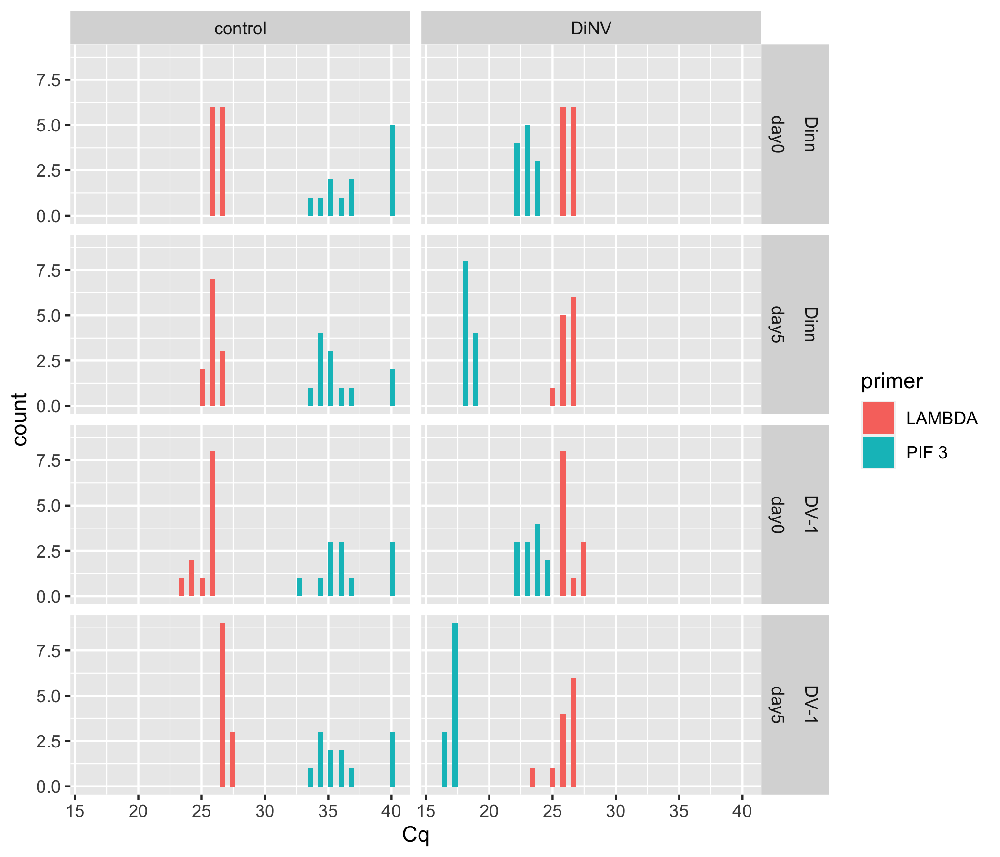
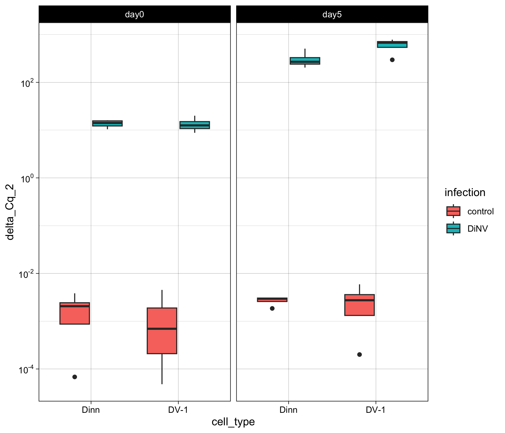
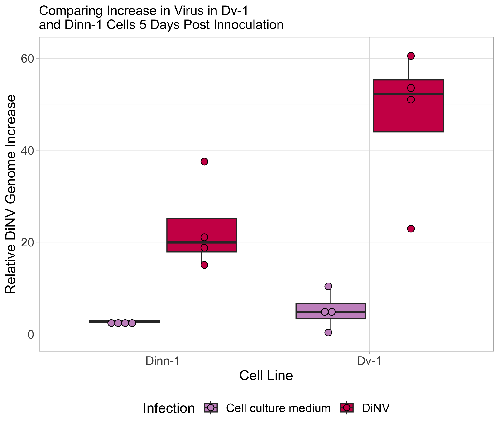
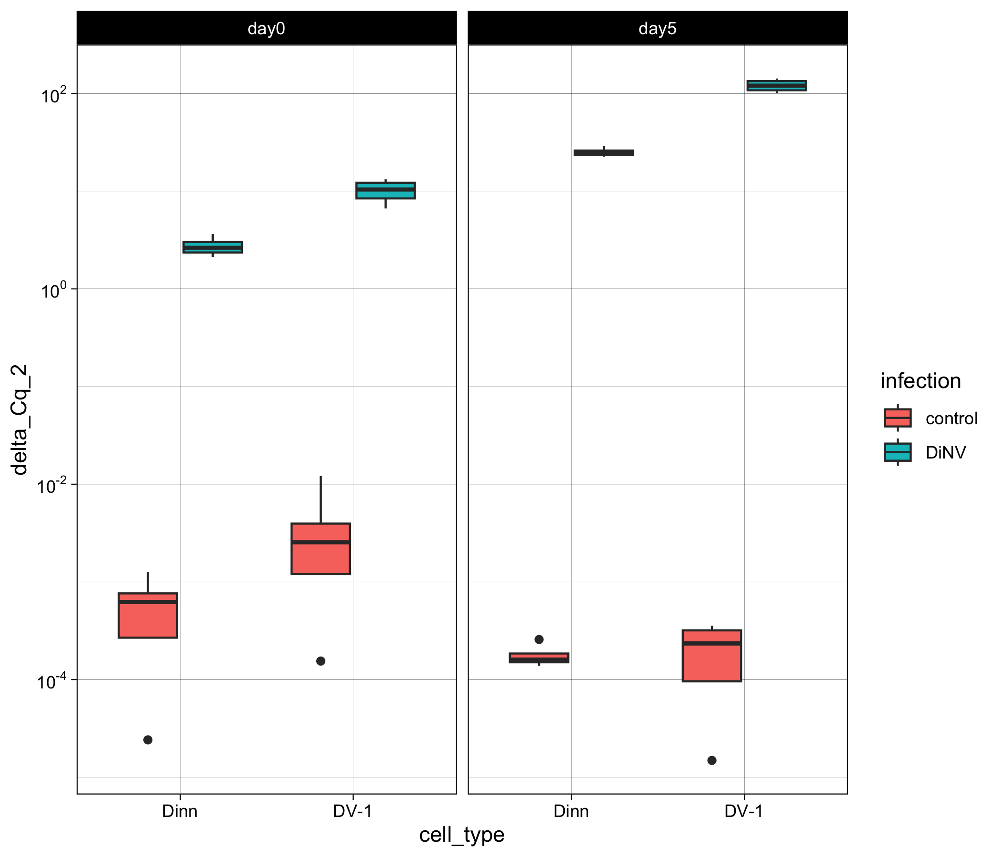
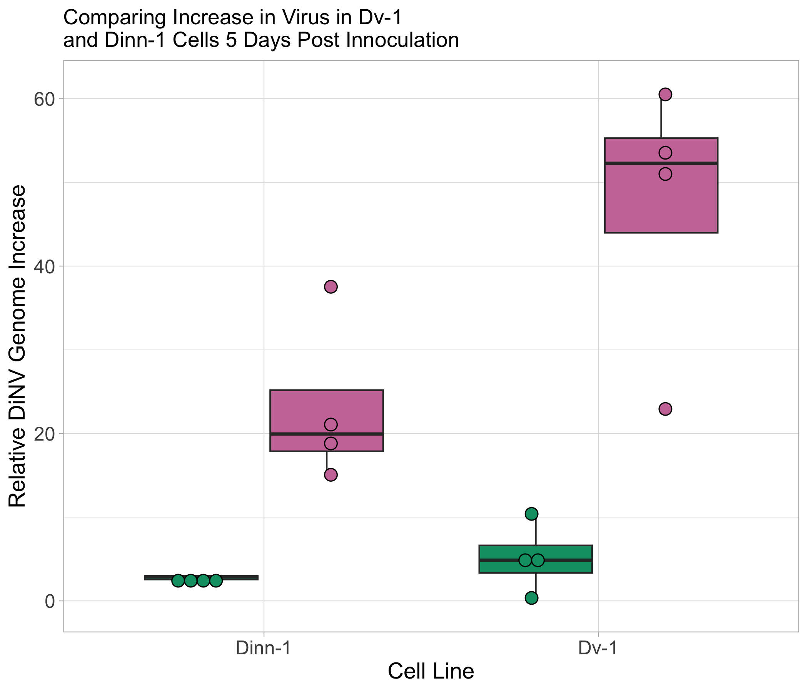
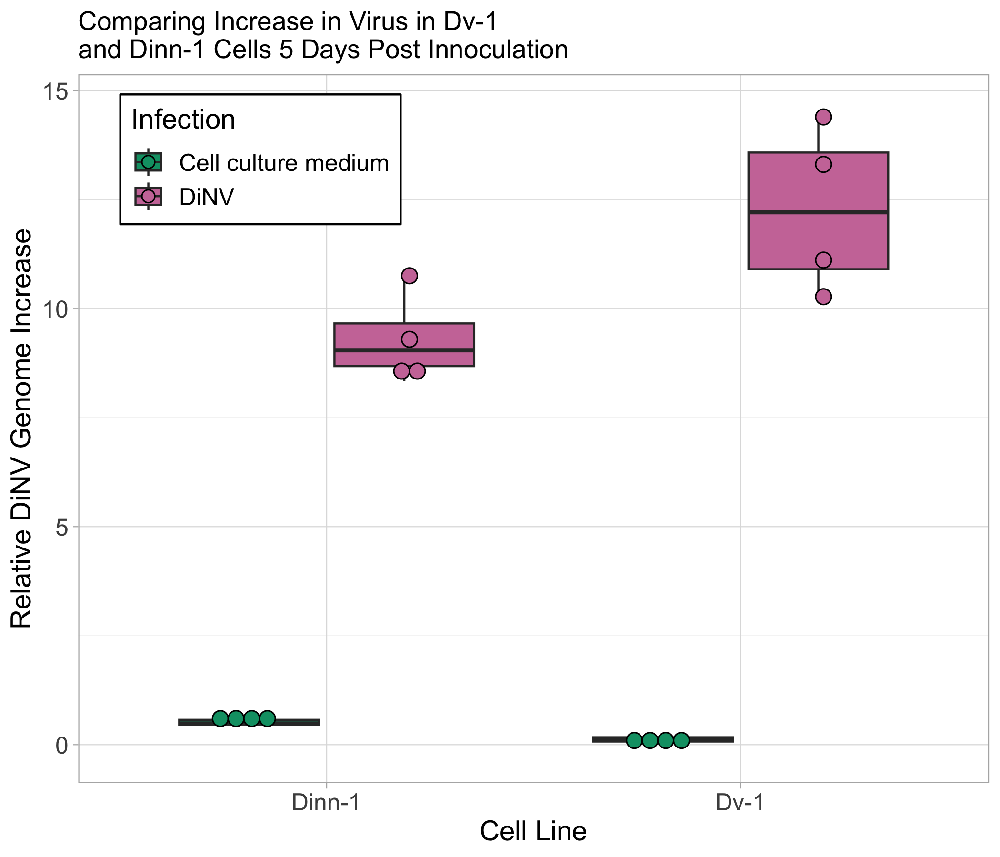

# 20240330-Dinn-Dv-1-qPCR

``` r
library(ggplot2)
library(dplyr)
```


    Attaching package: 'dplyr'

    The following objects are masked from 'package:stats':

        filter, lag

    The following objects are masked from 'package:base':

        intersect, setdiff, setequal, union

``` r
library(tidyr)
library(scales)
library(Rmisc)
```

    Loading required package: lattice

    Loading required package: plyr

    ------------------------------------------------------------------------------

    You have loaded plyr after dplyr - this is likely to cause problems.
    If you need functions from both plyr and dplyr, please load plyr first, then dplyr:
    library(plyr); library(dplyr)

    ------------------------------------------------------------------------------


    Attaching package: 'plyr'

    The following objects are masked from 'package:dplyr':

        arrange, count, desc, failwith, id, mutate, rename, summarise,
        summarize

``` r
library(rstatix)
```


    Attaching package: 'rstatix'

    The following objects are masked from 'package:plyr':

        desc, mutate

    The following object is masked from 'package:stats':

        filter

``` r
library(AICcmodavg)
```

Load in dataset

``` r
# lambda and PIF 3
Cq_values <- read.csv("/Users/maggieschedl/Desktop/Github/Unckless_Lab_Resources/qPCR_analysis/20240330-Dinn-Dv-1/20240330-Dinn-Dv-1.csv")
# load in RPL11 and TPI data
Cq_2 <- read.csv("/Users/maggieschedl/Desktop/Github/Unckless_Lab_Resources/qPCR_analysis/20240330-Dinn-Dv-1/RPL11-TPI.csv")
```

Look at raw Cq values

``` r
ggplot(Cq_values, aes(x= Cq, fill = primer)) + geom_histogram(position = "dodge") + facet_grid(~cell_type ~day ~infection) 
```

    `stat_bin()` using `bins = 30`. Pick better value with `binwidth`.



Controls look very similar and infections look very similar for each
cell line which is good I think.

``` r
# use the variance function, and calculates the variance in Cq by the unique.name (each sample/primer has 3 Cq values to 
# calculate the variance by)
Cq_values$Cq_var <- ave(Cq_values$Cq, Cq_values$unique_name, FUN=var)

# use the mean function, and calculates the mean of Cq values by the unique.name (each sample/primer has 3 Cq values to 
# calculate the mean by)
Cq_values$Cq_mean <- ave(Cq_values$Cq, Cq_values$unique_name, FUN=mean)

# Keep all rows where the replicate is 1 (or you could do 2 or 3)
# make into new Df so we keep the original with all the Cq values
Cq_values_1rep <- Cq_values[which(Cq_values$replicate == "1"),]

# histogram of all variances
ggplot(Cq_values_1rep, aes(x=Cq_var)) + geom_histogram(bins = 50)
```


``` r
# Ok some variation is really big, but most is fine 
# I do think this would be the controls for PIF 3 because some can be 40 and some can be like 35 and mess up the variance 
# If there is 1 Cq value that is vastly different than the other 2 technical replicatates I am going to remove it 

# first order df by the Cq variance 
ordered <- Cq_values[order(Cq_values$Cq_var, decreasing = TRUE),]
head(ordered)
```

       well sample replicate primer cell_type infection  day     unique_name    Cq
    43  D07     15         1  PIF 3      Dinn   control day5 Dinn-pif-cc-5-3 33.85
    44  D08     15         2  PIF 3      Dinn   control day5 Dinn-pif-cc-5-3 40.00
    45  D09     15         3  PIF 3      Dinn   control day5 Dinn-pif-cc-5-3 35.37
    28  C04     10         1  PIF 3      DV-1   control day5   Dv-pif-cc-5-2 40.00
    29  C05     10         2  PIF 3      DV-1   control day5   Dv-pif-cc-5-2 34.48
    30  C06     10         3  PIF 3      DV-1   control day5   Dv-pif-cc-5-2 34.51
         Cq_var  Cq_mean
    43 10.26163 36.40667
    44 10.26163 36.40667
    45 10.26163 36.40667
    28 10.10190 36.33000
    29 10.10190 36.33000
    30 10.10190 36.33000

``` r
# change rownames
rownames(ordered) <- NULL
# what rows have a Cq value that is very different than the other 2 replicates 
# 2, 4, 8, 11, 15, 18, 19, 24, 33, 45, 46, 49
#remove those rows with negative indexing 
ordered_2 <- ordered[-c(2, 4, 8, 11, 15, 18, 19, 24, 33, 45, 46, 49), ]
# now to re-do the variance and the means 
ordered_2$Cq_var <- ave(ordered_2$Cq, ordered_2$unique_name, FUN=var)
ordered_2$Cq_mean <- ave(ordered_2$Cq, ordered_2$unique_name, FUN=mean)
# this seems to have worked good 
# now I need to keep only 1 replicate row 
# remove "duplicated" rows based on the unique_name column: each technical replicate should have the same unique_name
Cq_values_var_1rep <- ordered_2[!duplicated(ordered_2$unique_name), ]
# re-look at histogram of variances
# there will probably be a few high ones because for some samples there was not an obvious 1 Cq value different than the others 
ggplot(Cq_values_var_1rep, aes(x=Cq_var)) + geom_histogram(bins = 50)
```


``` r
# this I think is a lot better and what I will move forward with 
```

Calculating Delta Cqs between Lambda and PIF3

``` r
# need to order the dataset 
# try ordering by primer first then by sample 
Cq_values_var_1rep <- Cq_values_var_1rep[order(Cq_values_var_1rep$primer),]
Cq_values_var_1rep
```

        well sample replicate primer cell_type infection  day     unique_name    Cq
    28   G07     27         1 LAMBDA      DV-1      DiNV day5    Dv-lam-D-5-3 24.00
    40   H01     29         1 LAMBDA      Dinn      DiNV day5  Dinn-lam-D-5-1 26.31
    52   G10     28         1 LAMBDA      DV-1      DiNV day5    Dv-lam-D-5-4 25.50
    55   E10     20         1 LAMBDA      DV-1      DiNV day0    Dv-lam-D-0-4 27.99
    58   H10     32         1 LAMBDA      Dinn      DiNV day5  Dinn-lam-D-5-4 26.38
    61   A10      4         1 LAMBDA      DV-1   control day0   Dv-lam-cc-0-4 25.77
    64   F01     21         1 LAMBDA      Dinn      DiNV day0  Dinn-lam-D-0-1 26.98
    67   E04     18         1 LAMBDA      DV-1      DiNV day0    Dv-lam-D-0-2 26.21
    70   C01      9         1 LAMBDA      DV-1   control day5   Dv-lam-cc-5-1 26.64
    79   A07      3         1 LAMBDA      DV-1   control day0   Dv-lam-cc-0-3 23.97
    82   D10     16         1 LAMBDA      Dinn   control day5 Dinn-lam-cc-5-4 26.67
    85   E07     19         1 LAMBDA      DV-1      DiNV day0    Dv-lam-D-0-3 26.14
    88   C04     10         1 LAMBDA      DV-1   control day5   Dv-lam-cc-5-2 27.25
    91   G01     25         1 LAMBDA      DV-1      DiNV day5    Dv-lam-D-5-1 26.53
    94   F10     24         1 LAMBDA      Dinn      DiNV day0  Dinn-lam-D-0-4 26.18
    100  G04     26         1 LAMBDA      DV-1      DiNV day5    Dv-lam-D-5-2 26.51
    106  C07     11         1 LAMBDA      DV-1   control day5   Dv-lam-cc-5-3 27.71
    115  A04      2         1 LAMBDA      DV-1   control day0   Dv-lam-cc-0-2 25.52
    118  D01     13         1 LAMBDA      Dinn   control day5 Dinn-lam-cc-5-1 25.44
    127  B10      8         1 LAMBDA      Dinn   control day0 Dinn-lam-cc-0-4 26.90
    130  B01      5         1 LAMBDA      Dinn   control day0 Dinn-lam-cc-0-1 26.24
    139  A01      1         1 LAMBDA      DV-1   control day0   Dv-lam-cc-0-1 26.24
    145  F04     22         1 LAMBDA      Dinn      DiNV day0  Dinn-lam-D-0-2 26.87
    148  H04     30         1 LAMBDA      Dinn      DiNV day5  Dinn-lam-D-5-2 26.59
    151  E01     17         1 LAMBDA      DV-1      DiNV day0    Dv-lam-D-0-1 26.09
    154  F07     23         1 LAMBDA      Dinn      DiNV day0  Dinn-lam-D-0-3 26.12
    160  C10     12         1 LAMBDA      DV-1   control day5   Dv-lam-cc-5-4 27.04
    163  H07     31         1 LAMBDA      Dinn      DiNV day5  Dinn-lam-D-5-3 26.05
    175  B07      7         1 LAMBDA      Dinn   control day0 Dinn-lam-cc-0-3 26.33
    178  D07     15         1 LAMBDA      Dinn   control day5 Dinn-lam-cc-5-3 26.27
    181  D04     14         1 LAMBDA      Dinn   control day5 Dinn-lam-cc-5-2 26.08
    187  B04      6         1 LAMBDA      Dinn   control day0 Dinn-lam-cc-0-2 26.74
    1    D07     15         1  PIF 3      Dinn   control day5 Dinn-pif-cc-5-3 33.85
    5    C05     10         2  PIF 3      DV-1   control day5   Dv-pif-cc-5-2 34.48
    7    D04     14         1  PIF 3      Dinn   control day5 Dinn-pif-cc-5-2 34.02
    10   B07      7         1  PIF 3      Dinn   control day0 Dinn-pif-cc-0-3 34.12
    13   A04      2         1  PIF 3      DV-1   control day0   Dv-pif-cc-0-2 40.00
    16   C07     11         1  PIF 3      DV-1   control day5   Dv-pif-cc-5-3 40.00
    20   A08      3         2  PIF 3      DV-1   control day0   Dv-pif-cc-0-3 35.70
    22   B10      8         1  PIF 3      Dinn   control day0 Dinn-pif-cc-0-4 36.32
    25   B04      6         1  PIF 3      Dinn   control day0 Dinn-pif-cc-0-2 32.96
    31   C10     12         1  PIF 3      DV-1   control day5   Dv-pif-cc-5-4 35.24
    34   A01      1         1  PIF 3      DV-1   control day0   Dv-pif-cc-0-1 35.00
    37   C01      9         1  PIF 3      DV-1   control day5   Dv-pif-cc-5-1 34.33
    43   D10     16         1  PIF 3      Dinn   control day5 Dinn-pif-cc-5-4 35.28
    47   D02     13         2  PIF 3      Dinn   control day5 Dinn-pif-cc-5-1 33.82
    50   A11      4         2  PIF 3      DV-1   control day0   Dv-pif-cc-0-4 35.18
    73   F04     22         1  PIF 3      Dinn      DiNV day0  Dinn-pif-D-0-2 23.02
    76   H10     32         1  PIF 3      Dinn      DiNV day5  Dinn-pif-D-5-4 17.51
    97   E07     19         1  PIF 3      DV-1      DiNV day0    Dv-pif-D-0-3 22.45
    103  H01     29         1  PIF 3      Dinn      DiNV day5  Dinn-pif-D-5-1 18.41
    109  G10     28         1  PIF 3      DV-1      DiNV day5    Dv-pif-D-5-4 16.40
    112  E10     20         1  PIF 3      DV-1      DiNV day0    Dv-pif-D-0-4 23.95
    121  F10     24         1  PIF 3      Dinn      DiNV day0  Dinn-pif-D-0-4 22.22
    124  F01     21         1  PIF 3      Dinn      DiNV day0  Dinn-pif-D-0-1 23.24
    133  G07     27         1  PIF 3      DV-1      DiNV day5    Dv-pif-D-5-3 17.19
    136  E01     17         1  PIF 3      DV-1      DiNV day0    Dv-pif-D-0-1 21.66
    142  H04     30         1  PIF 3      Dinn      DiNV day5  Dinn-pif-D-5-2 18.46
    157  H07     31         1  PIF 3      Dinn      DiNV day5  Dinn-pif-D-5-3 18.03
    166  G04     26         1  PIF 3      DV-1      DiNV day5    Dv-pif-D-5-2 16.99
    169  G01     25         1  PIF 3      DV-1      DiNV day5    Dv-pif-D-5-1 17.01
    172  E04     18         1  PIF 3      DV-1      DiNV day0    Dv-pif-D-0-2 23.24
    184  F07     23         1  PIF 3      Dinn      DiNV day0  Dinn-pif-D-0-3 22.39
    190  B01      5         1  PIF 3      Dinn   control day0 Dinn-pif-cc-0-1 40.00
              Cq_var  Cq_mean
    28  1.8854333333 25.48333
    40  0.8929333333 25.94333
    52  0.2719000000 25.93000
    55  0.1070333333 27.61333
    58  0.0643000000 26.67000
    61  0.0586333333 25.94333
    64  0.0417000000 26.75000
    67  0.0403000000 26.42000
    70  0.0399000000 26.69000
    79  0.0343000000 24.11000
    82  0.0237000000 26.80000
    85  0.0233333333 26.30667
    88  0.0226333333 27.09333
    91  0.0226333333 26.60667
    94  0.0217333333 26.23333
    100 0.0209333333 26.34333
    106 0.0169333333 27.71667
    115 0.0149333333 25.65333
    118 0.0147000000 25.51000
    127 0.0124000000 26.92000
    130 0.0112000000 26.16000
    139 0.0084000000 26.22000
    145 0.0057000000 26.80000
    148 0.0049333333 26.65667
    151 0.0049333333 26.08333
    154 0.0044333333 26.07667
    160 0.0036000000 27.10000
    163 0.0026333333 26.09333
    175 0.0009333333 26.33667
    178 0.0009333333 26.27667
    181 0.0004333333 26.07333
    187 0.0003000000 26.73000
    1   1.1552000000 34.61000
    5   0.0004500000 34.49500
    7   2.5538000000 35.15000
    10  2.6912000000 35.28000
    13  0.0000000000 40.00000
    16  0.0000000000 40.00000
    20  0.0112500000 35.62500
    22  0.5000000000 35.82000
    25  2.5692333333 34.75667
    31  0.0924500000 35.45500
    34  1.3671000000 34.01000
    37  1.1167000000 35.35000
    43  0.0040500000 35.23500
    47  0.0060500000 33.87500
    50  0.1058000000 35.41000
    73  0.0349000000 22.85000
    76  0.0346333333 17.68333
    97  0.0217000000 22.53000
    103 0.0182333333 18.27333
    109 0.0160333333 16.49667
    112 0.0152333333 24.08667
    121 0.0144333333 22.22667
    124 0.0129333333 23.36667
    133 0.0108333333 17.27333
    136 0.0091000000 21.76000
    142 0.0070333333 18.50333
    157 0.0040333333 18.10333
    166 0.0021000000 16.98000
    169 0.0017333333 16.99667
    172 0.0016333333 23.28333
    184 0.0004000000 22.39000
    190 0.0000000000 40.00000

``` r
# then order by sample 
Cq_values_var_1rep <- Cq_values_var_1rep[order(Cq_values_var_1rep$sample),]
Cq_values_var_1rep
```

        well sample replicate primer cell_type infection  day     unique_name    Cq
    139  A01      1         1 LAMBDA      DV-1   control day0   Dv-lam-cc-0-1 26.24
    34   A01      1         1  PIF 3      DV-1   control day0   Dv-pif-cc-0-1 35.00
    115  A04      2         1 LAMBDA      DV-1   control day0   Dv-lam-cc-0-2 25.52
    13   A04      2         1  PIF 3      DV-1   control day0   Dv-pif-cc-0-2 40.00
    79   A07      3         1 LAMBDA      DV-1   control day0   Dv-lam-cc-0-3 23.97
    20   A08      3         2  PIF 3      DV-1   control day0   Dv-pif-cc-0-3 35.70
    61   A10      4         1 LAMBDA      DV-1   control day0   Dv-lam-cc-0-4 25.77
    50   A11      4         2  PIF 3      DV-1   control day0   Dv-pif-cc-0-4 35.18
    130  B01      5         1 LAMBDA      Dinn   control day0 Dinn-lam-cc-0-1 26.24
    190  B01      5         1  PIF 3      Dinn   control day0 Dinn-pif-cc-0-1 40.00
    187  B04      6         1 LAMBDA      Dinn   control day0 Dinn-lam-cc-0-2 26.74
    25   B04      6         1  PIF 3      Dinn   control day0 Dinn-pif-cc-0-2 32.96
    175  B07      7         1 LAMBDA      Dinn   control day0 Dinn-lam-cc-0-3 26.33
    10   B07      7         1  PIF 3      Dinn   control day0 Dinn-pif-cc-0-3 34.12
    127  B10      8         1 LAMBDA      Dinn   control day0 Dinn-lam-cc-0-4 26.90
    22   B10      8         1  PIF 3      Dinn   control day0 Dinn-pif-cc-0-4 36.32
    70   C01      9         1 LAMBDA      DV-1   control day5   Dv-lam-cc-5-1 26.64
    37   C01      9         1  PIF 3      DV-1   control day5   Dv-pif-cc-5-1 34.33
    88   C04     10         1 LAMBDA      DV-1   control day5   Dv-lam-cc-5-2 27.25
    5    C05     10         2  PIF 3      DV-1   control day5   Dv-pif-cc-5-2 34.48
    106  C07     11         1 LAMBDA      DV-1   control day5   Dv-lam-cc-5-3 27.71
    16   C07     11         1  PIF 3      DV-1   control day5   Dv-pif-cc-5-3 40.00
    160  C10     12         1 LAMBDA      DV-1   control day5   Dv-lam-cc-5-4 27.04
    31   C10     12         1  PIF 3      DV-1   control day5   Dv-pif-cc-5-4 35.24
    118  D01     13         1 LAMBDA      Dinn   control day5 Dinn-lam-cc-5-1 25.44
    47   D02     13         2  PIF 3      Dinn   control day5 Dinn-pif-cc-5-1 33.82
    181  D04     14         1 LAMBDA      Dinn   control day5 Dinn-lam-cc-5-2 26.08
    7    D04     14         1  PIF 3      Dinn   control day5 Dinn-pif-cc-5-2 34.02
    178  D07     15         1 LAMBDA      Dinn   control day5 Dinn-lam-cc-5-3 26.27
    1    D07     15         1  PIF 3      Dinn   control day5 Dinn-pif-cc-5-3 33.85
    82   D10     16         1 LAMBDA      Dinn   control day5 Dinn-lam-cc-5-4 26.67
    43   D10     16         1  PIF 3      Dinn   control day5 Dinn-pif-cc-5-4 35.28
    151  E01     17         1 LAMBDA      DV-1      DiNV day0    Dv-lam-D-0-1 26.09
    136  E01     17         1  PIF 3      DV-1      DiNV day0    Dv-pif-D-0-1 21.66
    67   E04     18         1 LAMBDA      DV-1      DiNV day0    Dv-lam-D-0-2 26.21
    172  E04     18         1  PIF 3      DV-1      DiNV day0    Dv-pif-D-0-2 23.24
    85   E07     19         1 LAMBDA      DV-1      DiNV day0    Dv-lam-D-0-3 26.14
    97   E07     19         1  PIF 3      DV-1      DiNV day0    Dv-pif-D-0-3 22.45
    55   E10     20         1 LAMBDA      DV-1      DiNV day0    Dv-lam-D-0-4 27.99
    112  E10     20         1  PIF 3      DV-1      DiNV day0    Dv-pif-D-0-4 23.95
    64   F01     21         1 LAMBDA      Dinn      DiNV day0  Dinn-lam-D-0-1 26.98
    124  F01     21         1  PIF 3      Dinn      DiNV day0  Dinn-pif-D-0-1 23.24
    145  F04     22         1 LAMBDA      Dinn      DiNV day0  Dinn-lam-D-0-2 26.87
    73   F04     22         1  PIF 3      Dinn      DiNV day0  Dinn-pif-D-0-2 23.02
    154  F07     23         1 LAMBDA      Dinn      DiNV day0  Dinn-lam-D-0-3 26.12
    184  F07     23         1  PIF 3      Dinn      DiNV day0  Dinn-pif-D-0-3 22.39
    94   F10     24         1 LAMBDA      Dinn      DiNV day0  Dinn-lam-D-0-4 26.18
    121  F10     24         1  PIF 3      Dinn      DiNV day0  Dinn-pif-D-0-4 22.22
    91   G01     25         1 LAMBDA      DV-1      DiNV day5    Dv-lam-D-5-1 26.53
    169  G01     25         1  PIF 3      DV-1      DiNV day5    Dv-pif-D-5-1 17.01
    100  G04     26         1 LAMBDA      DV-1      DiNV day5    Dv-lam-D-5-2 26.51
    166  G04     26         1  PIF 3      DV-1      DiNV day5    Dv-pif-D-5-2 16.99
    28   G07     27         1 LAMBDA      DV-1      DiNV day5    Dv-lam-D-5-3 24.00
    133  G07     27         1  PIF 3      DV-1      DiNV day5    Dv-pif-D-5-3 17.19
    52   G10     28         1 LAMBDA      DV-1      DiNV day5    Dv-lam-D-5-4 25.50
    109  G10     28         1  PIF 3      DV-1      DiNV day5    Dv-pif-D-5-4 16.40
    40   H01     29         1 LAMBDA      Dinn      DiNV day5  Dinn-lam-D-5-1 26.31
    103  H01     29         1  PIF 3      Dinn      DiNV day5  Dinn-pif-D-5-1 18.41
    148  H04     30         1 LAMBDA      Dinn      DiNV day5  Dinn-lam-D-5-2 26.59
    142  H04     30         1  PIF 3      Dinn      DiNV day5  Dinn-pif-D-5-2 18.46
    163  H07     31         1 LAMBDA      Dinn      DiNV day5  Dinn-lam-D-5-3 26.05
    157  H07     31         1  PIF 3      Dinn      DiNV day5  Dinn-pif-D-5-3 18.03
    58   H10     32         1 LAMBDA      Dinn      DiNV day5  Dinn-lam-D-5-4 26.38
    76   H10     32         1  PIF 3      Dinn      DiNV day5  Dinn-pif-D-5-4 17.51
              Cq_var  Cq_mean
    139 0.0084000000 26.22000
    34  1.3671000000 34.01000
    115 0.0149333333 25.65333
    13  0.0000000000 40.00000
    79  0.0343000000 24.11000
    20  0.0112500000 35.62500
    61  0.0586333333 25.94333
    50  0.1058000000 35.41000
    130 0.0112000000 26.16000
    190 0.0000000000 40.00000
    187 0.0003000000 26.73000
    25  2.5692333333 34.75667
    175 0.0009333333 26.33667
    10  2.6912000000 35.28000
    127 0.0124000000 26.92000
    22  0.5000000000 35.82000
    70  0.0399000000 26.69000
    37  1.1167000000 35.35000
    88  0.0226333333 27.09333
    5   0.0004500000 34.49500
    106 0.0169333333 27.71667
    16  0.0000000000 40.00000
    160 0.0036000000 27.10000
    31  0.0924500000 35.45500
    118 0.0147000000 25.51000
    47  0.0060500000 33.87500
    181 0.0004333333 26.07333
    7   2.5538000000 35.15000
    178 0.0009333333 26.27667
    1   1.1552000000 34.61000
    82  0.0237000000 26.80000
    43  0.0040500000 35.23500
    151 0.0049333333 26.08333
    136 0.0091000000 21.76000
    67  0.0403000000 26.42000
    172 0.0016333333 23.28333
    85  0.0233333333 26.30667
    97  0.0217000000 22.53000
    55  0.1070333333 27.61333
    112 0.0152333333 24.08667
    64  0.0417000000 26.75000
    124 0.0129333333 23.36667
    145 0.0057000000 26.80000
    73  0.0349000000 22.85000
    154 0.0044333333 26.07667
    184 0.0004000000 22.39000
    94  0.0217333333 26.23333
    121 0.0144333333 22.22667
    91  0.0226333333 26.60667
    169 0.0017333333 16.99667
    100 0.0209333333 26.34333
    166 0.0021000000 16.98000
    28  1.8854333333 25.48333
    133 0.0108333333 17.27333
    52  0.2719000000 25.93000
    109 0.0160333333 16.49667
    40  0.8929333333 25.94333
    103 0.0182333333 18.27333
    148 0.0049333333 26.65667
    142 0.0070333333 18.50333
    163 0.0026333333 26.09333
    157 0.0040333333 18.10333
    58  0.0643000000 26.67000
    76  0.0346333333 17.68333

``` r
# this consistently LAMBDA first, then PIF 3 
nrow(Cq_values_var_1rep)
```

    [1] 64

``` r
# Separate that dataframe, incriminating by 2, every number between 1-64 (number of rows in dataframe)
Cq_values_var_1rep$Cq_mean[seq(1,64,2)] # these are the LAMBDA Cq means 
```

     [1] 26.22000 25.65333 24.11000 25.94333 26.16000 26.73000 26.33667 26.92000
     [9] 26.69000 27.09333 27.71667 27.10000 25.51000 26.07333 26.27667 26.80000
    [17] 26.08333 26.42000 26.30667 27.61333 26.75000 26.80000 26.07667 26.23333
    [25] 26.60667 26.34333 25.48333 25.93000 25.94333 26.65667 26.09333 26.67000

``` r
Cq_values_var_1rep$Cq_mean[seq(2,64,2)] # these are the PIF 3 primer Cq means 
```

     [1] 34.01000 40.00000 35.62500 35.41000 40.00000 34.75667 35.28000 35.82000
     [9] 35.35000 34.49500 40.00000 35.45500 33.87500 35.15000 34.61000 35.23500
    [17] 21.76000 23.28333 22.53000 24.08667 23.36667 22.85000 22.39000 22.22667
    [25] 16.99667 16.98000 17.27333 16.49667 18.27333 18.50333 18.10333 17.68333

``` r
# make the delta Cq by subtracting the PIF 3 values from the LAMBDA primer values
# and this is saved as a vector in R 
delta_Cqs <- Cq_values_var_1rep$Cq_mean[seq(1,64,2)] - Cq_values_var_1rep$Cq_mean[seq(2,64,2)]
#vector
delta_Cqs
```

     [1]  -7.790000 -14.346667 -11.515000  -9.466667 -13.840000  -8.026667
     [7]  -8.943333  -8.900000  -8.660000  -7.401667 -12.283333  -8.355000
    [13]  -8.365000  -9.076667  -8.333333  -8.435000   4.323333   3.136667
    [19]   3.776667   3.526667   3.383333   3.950000   3.686667   4.006667
    [25]   9.610000   9.363333   8.210000   9.433333   7.670000   8.153333
    [31]   7.990000   8.986667

``` r
# Keep only rows that are PIF3 because now we have two rows per sample
Cq_values1rep_Delta <- Cq_values_var_1rep[which(Cq_values_var_1rep$primer == "PIF 3"),]
# And then add in the delta Cqs as a new column
Cq_values1rep_Delta$delta_Cq <- delta_Cqs

# do 2^ delta Cq
Cq_values1rep_Delta$delta_Cq_2 <- 2^(delta_Cqs)

# plot 
ggplot(Cq_values1rep_Delta, aes(y= delta_Cq_2, x=cell_type, fill=infection)) + geom_boxplot()  + theme_linedraw()  + facet_grid(~day)  + scale_y_continuous(trans='log10', breaks=trans_breaks('log10', function(x) 10^x), labels=trans_format('log10', math_format(10^.x)))
```



Calculating delta delta Cq

Controls

``` r
# separate out control and DiNV samples 
control <- Cq_values1rep_Delta[which(Cq_values1rep_Delta$infection == "control"),]
DiNV <- Cq_values1rep_Delta[which(Cq_values1rep_Delta$infection != "control"),]
 
# separate out the day 0 samples to start with 
day_0_cc <- control[which(control$day == "day0"),]
# separate out cell type Dv-1 
day_0_cc_Dv1 <- day_0_cc[which(day_0_cc$cell_type == "DV-1"),]
# find mean of Delta Cq (not 2^delta) for Dv-1
mean(day_0_cc_Dv1$delta_Cq)
```

    [1] -10.77958

``` r
# -10.77958
# separate out cell type Myd88 
day_0_cc_Dinn <- day_0_cc[which(day_0_cc$cell_type != "DV-1"),]
# find mean of Delta Cq (not 2^delta) for Dinn
mean(day_0_cc_Dinn$delta_Cq)
```

    [1] -9.9275

``` r
# -9.9275

# separate out day 5 only from controls 
day_5_cc <- control[which(control$day != "day0"),]
# separate out Dv-1
day_5_cc_Dv1 <- day_5_cc[which(day_5_cc$cell_type == "DV-1"),]

# subtract average day 0 delta Cq for Dv-1 from the delta Cq of all others 
day_5_cc_Dv1_delta_delta <- day_5_cc_Dv1$delta_Cq - -10.77958
day_5_cc_Dv1_delta_delta
```

    [1]  2.119580  3.377913 -1.503753  2.424580

``` r
# add as column 
day_5_cc_Dv1$delta_delta_Cq <- day_5_cc_Dv1_delta_delta

# do 2^ delta delta 
day_5_cc_Dv1$delta_delta_Cq_2 <- 2^(day_5_cc_Dv1_delta_delta)

# separate out Dinn
day_5_cc_Dinn <- day_5_cc[which(day_5_cc$cell_type != "DV-1"),]

# subtract average day 0 delta Cq for Dinn from the delta Cq of all others 
day_5_cc_Dinn_delta_delta <- day_5_cc_Dinn$delta_Cq - -9.9275
day_5_cc_Dinn_delta_delta
```

    [1] 1.5625000 0.8508333 1.5941667 1.4925000

``` r
# add as column 
day_5_cc_Dinn$delta_delta_Cq <- day_5_cc_Dinn_delta_delta

# do 2^ delta delta 
day_5_cc_Dinn$delta_delta_Cq_2 <- 2^(day_5_cc_Dinn_delta_delta)

# combine controls back together  
Control_delta_delta <- rbind(day_5_cc_Dv1, day_5_cc_Dinn)
```

Delta Delta calculations for DiNV samples

``` r
# separate out the day 0 samples to start with 
day_0_DiNV <- DiNV[which(DiNV$day == "day0"),]
# separate out cell type Dv-1 
day_0_DiNV_Dv1 <- day_0_DiNV[which(day_0_DiNV$cell_type == "DV-1"),]
# find mean of Delta Cq (not 2^delta) for Dv-1
mean(day_0_DiNV_Dv1$delta_Cq)
```

    [1] 3.690833

``` r
# 3.690833
# separate out cell type Dinn 
day_0_DiNV_Dinn <- day_0_DiNV[which(day_0_DiNV$cell_type != "DV-1"),]
# find mean of Delta Cq (not 2^delta) for Dv-1
mean(day_0_DiNV_Dinn$delta_Cq)
```

    [1] 3.756667

``` r
# 3.756667

# separate out day 5 only from DiNVs
day_5_DiNV <- DiNV[which(DiNV$day != "day0"),]
# separate out Dv-1
day_5_DiNV_Dv1 <- day_5_DiNV[which(day_5_DiNV$cell_type == "DV-1"),]

# subtract average day 0 delta Cq for Dv-1 from the delta Cq of all others 
day_5_DiNV_Dv1_delta_delta <- day_5_DiNV_Dv1$delta_Cq -  3.690833
day_5_DiNV_Dv1_delta_delta
```

    [1] 5.919167 5.672500 4.519167 5.742500

``` r
# add as column 
day_5_DiNV_Dv1$delta_delta_Cq <- day_5_DiNV_Dv1_delta_delta

# do 2^ delta delta 
day_5_DiNV_Dv1$delta_delta_Cq_2 <- 2^(day_5_DiNV_Dv1_delta_delta)

# separate out Dinn
day_5_DiNV_Dinn <- day_5_DiNV[which(day_5_DiNV$cell_type != "DV-1"),]

# subtract average day 0 delta Cq for Dinn from the delta Cq of all others 
day_5_DiNV_Dinn_delta_delta <- day_5_DiNV_Dinn$delta_Cq - 3.756667
day_5_DiNV_Dinn_delta_delta
```

    [1] 3.913333 4.396666 4.233333 5.230000

``` r
# add as column 
day_5_DiNV_Dinn$delta_delta_Cq <- day_5_DiNV_Dinn_delta_delta

# do 2^ delta delta 
day_5_DiNV_Dinn$delta_delta_Cq_2 <- 2^(day_5_DiNV_Dinn_delta_delta)

# combine controls back together  
DiNV_delta_delta <- rbind(day_5_DiNV_Dv1, day_5_DiNV_Dinn)
```

Combine control and DiNV back together and plot delta delta Cq

``` r
delta_delta <- rbind(Control_delta_delta, DiNV_delta_delta)

legend_title <- "Infection"

# plot 
ggplot(delta_delta, aes(y= delta_delta_Cq_2, x=cell_type, fill=infection)) + geom_boxplot(outlier.shape=NA)  + theme_light()  + scale_fill_manual(legend_title, values=c("#C994C7", "#CE1256"), labels= c("Cell culture medium", "DiNV")) + geom_dotplot(binaxis='y', stackdir='center', dotsize=0.75, position=position_dodge(0.8)) + scale_x_discrete(labels=c("DV-1" = "Dv-1", "Dinn" = "Dinn-1"))+ 
  theme(axis.text=element_text(size=12),axis.title=element_text(size=14), legend.text=element_text(size=12), legend.title=element_text(size=14), legend.position = "bottom") +
  labs(title = "Comparing Increase in Virus in Dv-1 \nand Dinn-1 Cells 5 Days Post Innoculation",y = "Relative DiNV Genome Increase", x = "Cell Line")
```

    Bin width defaults to 1/30 of the range of the data. Pick better value with
    `binwidth`.



Pairwise t test with lambda primers

``` r
stat.test <- delta_delta %>%
  group_by(infection) %>%
  t_test(delta_delta_Cq_2 ~ cell_type) %>%
  adjust_pvalue(method = "bonferroni") %>%
  add_significance("p.adj")
stat.test
```

    # A tibble: 2 × 11
      infection .y.            group1 group2    n1    n2 statistic    df     p p.adj
      <chr>     <chr>          <chr>  <chr>  <int> <int>     <dbl> <dbl> <dbl> <dbl>
    1 DiNV      delta_delta_C… Dinn   DV-1       4     4     -2.48  4.91 0.057 0.114
    2 control   delta_delta_C… Dinn   DV-1       4     4     -1.18  3.11 0.319 0.638
    # ℹ 1 more variable: p.adj.signif <chr>

Linear model instead of t-test (better)

``` r
# using lambda as control
# compare model with infection and cell type
# use only the delta delta Cq, not 2^
Dv_Dinn_l_model <- lm(delta_delta_Cq~infection*cell_type, data = delta_delta)
summary(aov(Dv_Dinn_l_model))
```

                        Df Sum Sq Mean Sq F value   Pr(>F)    
    infection            1  47.98   47.98  35.363 6.75e-05 ***
    cell_type            1   1.56    1.56   1.151    0.304    
    infection:cell_type  1   0.62    0.62   0.460    0.510    
    Residuals           12  16.28    1.36                     
    ---
    Signif. codes:  0 '***' 0.001 '**' 0.01 '*' 0.05 '.' 0.1 ' ' 1

``` r
# model without interaction 
Dv_Dinn_l_modelni <- lm(delta_delta_Cq~infection+cell_type, data = delta_delta)
summary(aov(Dv_Dinn_l_modelni))
```

                Df Sum Sq Mean Sq F value   Pr(>F)    
    infection    1  47.98   47.98  36.895 3.94e-05 ***
    cell_type    1   1.56    1.56   1.201    0.293    
    Residuals   13  16.91    1.30                     
    ---
    Signif. codes:  0 '***' 0.001 '**' 0.01 '*' 0.05 '.' 0.1 ' ' 1

``` r
# model without cell type 
Dv_Dinn_l_modelnc <- lm(delta_delta_Cq~infection, data = delta_delta)
summary(aov(Dv_Dinn_l_modelnc))
```

                Df Sum Sq Mean Sq F value   Pr(>F)    
    infection    1  47.98   47.98   36.37 3.09e-05 ***
    Residuals   14  18.47    1.32                     
    ---
    Signif. codes:  0 '***' 0.001 '**' 0.01 '*' 0.05 '.' 0.1 ' ' 1

``` r
# try special package for comparing AIC 
modelsl <- list( Dv_Dinn_l_model, Dv_Dinn_l_modelni, Dv_Dinn_l_modelnc)

model.namesl <- c( 'interaction', 'no interaction', 'no cell type')

aictab(cand.set = modelsl, modnames = model.namesl)
```


    Model selection based on AICc:

                   K  AICc Delta_AICc AICcWt Cum.Wt     LL
    no cell type   3 55.70       0.00   0.73   0.73 -23.85
    no interaction 4 57.93       2.22   0.24   0.96 -23.14
    interaction    5 61.69       5.98   0.04   1.00 -22.84

``` r
# best model is no cell type 
summary(aov(Dv_Dinn_l_modelnc))
```

                Df Sum Sq Mean Sq F value   Pr(>F)    
    infection    1  47.98   47.98   36.37 3.09e-05 ***
    Residuals   14  18.47    1.32                     
    ---
    Signif. codes:  0 '***' 0.001 '**' 0.01 '*' 0.05 '.' 0.1 ' ' 1

Now compare Pif 3 Cqs with TPI/RPL11 for delta delta Cq

Look at variance in control primer Cqs

``` r
# use the variance function, and calculates the variance in Cq by the unique.name (each sample/primer has 3 Cq values to 
# calculate the variance by)
Cq_2$Cq_var <- ave(Cq_2$Cq, Cq_2$unique_name, FUN=var)

# use the mean function, and calculates the mean of Cq values by the unique.name (each sample/primer has 3 Cq values to 
# calculate the mean by)
Cq_2$Cq_mean <- ave(Cq_2$Cq, Cq_2$unique_name, FUN=mean)

# Keep all rows where the replicate is 1 (or you could do 2 or 3)
# make into new Df so we keep the original with all the Cq values
Cq_2_1rep <- Cq_2[which(Cq_2$replicate == "1"),]

# histogram of all variances
ggplot(Cq_2_1rep, aes(x=Cq_var)) + geom_histogram(bins = 50)
```


``` r
# all of these are very low, great
```

Delta Cq with Cell primers

``` r
# separate out just PIF 3 samples from Cq_values
Cq_pif <- Cq_values_var_1rep[which(Cq_values_var_1rep$primer == "PIF 3"),]
# combine datasets 

cell_Cqs <- rbind(Cq_pif, Cq_2_1rep)

# need to order the dataset 
# try ordering by primer first then by sample 
cell_Cqs <- cell_Cqs[order(cell_Cqs$primer),]
cell_Cqs
```

        well sample replicate primer cell_type infection  day     unique_name    Cq
    34   A01      1         1  PIF 3      DV-1   control day0   Dv-pif-cc-0-1 35.00
    13   A04      2         1  PIF 3      DV-1   control day0   Dv-pif-cc-0-2 40.00
    20   A08      3         2  PIF 3      DV-1   control day0   Dv-pif-cc-0-3 35.70
    50   A11      4         2  PIF 3      DV-1   control day0   Dv-pif-cc-0-4 35.18
    190  B01      5         1  PIF 3      Dinn   control day0 Dinn-pif-cc-0-1 40.00
    25   B04      6         1  PIF 3      Dinn   control day0 Dinn-pif-cc-0-2 32.96
    10   B07      7         1  PIF 3      Dinn   control day0 Dinn-pif-cc-0-3 34.12
    22   B10      8         1  PIF 3      Dinn   control day0 Dinn-pif-cc-0-4 36.32
    37   C01      9         1  PIF 3      DV-1   control day5   Dv-pif-cc-5-1 34.33
    5    C05     10         2  PIF 3      DV-1   control day5   Dv-pif-cc-5-2 34.48
    16   C07     11         1  PIF 3      DV-1   control day5   Dv-pif-cc-5-3 40.00
    31   C10     12         1  PIF 3      DV-1   control day5   Dv-pif-cc-5-4 35.24
    47   D02     13         2  PIF 3      Dinn   control day5 Dinn-pif-cc-5-1 33.82
    7    D04     14         1  PIF 3      Dinn   control day5 Dinn-pif-cc-5-2 34.02
    1    D07     15         1  PIF 3      Dinn   control day5 Dinn-pif-cc-5-3 33.85
    43   D10     16         1  PIF 3      Dinn   control day5 Dinn-pif-cc-5-4 35.28
    136  E01     17         1  PIF 3      DV-1      DiNV day0    Dv-pif-D-0-1 21.66
    172  E04     18         1  PIF 3      DV-1      DiNV day0    Dv-pif-D-0-2 23.24
    97   E07     19         1  PIF 3      DV-1      DiNV day0    Dv-pif-D-0-3 22.45
    112  E10     20         1  PIF 3      DV-1      DiNV day0    Dv-pif-D-0-4 23.95
    124  F01     21         1  PIF 3      Dinn      DiNV day0  Dinn-pif-D-0-1 23.24
    73   F04     22         1  PIF 3      Dinn      DiNV day0  Dinn-pif-D-0-2 23.02
    184  F07     23         1  PIF 3      Dinn      DiNV day0  Dinn-pif-D-0-3 22.39
    121  F10     24         1  PIF 3      Dinn      DiNV day0  Dinn-pif-D-0-4 22.22
    169  G01     25         1  PIF 3      DV-1      DiNV day5    Dv-pif-D-5-1 17.01
    166  G04     26         1  PIF 3      DV-1      DiNV day5    Dv-pif-D-5-2 16.99
    133  G07     27         1  PIF 3      DV-1      DiNV day5    Dv-pif-D-5-3 17.19
    109  G10     28         1  PIF 3      DV-1      DiNV day5    Dv-pif-D-5-4 16.40
    103  H01     29         1  PIF 3      Dinn      DiNV day5  Dinn-pif-D-5-1 18.41
    142  H04     30         1  PIF 3      Dinn      DiNV day5  Dinn-pif-D-5-2 18.46
    157  H07     31         1  PIF 3      Dinn      DiNV day5  Dinn-pif-D-5-3 18.03
    76   H10     32         1  PIF 3      Dinn      DiNV day5  Dinn-pif-D-5-4 17.51
    11   A01      1         1  RPL11      DV-1   control day0   Dv-rpl-cc-0-1 27.77
    4    A04      2         1  RPL11      DV-1   control day0   Dv-rpl-cc-0-2 27.29
    71   A07      3         1  RPL11      DV-1   control day0   Dv-rpl-cc-0-3 26.88
    101  A10      4         1  RPL11      DV-1   control day0   Dv-rpl-cc-0-4 26.64
    251  C01      9         1  RPL11      DV-1   control day5   Dv-rpl-cc-5-1 23.02
    28   C04     10         1  RPL11      DV-1   control day5   Dv-rpl-cc-5-2 22.77
    311  C07     11         1  RPL11      DV-1   control day5   Dv-rpl-cc-5-3 23.87
    341  C10     12         1  RPL11      DV-1   control day5   Dv-rpl-cc-5-4 23.81
    49   E01     17         1  RPL11      DV-1      DiNV day0    Dv-rpl-D-0-1 25.37
    52   E04     18         1  RPL11      DV-1      DiNV day0    Dv-rpl-D-0-2 26.35
    55   E07     19         1  RPL11      DV-1      DiNV day0    Dv-rpl-D-0-3 26.18
    58   E10     20         1  RPL11      DV-1      DiNV day0    Dv-rpl-D-0-4 26.59
    731  G01     25         1  RPL11      DV-1      DiNV day5    Dv-rpl-D-5-1 23.63
    761  G04     26         1  RPL11      DV-1      DiNV day5    Dv-rpl-D-5-2 24.08
    79   G07     27         1  RPL11      DV-1      DiNV day5    Dv-rpl-D-5-3 24.21
    82   G10     28         1  RPL11      DV-1      DiNV day5    Dv-rpl-D-5-4 23.13
    131  B01      5         1    TPI      Dinn   control day0 Dinn-tpi-cc-0-1 24.65
    161  B04      6         1    TPI      Dinn   control day0 Dinn-tpi-cc-0-2 25.16
    19   B07      7         1    TPI      Dinn   control day0 Dinn-tpi-cc-0-3 24.51
    221  B10      8         1    TPI      Dinn   control day0 Dinn-tpi-cc-0-4 25.10
    371  D01     13         1    TPI      Dinn   control day5 Dinn-tpi-cc-5-1 21.27
    40   D04     14         1    TPI      Dinn   control day5 Dinn-tpi-cc-5-2 22.34
    431  D07     15         1    TPI      Dinn   control day5 Dinn-tpi-cc-5-3 22.67
    46   D10     16         1    TPI      Dinn   control day5 Dinn-tpi-cc-5-4 22.56
    61   F01     21         1    TPI      Dinn      DiNV day0  Dinn-tpi-D-0-1 24.63
    64   F04     22         1    TPI      Dinn      DiNV day0  Dinn-tpi-D-0-2 24.41
    67   F07     23         1    TPI      Dinn      DiNV day0  Dinn-tpi-D-0-3 23.45
    70   F10     24         1    TPI      Dinn      DiNV day0  Dinn-tpi-D-0-4 24.03
    85   H01     29         1    TPI      Dinn      DiNV day5  Dinn-tpi-D-5-1 22.82
    88   H04     30         1    TPI      Dinn      DiNV day5  Dinn-tpi-D-5-2 23.00
    91   H07     31         1    TPI      Dinn      DiNV day5  Dinn-tpi-D-5-3 22.98
    94   H10     32         1    TPI      Dinn      DiNV day5  Dinn-tpi-D-5-4 22.21
              Cq_var  Cq_mean
    34  1.3671000000 34.01000
    13  0.0000000000 40.00000
    20  0.0112500000 35.62500
    50  0.1058000000 35.41000
    190 0.0000000000 40.00000
    25  2.5692333333 34.75667
    10  2.6912000000 35.28000
    22  0.5000000000 35.82000
    37  1.1167000000 35.35000
    5   0.0004500000 34.49500
    16  0.0000000000 40.00000
    31  0.0924500000 35.45500
    47  0.0060500000 33.87500
    7   2.5538000000 35.15000
    1   1.1552000000 34.61000
    43  0.0040500000 35.23500
    136 0.0091000000 21.76000
    172 0.0016333333 23.28333
    97  0.0217000000 22.53000
    112 0.0152333333 24.08667
    124 0.0129333333 23.36667
    73  0.0349000000 22.85000
    184 0.0004000000 22.39000
    121 0.0144333333 22.22667
    169 0.0017333333 16.99667
    166 0.0021000000 16.98000
    133 0.0108333333 17.27333
    109 0.0160333333 16.49667
    103 0.0182333333 18.27333
    142 0.0070333333 18.50333
    157 0.0040333333 18.10333
    76  0.0346333333 17.68333
    11  0.0134333333 27.64667
    4   0.0151000000 27.34000
    71  0.0387000000 26.91000
    101 0.0465333333 26.88667
    251 0.0144333333 22.89667
    28  0.0036333333 22.82667
    311 0.0067000000 23.96000
    341 0.0282333333 23.99333
    49  0.0016333333 25.32667
    52  0.0144333333 26.47333
    55  0.0049000000 26.26000
    58  0.0424333333 26.82333
    731 0.0044333333 23.66333
    761 0.0022333333 24.13333
    79  0.0086333333 24.31333
    82  0.0305333333 23.27667
    131 0.0007000000 24.66000
    161 0.0016333333 25.12333
    19  0.0140333333 24.57333
    221 0.0432000000 25.22000
    371 0.0016333333 21.31333
    40  0.0013000000 22.33000
    431 0.0005333333 22.68333
    46  0.0082333333 22.57333
    61  0.0060333333 24.65333
    64  0.0025000000 24.36000
    67  0.0003000000 23.47000
    70  0.0046333333 24.08333
    85  0.0037333333 22.76667
    88  0.0044333333 23.07333
    91  0.0134333333 22.96333
    94  0.0170333333 22.33333

``` r
# then order by sample 
cell_Cqs <- cell_Cqs[order(cell_Cqs$sample),]
cell_Cqs
```

        well sample replicate primer cell_type infection  day     unique_name    Cq
    34   A01      1         1  PIF 3      DV-1   control day0   Dv-pif-cc-0-1 35.00
    11   A01      1         1  RPL11      DV-1   control day0   Dv-rpl-cc-0-1 27.77
    13   A04      2         1  PIF 3      DV-1   control day0   Dv-pif-cc-0-2 40.00
    4    A04      2         1  RPL11      DV-1   control day0   Dv-rpl-cc-0-2 27.29
    20   A08      3         2  PIF 3      DV-1   control day0   Dv-pif-cc-0-3 35.70
    71   A07      3         1  RPL11      DV-1   control day0   Dv-rpl-cc-0-3 26.88
    50   A11      4         2  PIF 3      DV-1   control day0   Dv-pif-cc-0-4 35.18
    101  A10      4         1  RPL11      DV-1   control day0   Dv-rpl-cc-0-4 26.64
    190  B01      5         1  PIF 3      Dinn   control day0 Dinn-pif-cc-0-1 40.00
    131  B01      5         1    TPI      Dinn   control day0 Dinn-tpi-cc-0-1 24.65
    25   B04      6         1  PIF 3      Dinn   control day0 Dinn-pif-cc-0-2 32.96
    161  B04      6         1    TPI      Dinn   control day0 Dinn-tpi-cc-0-2 25.16
    10   B07      7         1  PIF 3      Dinn   control day0 Dinn-pif-cc-0-3 34.12
    19   B07      7         1    TPI      Dinn   control day0 Dinn-tpi-cc-0-3 24.51
    22   B10      8         1  PIF 3      Dinn   control day0 Dinn-pif-cc-0-4 36.32
    221  B10      8         1    TPI      Dinn   control day0 Dinn-tpi-cc-0-4 25.10
    37   C01      9         1  PIF 3      DV-1   control day5   Dv-pif-cc-5-1 34.33
    251  C01      9         1  RPL11      DV-1   control day5   Dv-rpl-cc-5-1 23.02
    5    C05     10         2  PIF 3      DV-1   control day5   Dv-pif-cc-5-2 34.48
    28   C04     10         1  RPL11      DV-1   control day5   Dv-rpl-cc-5-2 22.77
    16   C07     11         1  PIF 3      DV-1   control day5   Dv-pif-cc-5-3 40.00
    311  C07     11         1  RPL11      DV-1   control day5   Dv-rpl-cc-5-3 23.87
    31   C10     12         1  PIF 3      DV-1   control day5   Dv-pif-cc-5-4 35.24
    341  C10     12         1  RPL11      DV-1   control day5   Dv-rpl-cc-5-4 23.81
    47   D02     13         2  PIF 3      Dinn   control day5 Dinn-pif-cc-5-1 33.82
    371  D01     13         1    TPI      Dinn   control day5 Dinn-tpi-cc-5-1 21.27
    7    D04     14         1  PIF 3      Dinn   control day5 Dinn-pif-cc-5-2 34.02
    40   D04     14         1    TPI      Dinn   control day5 Dinn-tpi-cc-5-2 22.34
    1    D07     15         1  PIF 3      Dinn   control day5 Dinn-pif-cc-5-3 33.85
    431  D07     15         1    TPI      Dinn   control day5 Dinn-tpi-cc-5-3 22.67
    43   D10     16         1  PIF 3      Dinn   control day5 Dinn-pif-cc-5-4 35.28
    46   D10     16         1    TPI      Dinn   control day5 Dinn-tpi-cc-5-4 22.56
    136  E01     17         1  PIF 3      DV-1      DiNV day0    Dv-pif-D-0-1 21.66
    49   E01     17         1  RPL11      DV-1      DiNV day0    Dv-rpl-D-0-1 25.37
    172  E04     18         1  PIF 3      DV-1      DiNV day0    Dv-pif-D-0-2 23.24
    52   E04     18         1  RPL11      DV-1      DiNV day0    Dv-rpl-D-0-2 26.35
    97   E07     19         1  PIF 3      DV-1      DiNV day0    Dv-pif-D-0-3 22.45
    55   E07     19         1  RPL11      DV-1      DiNV day0    Dv-rpl-D-0-3 26.18
    112  E10     20         1  PIF 3      DV-1      DiNV day0    Dv-pif-D-0-4 23.95
    58   E10     20         1  RPL11      DV-1      DiNV day0    Dv-rpl-D-0-4 26.59
    124  F01     21         1  PIF 3      Dinn      DiNV day0  Dinn-pif-D-0-1 23.24
    61   F01     21         1    TPI      Dinn      DiNV day0  Dinn-tpi-D-0-1 24.63
    73   F04     22         1  PIF 3      Dinn      DiNV day0  Dinn-pif-D-0-2 23.02
    64   F04     22         1    TPI      Dinn      DiNV day0  Dinn-tpi-D-0-2 24.41
    184  F07     23         1  PIF 3      Dinn      DiNV day0  Dinn-pif-D-0-3 22.39
    67   F07     23         1    TPI      Dinn      DiNV day0  Dinn-tpi-D-0-3 23.45
    121  F10     24         1  PIF 3      Dinn      DiNV day0  Dinn-pif-D-0-4 22.22
    70   F10     24         1    TPI      Dinn      DiNV day0  Dinn-tpi-D-0-4 24.03
    169  G01     25         1  PIF 3      DV-1      DiNV day5    Dv-pif-D-5-1 17.01
    731  G01     25         1  RPL11      DV-1      DiNV day5    Dv-rpl-D-5-1 23.63
    166  G04     26         1  PIF 3      DV-1      DiNV day5    Dv-pif-D-5-2 16.99
    761  G04     26         1  RPL11      DV-1      DiNV day5    Dv-rpl-D-5-2 24.08
    133  G07     27         1  PIF 3      DV-1      DiNV day5    Dv-pif-D-5-3 17.19
    79   G07     27         1  RPL11      DV-1      DiNV day5    Dv-rpl-D-5-3 24.21
    109  G10     28         1  PIF 3      DV-1      DiNV day5    Dv-pif-D-5-4 16.40
    82   G10     28         1  RPL11      DV-1      DiNV day5    Dv-rpl-D-5-4 23.13
    103  H01     29         1  PIF 3      Dinn      DiNV day5  Dinn-pif-D-5-1 18.41
    85   H01     29         1    TPI      Dinn      DiNV day5  Dinn-tpi-D-5-1 22.82
    142  H04     30         1  PIF 3      Dinn      DiNV day5  Dinn-pif-D-5-2 18.46
    88   H04     30         1    TPI      Dinn      DiNV day5  Dinn-tpi-D-5-2 23.00
    157  H07     31         1  PIF 3      Dinn      DiNV day5  Dinn-pif-D-5-3 18.03
    91   H07     31         1    TPI      Dinn      DiNV day5  Dinn-tpi-D-5-3 22.98
    76   H10     32         1  PIF 3      Dinn      DiNV day5  Dinn-pif-D-5-4 17.51
    94   H10     32         1    TPI      Dinn      DiNV day5  Dinn-tpi-D-5-4 22.21
              Cq_var  Cq_mean
    34  1.3671000000 34.01000
    11  0.0134333333 27.64667
    13  0.0000000000 40.00000
    4   0.0151000000 27.34000
    20  0.0112500000 35.62500
    71  0.0387000000 26.91000
    50  0.1058000000 35.41000
    101 0.0465333333 26.88667
    190 0.0000000000 40.00000
    131 0.0007000000 24.66000
    25  2.5692333333 34.75667
    161 0.0016333333 25.12333
    10  2.6912000000 35.28000
    19  0.0140333333 24.57333
    22  0.5000000000 35.82000
    221 0.0432000000 25.22000
    37  1.1167000000 35.35000
    251 0.0144333333 22.89667
    5   0.0004500000 34.49500
    28  0.0036333333 22.82667
    16  0.0000000000 40.00000
    311 0.0067000000 23.96000
    31  0.0924500000 35.45500
    341 0.0282333333 23.99333
    47  0.0060500000 33.87500
    371 0.0016333333 21.31333
    7   2.5538000000 35.15000
    40  0.0013000000 22.33000
    1   1.1552000000 34.61000
    431 0.0005333333 22.68333
    43  0.0040500000 35.23500
    46  0.0082333333 22.57333
    136 0.0091000000 21.76000
    49  0.0016333333 25.32667
    172 0.0016333333 23.28333
    52  0.0144333333 26.47333
    97  0.0217000000 22.53000
    55  0.0049000000 26.26000
    112 0.0152333333 24.08667
    58  0.0424333333 26.82333
    124 0.0129333333 23.36667
    61  0.0060333333 24.65333
    73  0.0349000000 22.85000
    64  0.0025000000 24.36000
    184 0.0004000000 22.39000
    67  0.0003000000 23.47000
    121 0.0144333333 22.22667
    70  0.0046333333 24.08333
    169 0.0017333333 16.99667
    731 0.0044333333 23.66333
    166 0.0021000000 16.98000
    761 0.0022333333 24.13333
    133 0.0108333333 17.27333
    79  0.0086333333 24.31333
    109 0.0160333333 16.49667
    82  0.0305333333 23.27667
    103 0.0182333333 18.27333
    85  0.0037333333 22.76667
    142 0.0070333333 18.50333
    88  0.0044333333 23.07333
    157 0.0040333333 18.10333
    91  0.0134333333 22.96333
    76  0.0346333333 17.68333
    94  0.0170333333 22.33333

``` r
# this consistently PIF 3 first, then control primers 
nrow(cell_Cqs)
```

    [1] 64

``` r
# Separate that dataframe, incriminating by 2, every number between 1-64 (number of rows in dataframe)
cell_Cqs$Cq_mean[seq(1,64,2)] # these are the PIF 3 Cq means 
```

     [1] 34.01000 40.00000 35.62500 35.41000 40.00000 34.75667 35.28000 35.82000
     [9] 35.35000 34.49500 40.00000 35.45500 33.87500 35.15000 34.61000 35.23500
    [17] 21.76000 23.28333 22.53000 24.08667 23.36667 22.85000 22.39000 22.22667
    [25] 16.99667 16.98000 17.27333 16.49667 18.27333 18.50333 18.10333 17.68333

``` r
cell_Cqs$Cq_mean[seq(2,64,2)] # these are the cell primer Cq means 
```

     [1] 27.64667 27.34000 26.91000 26.88667 24.66000 25.12333 24.57333 25.22000
     [9] 22.89667 22.82667 23.96000 23.99333 21.31333 22.33000 22.68333 22.57333
    [17] 25.32667 26.47333 26.26000 26.82333 24.65333 24.36000 23.47000 24.08333
    [25] 23.66333 24.13333 24.31333 23.27667 22.76667 23.07333 22.96333 22.33333

``` r
# make the delta Cq by subtracting the PIF 3 values from the cell primer values
# and this is saved as a vector in R 
delta_cell_Cqs <- cell_Cqs$Cq_mean[seq(2,64,2)] - cell_Cqs$Cq_mean[seq(1,64,2)]
#vector
delta_cell_Cqs
```

     [1]  -6.363333 -12.660000  -8.715000  -8.523333 -15.340000  -9.633333
     [7] -10.706667 -10.600000 -12.453333 -11.668333 -16.040000 -11.461667
    [13] -12.561667 -12.820000 -11.926667 -12.661667   3.566667   3.190000
    [19]   3.730000   2.736667   1.286667   1.510000   1.080000   1.856667
    [25]   6.666667   7.153333   7.040000   6.780000   4.493333   4.570000
    [31]   4.860000   4.650000

``` r
# Keep only rows that are PIF3 because now we have two rows per sample
cell_Cqs_Delta <- cell_Cqs[which(cell_Cqs$primer == "PIF 3"),]
# And then add in the delta Cqs as a new column
cell_Cqs_Delta$delta_Cq <- delta_cell_Cqs

# do 2^ delta Cq
cell_Cqs_Delta$delta_Cq_2 <- 2^(delta_cell_Cqs)

# plot 
ggplot(cell_Cqs_Delta, aes(y= delta_Cq_2, x=cell_type, fill=infection)) + geom_boxplot()  + theme_linedraw()  + facet_grid(~day)  + scale_y_continuous(trans='log10', breaks=trans_breaks('log10', function(x) 10^x), labels=trans_format('log10', math_format(10^.x)))
```



Very similar to what we saw with Lambda, which should be expected!

Calculating delta delta Cq with cell primers

Controls

``` r
# separate out control and DiNV samples 
Ccontrol <- cell_Cqs_Delta[which(cell_Cqs_Delta$infection == "control"),]
CDiNV <- cell_Cqs_Delta[which(cell_Cqs_Delta$infection != "control"),]
 
# separate out the day 0 samples to start with 
Cday_0_cc <- Ccontrol[which(Ccontrol$day == "day0"),]
# separate out cell type Dv-1 
Cday_0_cc_Dv1 <- Cday_0_cc[which(Cday_0_cc$cell_type == "DV-1"),]
# find mean of Delta Cq (not 2^delta) for Dv-1
mean(Cday_0_cc_Dv1$delta_Cq)
```

    [1] -9.065417

``` r
# -9.065417
# separate out cell type Dinn 
Cday_0_cc_Dinn <- Cday_0_cc[which(Cday_0_cc$cell_type != "DV-1"),]
# find mean of Delta Cq (not 2^delta) for Dinn
mean(Cday_0_cc_Dinn$delta_Cq)
```

    [1] -11.57

``` r
# -11.57

# separate out day 5 only from controls 
Cday_5_cc <- Ccontrol[which(Ccontrol$day != "day0"),]
# separate out Dv-1
Cday_5_cc_Dv1 <- Cday_5_cc[which(Cday_5_cc$cell_type == "DV-1"),]

# subtract average day 0 delta Cq for Dv-1 from the delta Cq of all others 
Cday_5_cc_Dv1_delta_delta <- Cday_5_cc_Dv1$delta_Cq - -9.065417
Cday_5_cc_Dv1_delta_delta
```

    [1] -3.387916 -2.602916 -6.974583 -2.396250

``` r
# add as column 
Cday_5_cc_Dv1$delta_delta_Cq <- Cday_5_cc_Dv1_delta_delta

# do 2^ delta delta 
Cday_5_cc_Dv1$delta_delta_Cq_2 <- 2^(Cday_5_cc_Dv1_delta_delta)

# separate out Dinn
Cday_5_cc_Dinn <- Cday_5_cc[which(Cday_5_cc$cell_type != "DV-1"),]

# subtract average day 0 delta Cq for Dinn from the delta Cq of all others 
Cday_5_cc_Dinn_delta_delta <- Cday_5_cc_Dinn$delta_Cq - -11.57
Cday_5_cc_Dinn_delta_delta
```

    [1] -0.9916667 -1.2500000 -0.3566667 -1.0916667

``` r
# add as column 
Cday_5_cc_Dinn$delta_delta_Cq <- Cday_5_cc_Dinn_delta_delta

# do 2^ delta delta 
Cday_5_cc_Dinn$delta_delta_Cq_2 <- 2^(Cday_5_cc_Dinn_delta_delta)

# combine controls back together  
CControl_delta_delta <- rbind(Cday_5_cc_Dv1, Cday_5_cc_Dinn)
```

Delta Delta calculations for DiNV samples

``` r
# separate out the day 0 samples to start with 
Cday_0_DiNV <- CDiNV[which(CDiNV$day == "day0"),]
# separate out cell type Dv-1 
Cday_0_DiNV_Dv1 <- Cday_0_DiNV[which(Cday_0_DiNV$cell_type == "DV-1"),]
# find mean of Delta Cq (not 2^delta) for Dv-1
mean(Cday_0_DiNV_Dv1$delta_Cq)
```

    [1] 3.305833

``` r
# 3.305833
# separate out cell type Dinn 
Cday_0_DiNV_Dinn <- Cday_0_DiNV[which(Cday_0_DiNV$cell_type != "DV-1"),]
# find mean of Delta Cq (not 2^delta) for Dinn
mean(Cday_0_DiNV_Dinn$delta_Cq)
```

    [1] 1.433333

``` r
# 1.433333

# separate out day 5 only from DiNVs
Cday_5_DiNV <- CDiNV[which(CDiNV$day != "day0"),]
# separate out Dv-1
Cday_5_DiNV_Dv1 <- Cday_5_DiNV[which(Cday_5_DiNV$cell_type == "DV-1"),]

# subtract average day 0 delta Cq for Dv-1 from the delta Cq of all others 
Cday_5_DiNV_Dv1_delta_delta <- Cday_5_DiNV_Dv1$delta_Cq -  3.305833
Cday_5_DiNV_Dv1_delta_delta
```

    [1] 3.360834 3.847500 3.734167 3.474167

``` r
# add as column 
Cday_5_DiNV_Dv1$delta_delta_Cq <- Cday_5_DiNV_Dv1_delta_delta

# do 2^ delta delta 
Cday_5_DiNV_Dv1$delta_delta_Cq_2 <- 2^(Cday_5_DiNV_Dv1_delta_delta)

# separate out Dinn
Cday_5_DiNV_Dinn <- Cday_5_DiNV[which(Cday_5_DiNV$cell_type != "DV-1"),]

# subtract average day 0 delta Cq for Dinn from the delta Cq of all others 
Cday_5_DiNV_Dinn_delta_delta <- Cday_5_DiNV_Dinn$delta_Cq - 1.433333
Cday_5_DiNV_Dinn_delta_delta
```

    [1] 3.060000 3.136667 3.426667 3.216667

``` r
# add as column 
Cday_5_DiNV_Dinn$delta_delta_Cq <- Cday_5_DiNV_Dinn_delta_delta

# do 2^ delta delta 
Cday_5_DiNV_Dinn$delta_delta_Cq_2 <- 2^(Cday_5_DiNV_Dinn_delta_delta)

# combine controls back together  
CDiNV_delta_delta <- rbind(Cday_5_DiNV_Dv1, Cday_5_DiNV_Dinn)
```

Combine control and DiNV back together and plot delta delta Cq

``` r
Cdelta_delta <- rbind(CControl_delta_delta, CDiNV_delta_delta)

legend_title <- "Infection"

# plot 
ggplot(Cdelta_delta, aes(y= delta_delta_Cq_2, x=cell_type, fill=infection)) + geom_boxplot(outlier.shape=NA)  + theme_light()  + scale_fill_manual(legend_title, values=c("#C994C7", "#CE1256"), labels= c("Cell culture medium", "DiNV")) + geom_dotplot(binaxis='y', stackdir='center', dotsize=0.75, position=position_dodge(0.8)) + scale_x_discrete(labels=c("DV-1" = "Dv-1", "Dinn" = "Dinn-1"))+ 
  theme(axis.text=element_text(size=12),axis.title=element_text(size=14), legend.text=element_text(size=12), legend.title=element_text(size=14), legend.position = "bottom") +
  labs(title = "Comparing Increase in Virus in Dv-1 \nand Dinn-1 Cells 5 Days Post Innoculation",y = "Relative DiNV Genome Increase", x = "Cell Line")
```

    Bin width defaults to 1/30 of the range of the data. Pick better value with
    `binwidth`.


find mean increase for Dv-1 samples

``` r
# separate out Dv-1
Dv <- Cdelta_delta[which(Cdelta_delta$cell_type == "DV-1"),]
# separate out DiNV infected 
DvD <- Dv[which(Dv$infection == "DiNV"),]
meanD <- mean(DvD$delta_delta_Cq_2)
meanD
```

    [1] 12.2722

find mean increase for Dinn samples

``` r
# separate out Dinn
Di <- Cdelta_delta[which(Cdelta_delta$cell_type == "Dinn"),]
# separate out DiNV infected 
DiD <- Di[which(Di$infection == "DiNV"),]
meanDi <- mean(DiD$delta_delta_Cq_2)
meanDi
```

    [1] 9.295998

Pairwise t test with cell primers

``` r
stat.test.c <- Cdelta_delta %>%
  group_by(infection) %>%
  t_test(delta_delta_Cq_2 ~ cell_type) %>%
  adjust_pvalue(method = "bonferroni") %>%
  add_significance("p.adj")
stat.test.c
```

    # A tibble: 2 × 11
      infection .y.         group1 group2    n1    n2 statistic    df       p  p.adj
      <chr>     <chr>       <chr>  <chr>  <int> <int>     <dbl> <dbl>   <dbl>  <dbl>
    1 DiNV      delta_delt… Dinn   DV-1       4     4     -2.74  4.66 0.0442  0.0884
    2 control   delta_delt… Dinn   DV-1       4     4      4.73  4.43 0.00707 0.0141
    # ℹ 1 more variable: p.adj.signif <chr>

Linear model instead of t-test (better)

``` r
# using cell primers as control
# compare model with infection and cell type
# use only the delta delta Cq, not 2^
Dv_Dinn_c_model <- lm(delta_delta_Cq~infection*cell_type, data = Cdelta_delta)
summary(aov(Dv_Dinn_c_model))
```

                        Df Sum Sq Mean Sq F value   Pr(>F)    
    infection            1 134.03  134.03 112.215 1.91e-07 ***
    cell_type            1   6.37    6.37   5.333   0.0395 *  
    infection:cell_type  1  10.97   10.97   9.185   0.0105 *  
    Residuals           12  14.33    1.19                     
    ---
    Signif. codes:  0 '***' 0.001 '**' 0.01 '*' 0.05 '.' 0.1 ' ' 1

``` r
# model without interaction 
Dv_Dinn_c_modelni <- lm(delta_delta_Cq~infection+cell_type, data = Cdelta_delta)
summary(aov(Dv_Dinn_c_modelni))
```

                Df Sum Sq Mean Sq F value   Pr(>F)    
    infection    1 134.03  134.03  68.862 1.49e-06 ***
    cell_type    1   6.37    6.37   3.272   0.0936 .  
    Residuals   13  25.30    1.95                     
    ---
    Signif. codes:  0 '***' 0.001 '**' 0.01 '*' 0.05 '.' 0.1 ' ' 1

``` r
# model without cell type 
Dv_Dinn_c_modelnc <- lm(delta_delta_Cq~infection, data = Cdelta_delta)
summary(aov(Dv_Dinn_c_modelnc))
```

                Df Sum Sq Mean Sq F value   Pr(>F)    
    infection    1 134.03  134.03   59.24 2.14e-06 ***
    Residuals   14  31.67    2.26                     
    ---
    Signif. codes:  0 '***' 0.001 '**' 0.01 '*' 0.05 '.' 0.1 ' ' 1

``` r
# try special package for comparing AIC 
modelsc <- list( Dv_Dinn_c_model, Dv_Dinn_c_modelni, Dv_Dinn_c_modelnc)

model.namesc <- c( 'interaction', 'no interaction', 'no cell type')

aictab(cand.set = modelsc, modnames = model.namesc)
```


    Model selection based on AICc:

                   K  AICc Delta_AICc AICcWt Cum.Wt     LL
    interaction    5 59.65       0.00   0.84   0.84 -21.82
    no cell type   3 64.33       4.69   0.08   0.92 -28.17
    no interaction 4 64.38       4.73   0.08   1.00 -26.37

``` r
# interaction model is the best 
summary(aov(Dv_Dinn_c_model))
```

                        Df Sum Sq Mean Sq F value   Pr(>F)    
    infection            1 134.03  134.03 112.215 1.91e-07 ***
    cell_type            1   6.37    6.37   5.333   0.0395 *  
    infection:cell_type  1  10.97   10.97   9.185   0.0105 *  
    Residuals           12  14.33    1.19                     
    ---
    Signif. codes:  0 '***' 0.001 '**' 0.01 '*' 0.05 '.' 0.1 ' ' 1

Making figures with different color pallets for paper (colorblind
friendly)

Lambda comparison

changing colors

no legend position because in Myd88 figure

``` r
legend_title <- "Infection"

# plot 
ggplot(delta_delta, aes(y= delta_delta_Cq_2, x=cell_type, fill=infection)) + geom_boxplot(outlier.shape=NA)  + theme_light()  + scale_fill_manual(legend_title, values=c("#009E73", "#CC79A7"), labels= c("Cell culture medium", "DiNV")) + geom_dotplot(binaxis='y', stackdir='center', dotsize=0.75, position=position_dodge(0.8)) + scale_x_discrete(labels=c("DV-1" = "Dv-1", "Dinn" = "Dinn-1"))+ 
  theme(axis.text=element_text(size=12),axis.title=element_text(size=14), legend.text=element_text(size=12), legend.title=element_text(size=14), legend.position = "none") +
  labs(title = "Comparing Increase in Virus in Dv-1 \nand Dinn-1 Cells 5 Days Post Innoculation",y = "Relative DiNV Genome Increase", x = "Cell Line")
```

    Bin width defaults to 1/30 of the range of the data. Pick better value with
    `binwidth`.



Cell primers Putting legend in the plot and changing colors

``` r
legend_title <- "Infection"

# plot 
ggplot(Cdelta_delta, aes(y= delta_delta_Cq_2, x=cell_type, fill=infection)) + geom_boxplot(outlier.shape=NA)  + theme_light()  + scale_fill_manual(legend_title, values=c("#009E73", "#CC79A7"), labels= c("Cell culture medium", "DiNV")) + geom_dotplot(binaxis='y', stackdir='center', dotsize=0.75, position=position_dodge(0.8)) + scale_x_discrete(labels=c("DV-1" = "Dv-1", "Dinn" = "Dinn-1"))+ 
  theme(axis.text=element_text(size=12),axis.title=element_text(size=14), legend.text=element_text(size=12), legend.title=element_text(size=14), legend.position = c(0.2, 0.88), 
        legend.background = element_rect(colour = 'black', fill = 'white', linetype='solid')) +
  labs(title = "Comparing Increase in Virus in Dv-1 \nand Dinn-1 Cells 5 Days Post Innoculation",y = "Relative DiNV Genome Increase", x = "Cell Line")
```

    Bin width defaults to 1/30 of the range of the data. Pick better value with
    `binwidth`.


