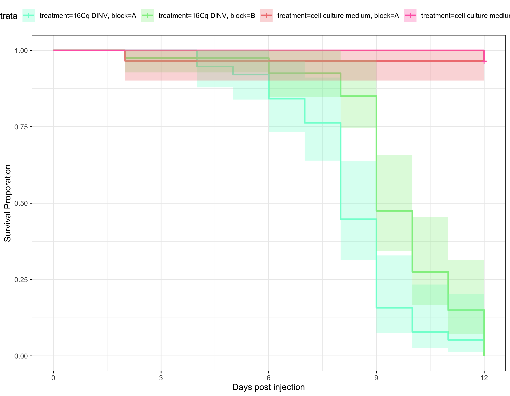
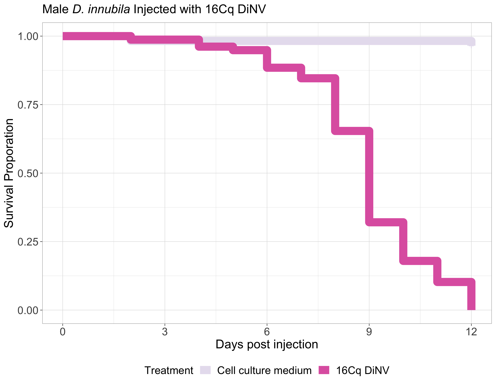
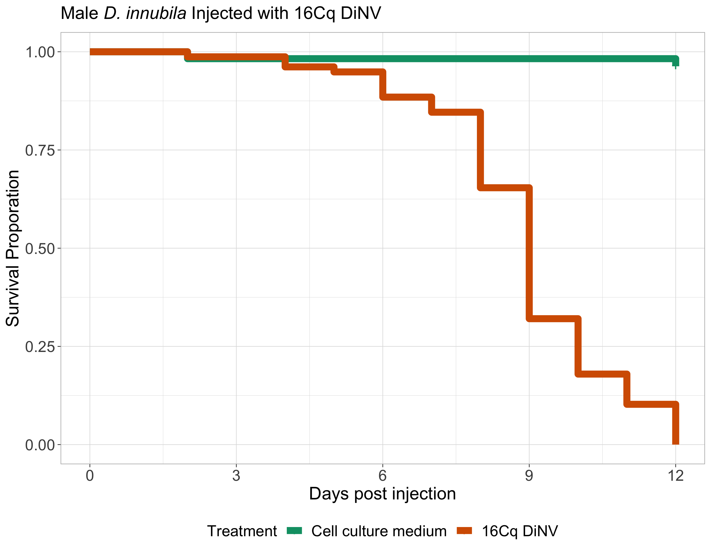

# Combined-16Cq-inject

Load in packages needed for the analysis

``` r
library("survival")
library("survminer")
```

    Loading required package: ggplot2

    Loading required package: ggpubr


    Attaching package: 'survminer'

    The following object is masked from 'package:survival':

        myeloma

### Loop to convert the example data.frame ‘df’ into properly formatted data.frame ‘results’

``` r
#write a function to transform a data.frame that has the column format 'vial | treatment | D0 | D1 | D2...', with one row for each vial
#into a long version in tidy format that can be input to make a survivorship curve
convert_df<-function(df){
  #open empty data.frame to store results
  results<-data.frame(vial=character(),treatment=character(),dead=numeric(),status=numeric())
  #This loop will index out each row (one row per vial) one at a time, transform it into long format (one row per fly), and add the information to the empty data.frame called results
  for(i in 1:nrow(df)){
  #isolate the row (vial) you want to work on
  temp<-df[i,]
    #iteratively isolate each day for this vial (day 0 must be column 3, day 1 column 4, etc.). Loop stops the column before the last day
    for(j in 3:(ncol(temp)-1)){
      #assign the number of flies that died in the vial on that day (starting with day 1) to the variable 'z'
      z<-temp[1,j]-temp[1,j+1]
        #if >0 flies died add this information to the results dataframe
        if(z>0){
          #iterate over 1 through total number of dead flies
          for(k in 1:z){
            #add a new row to the 'results' data.frame for the given dead fly, specifying vial #, treatment, day died, and
            #record the current vial #
            vial<-temp[,1]
            #record the genotype of the current vial
            treatment<-temp[,2]
            #record the death date of the flies that died on this day (assumes that your input DF starts with day 0 in column 3)
            dd<-j-2
            #append this information into a new row in the 'results' data.frame, and add a '1' in the 4th column to indicate mortality
            results[nrow(results)+1,]<- c(vial,treatment,dd,1)
          } #close for loop
        } #close if loop
    } #close for loop
  
  #now assign the number of flies remaining in the vial on the last day (value in the last column of the row) to the variable 'z'
  z<-temp[1,j+1]
    #if there are any flies alive in the vial on the last day
    if(z>0){
      #iterate over 1:(number of flies alive on the last day)
      for(l in 1:z){
        #record the current vial #
        vial<-temp[,1]
        #record the genotype of the current vial
        treatment<-temp[,2]
        #record the last day we recorded this fly alive (assumes that your input DF starts with day 0 in column 3)
        dd<-j-2
        #append this information into a new row in the 'results' data.frame, and add a '0' in the 4th column to indicate that the fly made it to the end of the experiment
        results[nrow(results)+1,]<- c(vial,treatment,dd,0)
      } #close for loop
    } #close if loop
  } #close original for loop
results$dead<-as.numeric(results$dead)  #reiterate that this column must be class numeric
results$status<-as.numeric(results$status)  #reiterate that this column must be class numeric
results$vial <- as.factor(results$vial) # make sure vial is considered a factor
# gives you only the results dataframe as output from function 
return(results) 
} #close function
```

Read in raw data

``` r
#read the file from csv
df<-read.csv("/Users/maggieschedl/Desktop/Github/Unckless_Lab_Resources/Infection_survival_analyses/Combined-rep-1-2-16Cq-injt/Combined-2-replicate-dataset.csv")

# there are no columns to remove
```

### Convert each of these dataframes to long and tidy format using function defined above

``` r
df.convert<-convert_df(df)

# add in block after conversion 
# create a new column that is all Bs
df.convert$block <- "B"
# make the vials that are 1-7 have A for block (so the samples can be separated out by replicate infection)
df.convert$block[which(df.convert$vial %in% 1:7)] = "A"
```

### Make the survival curve separated by block

``` r
# add in treatment and block in the model 
df_fit<- survfit(Surv(dead, status) ~ treatment + block, data=df.convert)


ggsurvplot(df_fit,
          pval = FALSE, conf.int = TRUE,
          #risk.table = TRUE, # Add risk table
          #risk.table.col = "strata", # Change risk table color by groups
          #linetype = "strata", # Change line type by groups
          #surv.median.line = "hv", # Specify median survival
          ggtheme = theme_bw(), # Change ggplot2 theme
          palette = c("aquamarine", "lightgreen", "lightcoral", "hotpink")) + ylab("Survival Proporation") + xlab("Days post injection")
```



Make survival curve with blocks combined

``` r
# order treatments 
df.convert <- df.convert %>% 
  mutate(treatment = factor(treatment, levels = c("cell culture medium", "16Cq DiNV")))

df_fit2<- survfit(Surv(dead, status) ~ treatment, data=df.convert)


ggsurvplot(df_fit2, size = 5,
          pval = FALSE, conf.int = FALSE,
          ggtheme = theme_light(), # Change ggplot2 theme
          font.tickslab = c(14),
          legend = "bottom",
          font.x = c(16),
          font.y = c(16),
          font.t = c(16),
          title = expression(paste("Male",italic(" D. innubila "), "Injected with 16Cq DiNV")),
          legend.title="Treatment",
          legend.labs=c("Cell culture medium", "16Cq DiNV"),
          font.legend = c(14),
          palette = c("#E7E1EF", "#DF65B0")) + ylab("Survival Proporation") + xlab("Days post injection") 
```



``` r
# not sure why this plot is not rendering in the markdown with the same colors so save here
ggsave("16Cq-inject-male.jpeg")
```

    Saving 9 x 7 in image

### Comparing Models and Looking at Stats

Try to look at the models with Block as a factor, as well as block \*
treatment as an interaction effect, then see which model fits best using
AIC.

extractAIC gives two vlues:  
edf the \`\`equivalent degrees of freedom’’ of the fitted model fit.  
AIC the (generalized) Akaike Information Criterion for fit.

``` r
# reoder treatment order so that the statistics make sense
df.convert$treatment <- relevel(as.factor(df.convert$treatment), ref = "cell culture medium")

# new model using cox proportional hazard (which is basically what above is doing)
df_fit2<- coxph(Surv(dead, status) ~ treatment + block, data=df.convert)
# look at the statistics of the model
summary(df_fit2)
```

    Call:
    coxph(formula = Surv(dead, status) ~ treatment + block, data = df.convert)

      n= 135, number of events= 80 

                           coef exp(coef) se(coef)      z Pr(>|z|)    
    treatment16Cq DiNV   5.0567  157.0731   0.7499  6.743 1.55e-11 ***
    blockB              -0.6811    0.5061   0.2283 -2.984  0.00285 ** 
    ---
    Signif. codes:  0 '***' 0.001 '**' 0.01 '*' 0.05 '.' 0.1 ' ' 1

                       exp(coef) exp(-coef) lower .95 upper .95
    treatment16Cq DiNV  157.0731   0.006366   36.1213  683.0304
    blockB                0.5061   1.976023    0.3235    0.7916

    Concordance= 0.857  (se = 0.021 )
    Likelihood ratio test= 168.6  on 2 df,   p=<2e-16
    Wald test            = 51.6  on 2 df,   p=6e-12
    Score (logrank) test = 143.8  on 2 df,   p=<2e-16

``` r
# add model with interaction term (so treatment * block)
# no errors in this model when I made 9 fly die during experimental time in the control treatment for each block
# if no flies had died in one treatment in 1 block it would give infinate values for some confidence intervals which is not great
df_fit3<- coxph(Surv(dead, status) ~ block + treatment  + treatment * block, data=df.convert)
# look at the statistics of the model with interaction term
summary(df_fit3)
```

    Call:
    coxph(formula = Surv(dead, status) ~ block + treatment + treatment * 
        block, data = df.convert)

      n= 135, number of events= 80 

                                   coef exp(coef)  se(coef)      z Pr(>|z|)    
    blockB                      0.01222   1.01230   1.41422  0.009    0.993    
    treatment16Cq DiNV          5.35505 211.67372   1.03808  5.159 2.49e-07 ***
    blockB:treatment16Cq DiNV  -0.71109   0.49111   1.43295 -0.496    0.620    
    ---
    Signif. codes:  0 '***' 0.001 '**' 0.01 '*' 0.05 '.' 0.1 ' ' 1

                              exp(coef) exp(-coef) lower .95 upper .95
    blockB                       1.0123   0.987854   0.06332    16.184
    treatment16Cq DiNV         211.6737   0.004724  27.67247  1619.146
    blockB:treatment16Cq DiNV    0.4911   2.036210   0.02961     8.145

    Concordance= 0.857  (se = 0.023 )
    Likelihood ratio test= 168.8  on 3 df,   p=<2e-16
    Wald test            = 52.89  on 3 df,   p=2e-11
    Score (logrank) test = 155.2  on 3 df,   p=<2e-16

``` r
# extract AIC of df_fit2 (no interaction term)
extractAIC(df_fit2)
```

    [1]   2.0000 559.9158

``` r
# 2.0000 559.9158
# extract AIC of df_fit3 (with interaction term)
extractAIC(df_fit3)
```

    [1]   3.0000 561.6742

``` r
# 3.0000 561.6742

# compare AICs 

exp((559.9158 - 561.6742)/2)
```

    [1] 0.4151149

``` r
# 0.415, this would be a p value comparing the non interaction and the interaction models. There is no significant difference between the two AICs, so either one is a good fit 

# what about is I compare a model with just treatment to a model with treatment and block?

df_fit_t<- coxph(Surv(dead, status) ~ treatment, data=df.convert)
# look at the statistics of the model
summary(df_fit_t)
```

    Call:
    coxph(formula = Surv(dead, status) ~ treatment, data = df.convert)

      n= 135, number of events= 80 

                           coef exp(coef) se(coef)     z Pr(>|z|)    
    treatment16Cq DiNV   4.8893  132.8547   0.7467 6.548 5.84e-11 ***
    ---
    Signif. codes:  0 '***' 0.001 '**' 0.01 '*' 0.05 '.' 0.1 ' ' 1

                       exp(coef) exp(-coef) lower .95 upper .95
    treatment16Cq DiNV     132.9   0.007527     30.75     574.1

    Concordance= 0.806  (se = 0.023 )
    Likelihood ratio test= 159.9  on 1 df,   p=<2e-16
    Wald test            = 42.87  on 1 df,   p=6e-11
    Score (logrank) test = 137.6  on 1 df,   p=<2e-16

``` r
# get the AIC for the model with just treatment
extractAIC(df_fit_t)
```

    [1]   1.0000 566.6194

``` r
# 1.0000 566.6194 

# Compare AICs

exp((559.9158 - 566.6194)/2)
```

    [1] 0.03502126

``` r
# 0.03502126 
# So this would suggest that there is a significant difference in the AIC between the two models, and with AIC the lower number is the best one, indicating that the model that uses block + treatment is the best model
```

Changing figure colors and lines for paper

``` r
df_fit2<- survfit(Surv(dead, status) ~ treatment, data=df.convert)


ggsurvplot(df_fit2, size = 3,
          pval = FALSE, conf.int = FALSE,
          ggtheme = theme_light(), # Change ggplot2 theme
          font.tickslab = c(14),
          legend = "bottom",
          font.x = c(16),
          font.y = c(16),
          font.t = c(16),
          title = expression(paste("Male",italic(" D. innubila "), "Injected with 16Cq DiNV")),
          legend.title="Treatment",
          legend.labs=c("Cell culture medium", "16Cq DiNV"),
          font.legend = c(14),
          palette = c("#009E73", "#D55E00")) + ylab("Survival Proporation") + xlab("Days post injection") 
```


