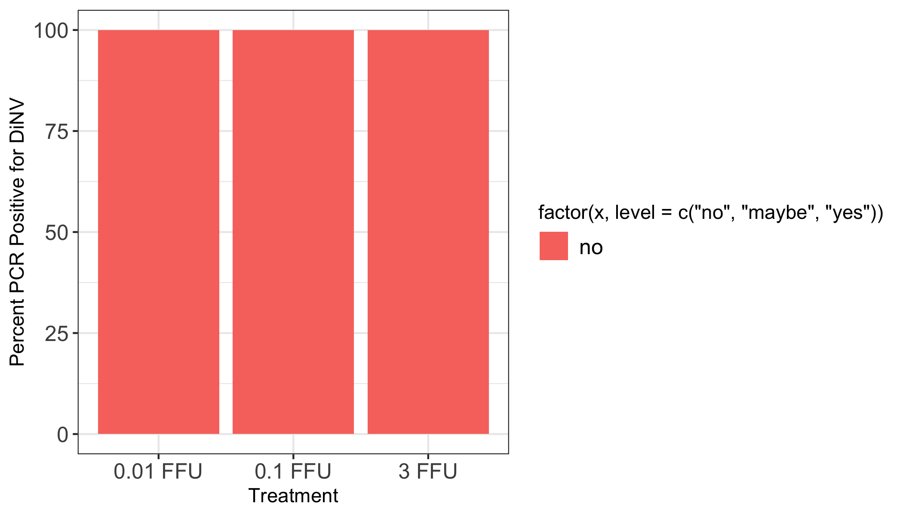
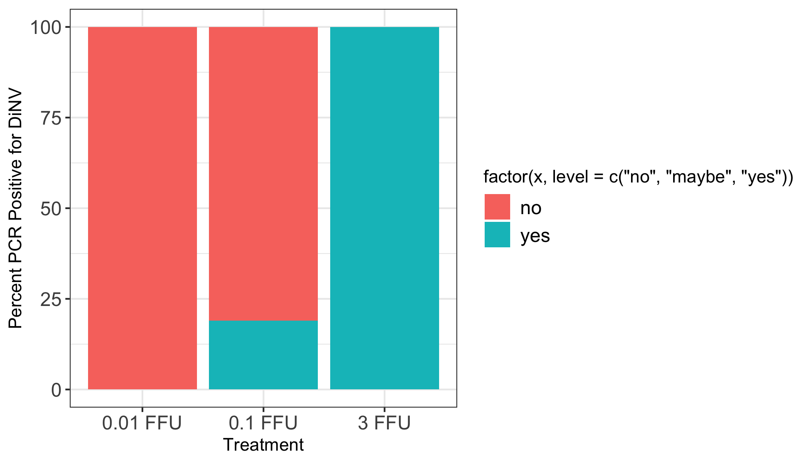
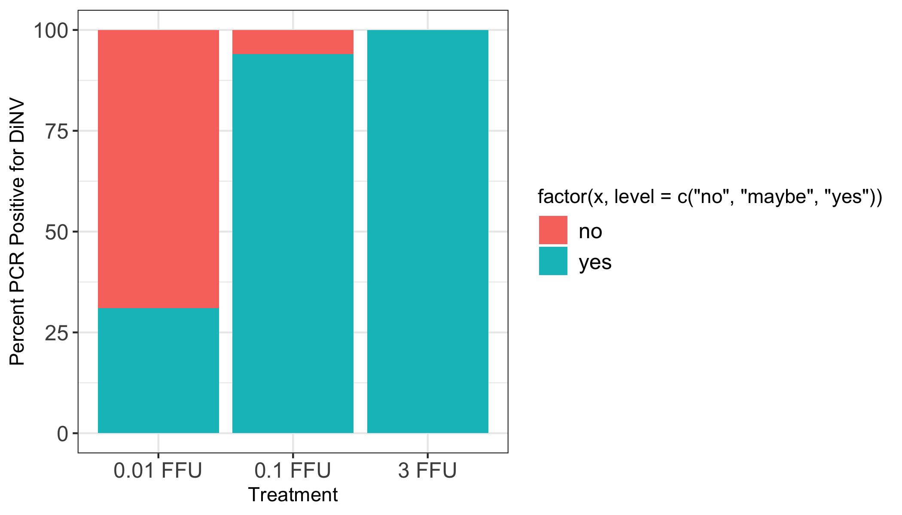
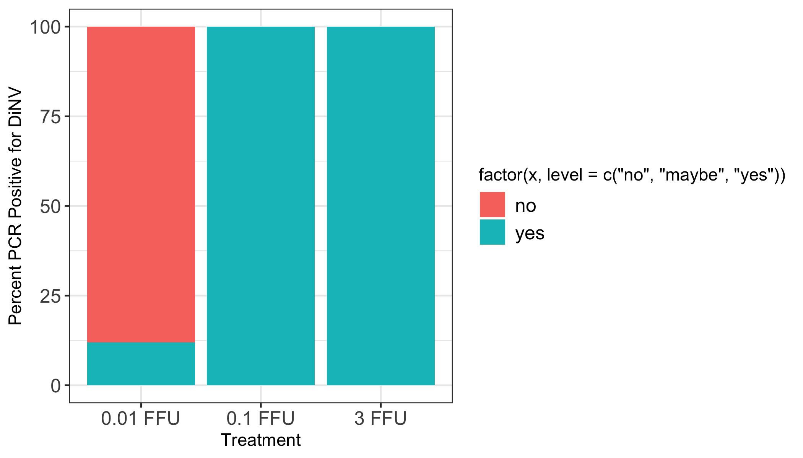
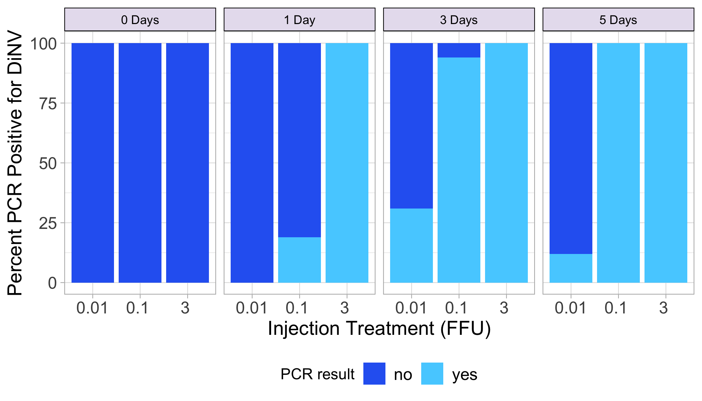

# viral-load-PCR

Load packages needed

``` r
library(ggplot2)
library(tidyr)
library(dplyr)
```


    Attaching package: 'dplyr'

    The following objects are masked from 'package:stats':

        filter, lag

    The following objects are masked from 'package:base':

        intersect, setdiff, setequal, union

``` r
library(plyr)
```

    ------------------------------------------------------------------------------

    You have loaded plyr after dplyr - this is likely to cause problems.
    If you need functions from both plyr and dplyr, please load plyr first, then dplyr:
    library(plyr); library(dplyr)

    ------------------------------------------------------------------------------


    Attaching package: 'plyr'

    The following objects are masked from 'package:dplyr':

        arrange, count, desc, failwith, id, mutate, rename, summarise,
        summarize

Load in dataset

``` r
PCR_results <- read.csv("/Users/maggieschedl/Desktop/Github/Unckless_Lab_Resources/PCR_analysis/viral-load-PCR/qPCR-viral-load-PCR.csv")
# no extra columns or rows to remove 
```

The only way I know how to do this is break up by each day and then
combine together

Right now I have not separated out male and female, in all other
analyses there is no difference between them so it should be fine to
combine

Day 0

``` r
# subset dataframe to just the day 0
PCR_results_day0 <- subset(PCR_results, day == "day0")

# subset out different FFUs
# 0.01 FFU
PCR_results_day0_001 <- subset(PCR_results_day0, dilution == "0.01 FFU")

# how many yes or no PCR results are there for the p47 PCR for the day0 flies 0.001 
# make this into a table 
p47_results_day0_001<- count(PCR_results_day0_001$p47)

# add a column to that table that is the count (column name is freq) divided by the number of rows to get a proportion

p47_results_day0_001$Result_prop <- p47_results_day0_001$freq / nrow(PCR_results_day0_001)

# add a column to that table with the percentage (proportion *100)
p47_results_day0_001$Result_percent <- p47_results_day0_001$Result_prop * 100

# add a column that says dilution
p47_results_day0_001$Dilution <- "0.01 FFU"

#########
# 0.1 FFU
PCR_results_day0_01 <- subset(PCR_results_day0, dilution == "0.1 FFU")

# how many yes or no PCR results are there for the p47 PCR for the day0 flies 0.01 
# make this into a table 
p47_results_day0_01<- count(PCR_results_day0_01$p47)

# add a column to that table that is the count (column name is freq) divided by the number of rows to get a proportion

p47_results_day0_01$Result_prop <- p47_results_day0_01$freq / nrow(PCR_results_day0_01)

# add a column to that table with the percentage (proportion *100)
p47_results_day0_01$Result_percent <- p47_results_day0_01$Result_prop * 100

# add a column that says dilution
p47_results_day0_01$Dilution <- "0.1 FFU"

##### 
# 3 FFU
PCR_results_day0_3 <- subset(PCR_results_day0, dilution == "3 FFU")

# how many yes or no PCR results are there for the p47 PCR for the day0 flies 3 
# make this into a table 
p47_results_day0_3<- count(PCR_results_day0_3$p47)

# add a column to that table that is the count (column name is freq) divided by the number of rows to get a proportion

p47_results_day0_3$Result_prop <- p47_results_day0_3$freq / nrow(PCR_results_day0_3)

# add a column to that table with the percentage (proportion *100)
p47_results_day0_3$Result_percent <- p47_results_day0_3$Result_prop * 100

# add a column that says dilution
p47_results_day0_3$Dilution <- "3 FFU"

###

# combine dfs
percent_table_day0 <- rbind(p47_results_day0_001, p47_results_day0_01, p47_results_day0_3)

# create a new column in the df that is a round of the percent column
percent_table_day0$Round_percent <- round(percent_table_day0$Result_percent)

# make a ledgend title
legend_title <- "PCR result"

ggplot(percent_table_day0, aes(x =factor(Dilution, level=c("0.01 FFU", "0.1 FFU", "3 FFU")), y = Round_percent,fill =factor(x, level=c('no', 'maybe', 'yes')))) +
    geom_bar(stat = "identity")  + theme_bw() + xlab("Treatment") +
    theme(legend.text=element_text(size=12), axis.text=element_text(size=12)) + 
    ylab("Percent PCR Positive for DiNV") 
```



Day 1

``` r
# subset dataframe to just the day 1
PCR_results_day1 <- subset(PCR_results, day == "day1")

# subset out different FFUs
# 0.01 FFU
PCR_results_day1_001 <- subset(PCR_results_day1, dilution == "0.01 FFU")

# how many yes or no PCR results are there for the p47 PCR for the day1 flies 0.001 
# make this into a table 
p47_results_day1_001<- count(PCR_results_day1_001$p47)

# add a column to that table that is the count (column name is freq) divided by the number of rows to get a proportion

p47_results_day1_001$Result_prop <- p47_results_day1_001$freq / nrow(PCR_results_day1_001)

# add a column to that table with the percentage (proportion *100)
p47_results_day1_001$Result_percent <- p47_results_day1_001$Result_prop * 100

# add a column that says dilution
p47_results_day1_001$Dilution <- "0.01 FFU"

#########
# 0.1 FFU
PCR_results_day1_01 <- subset(PCR_results_day1, dilution == "0.1 FFU")

# how many yes or no PCR results are there for the p47 PCR for the day1 flies 0.01 
# make this into a table 
p47_results_day1_01<- count(PCR_results_day1_01$p47)

# add a column to that table that is the count (column name is freq) divided by the number of rows to get a proportion

p47_results_day1_01$Result_prop <- p47_results_day1_01$freq / nrow(PCR_results_day1_01)

# add a column to that table with the percentage (proportion *100)
p47_results_day1_01$Result_percent <- p47_results_day1_01$Result_prop * 100

# add a column that says dilution
p47_results_day1_01$Dilution <- "0.1 FFU"

##### 
# 3 FFU
PCR_results_day1_3 <- subset(PCR_results_day1, dilution == "3 FFU")

# how many yes or no PCR results are there for the p47 PCR for the day1 flies 3 
# make this into a table 
p47_results_day1_3<- count(PCR_results_day1_3$p47)

# add a column to that table that is the count (column name is freq) divided by the number of rows to get a proportion

p47_results_day1_3$Result_prop <- p47_results_day1_3$freq / nrow(PCR_results_day1_3)

# add a column to that table with the percentage (proportion *100)
p47_results_day1_3$Result_percent <- p47_results_day1_3$Result_prop * 100

# add a column that says dilution
p47_results_day1_3$Dilution <- "3 FFU"

###

# combine dfs
percent_table_day1 <- rbind(p47_results_day1_001, p47_results_day1_01, p47_results_day1_3)

# create a new column in the df that is a round of the percent column
percent_table_day1$Round_percent <- round(percent_table_day1$Result_percent)

# make a ledgend title
legend_title <- "PCR result"

ggplot(percent_table_day1, aes(x =factor(Dilution, level=c("0.01 FFU", "0.1 FFU", "3 FFU")), y = Round_percent,fill =factor(x, level=c('no', 'maybe', 'yes')))) +
    geom_bar(stat = "identity")  + theme_bw() + xlab("Treatment") +
    theme(legend.text=element_text(size=12), axis.text=element_text(size=12)) + 
    ylab("Percent PCR Positive for DiNV") 
```



Day 3

``` r
# subset dataframe to just the day 3
PCR_results_day3 <- subset(PCR_results, day == "day3")

# subset out different FFUs
# 0.01 FFU
PCR_results_day3_001 <- subset(PCR_results_day3, dilution == "0.01 FFU")

# how many yes or no PCR results are there for the p47 PCR for the day3 flies 0.001 
# make this into a table 
p47_results_day3_001<- count(PCR_results_day3_001$p47)

# add a column to that table that is the count (column name is freq) divided by the number of rows to get a proportion

p47_results_day3_001$Result_prop <- p47_results_day3_001$freq / nrow(PCR_results_day3_001)

# add a column to that table with the percentage (proportion *100)
p47_results_day3_001$Result_percent <- p47_results_day3_001$Result_prop * 100

# add a column that says dilution
p47_results_day3_001$Dilution <- "0.01 FFU"

#########
# 0.1 FFU
PCR_results_day3_01 <- subset(PCR_results_day3, dilution == "0.1 FFU")

# how many yes or no PCR results are there for the p47 PCR for the day3 flies 0.01 
# make this into a table 
p47_results_day3_01<- count(PCR_results_day3_01$p47)

# add a column to that table that is the count (column name is freq) divided by the number of rows to get a proportion

p47_results_day3_01$Result_prop <- p47_results_day3_01$freq / nrow(PCR_results_day3_01)

# add a column to that table with the percentage (proportion *100)
p47_results_day3_01$Result_percent <- p47_results_day3_01$Result_prop * 100

# add a column that says dilution
p47_results_day3_01$Dilution <- "0.1 FFU"

##### 
# 3 FFU
PCR_results_day3_3 <- subset(PCR_results_day3, dilution == "3 FFU")

# how many yes or no PCR results are there for the p47 PCR for the day3 flies 3 
# make this into a table 
p47_results_day3_3<- count(PCR_results_day3_3$p47)

# add a column to that table that is the count (column name is freq) divided by the number of rows to get a proportion

p47_results_day3_3$Result_prop <- p47_results_day3_3$freq / nrow(PCR_results_day3_3)

# add a column to that table with the percentage (proportion *100)
p47_results_day3_3$Result_percent <- p47_results_day3_3$Result_prop * 100

# add a column that says dilution
p47_results_day3_3$Dilution <- "3 FFU"

###

# combine dfs
percent_table_day3 <- rbind(p47_results_day3_001, p47_results_day3_01, p47_results_day3_3)

# create a new column in the df that is a round of the percent column
percent_table_day3$Round_percent <- round(percent_table_day3$Result_percent)

# make a ledgend title
legend_title <- "PCR result"

ggplot(percent_table_day3, aes(x =factor(Dilution, level=c("0.01 FFU", "0.1 FFU", "3 FFU")), y = Round_percent,fill =factor(x, level=c('no', 'maybe', 'yes')))) +
    geom_bar(stat = "identity")  + theme_bw() + xlab("Treatment") +
    theme(legend.text=element_text(size=12), axis.text=element_text(size=12)) + 
    ylab("Percent PCR Positive for DiNV") 
```



Day 5

``` r
# subset dataframe to just the day 5
PCR_results_day5 <- subset(PCR_results, day == "day5")

# subset out different FFUs
# 0.01 FFU
PCR_results_day5_001 <- subset(PCR_results_day5, dilution == "0.01 FFU")

# how many yes or no PCR results are there for the p47 PCR for the day5 flies 0.001 
# make this into a table 
p47_results_day5_001<- count(PCR_results_day5_001$p47)

# add a column to that table that is the count (column name is freq) divided by the number of rows to get a proportion

p47_results_day5_001$Result_prop <- p47_results_day5_001$freq / nrow(PCR_results_day5_001)

# add a column to that table with the percentage (proportion *100)
p47_results_day5_001$Result_percent <- p47_results_day5_001$Result_prop * 100

# add a column that says dilution
p47_results_day5_001$Dilution <- "0.01 FFU"

#########
# 0.1 FFU
PCR_results_day5_01 <- subset(PCR_results_day5, dilution == "0.1 FFU")

# how many yes or no PCR results are there for the p47 PCR for the day5 flies 0.01 
# make this into a table 
p47_results_day5_01<- count(PCR_results_day5_01$p47)

# add a column to that table that is the count (column name is freq) divided by the number of rows to get a proportion

p47_results_day5_01$Result_prop <- p47_results_day5_01$freq / nrow(PCR_results_day5_01)

# add a column to that table with the percentage (proportion *100)
p47_results_day5_01$Result_percent <- p47_results_day5_01$Result_prop * 100

# add a column that says dilution
p47_results_day5_01$Dilution <- "0.1 FFU"

##### 
# 3 FFU
PCR_results_day5_3 <- subset(PCR_results_day5, dilution == "3 FFU")

# how many yes or no PCR results are there for the p47 PCR for the day1 flies 3 
# make this into a table 
p47_results_day5_3<- count(PCR_results_day5_3$p47)

# add a column to that table that is the count (column name is freq) divided by the number of rows to get a proportion

p47_results_day5_3$Result_prop <- p47_results_day5_3$freq / nrow(PCR_results_day5_3)

# add a column to that table with the percentage (proportion *100)
p47_results_day5_3$Result_percent <- p47_results_day5_3$Result_prop * 100

# add a column that says dilution
p47_results_day5_3$Dilution <- "3 FFU"

###

# combine dfs
percent_table_day5 <- rbind(p47_results_day5_001, p47_results_day5_01, p47_results_day5_3)

# create a new column in the df that is a round of the percent column
percent_table_day5$Round_percent <- round(percent_table_day5$Result_percent)

# make a ledgend title
legend_title <- "PCR result"

ggplot(percent_table_day5, aes(x =factor(Dilution, level=c("0.01 FFU", "0.1 FFU", "3 FFU")), y = Round_percent,fill =factor(x, level=c('no', 'maybe', 'yes')))) +
    geom_bar(stat = "identity")  + theme_bw() + xlab("Treatment") +
    theme(legend.text=element_text(size=12), axis.text=element_text(size=12)) + 
    ylab("Percent PCR Positive for DiNV") 
```



Combine days into 1 plot

``` r
# first need to add the day to each of the datasets 

percent_table_day0$day <- "0 Days"
percent_table_day1$day <- "1 Day"
percent_table_day3$day <- "3 Days"
percent_table_day5$day <- "5 Days"


# combine tables 
percent_tables <- rbind(percent_table_day0, percent_table_day1, percent_table_day3, percent_table_day5)

# order the days 
percent_tables$day= factor(percent_tables$day, levels=c('0 Days','1 Day','3 Days','5 Days'))


ggplot(percent_tables, aes(x =factor(Dilution, level=c("0.01 FFU" ,"0.1 FFU", "3 FFU")), y = Round_percent,fill =factor(x, level=c('no', 'yes')))) +
    geom_bar(stat = "identity")  + theme_light() + xlab("Injection Treatment (FFU)") +
    theme(legend.text=element_text(size=12), axis.text=element_text(size=12), legend.position = "bottom", axis.title=element_text(size=14), strip.background=element_rect(colour="black",fill="#E7E1EF"), strip.text = element_text(colour = 'black')) + 
    scale_fill_manual(values = c( "#2C67F2", "#55d0ff"), legend_title ) + 
    ylab("Percent PCR Positive for DiNV") + scale_x_discrete(labels=c("0.01 FFU" = "0.01", "0.1 FFU" = "0.1 ", "3 FFU" = "3 ")) + facet_grid(~day)
```


